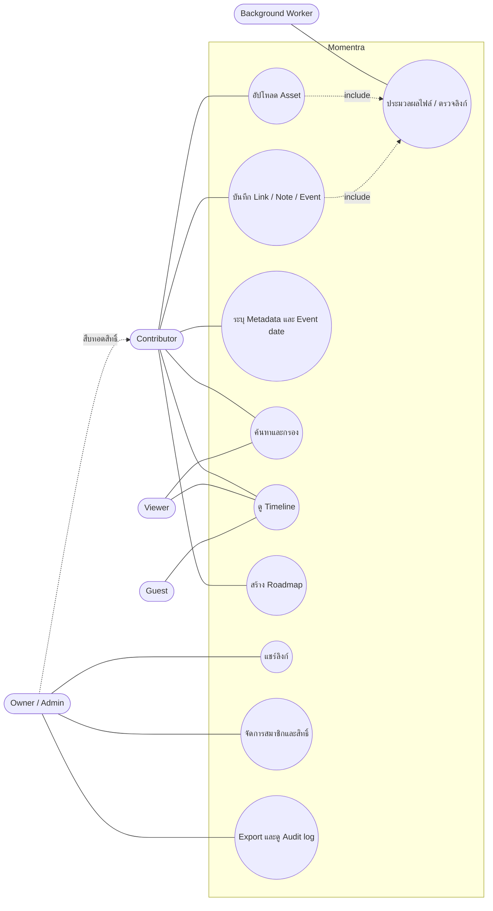
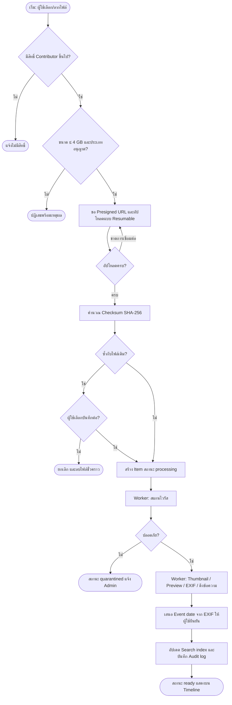
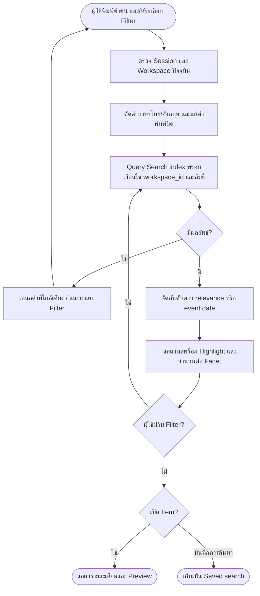
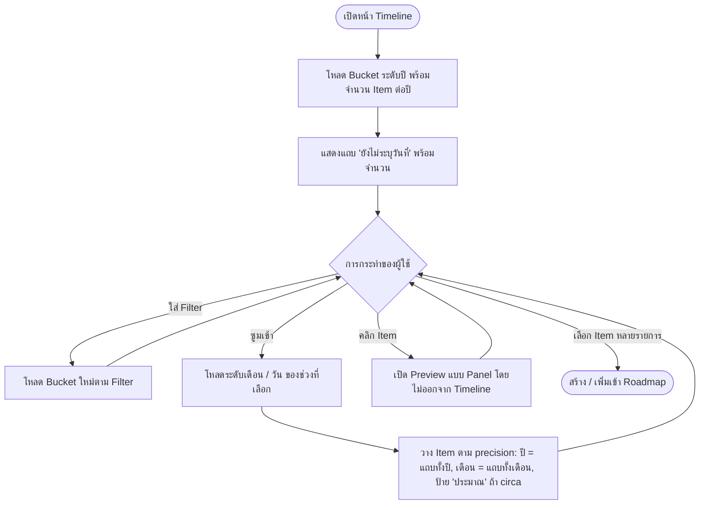

# Momentra – Software Requirements Specification (SRS)

Oct 5, 2026 · @isara chootip

## 0. Document Control

| รายการ | รายละเอียด |
| --- | --- |
| เอกสาร | Software Requirements Specification (SRS) – `docs/01-srs.md` |
| ระบบ | Momentra (ชื่อโครงการเดิม HDAM – Historical Digital Asset Management) |
| เวอร์ชัน | 0.1 Draft – รอทบทวนโดยผู้มีส่วนได้ส่วนเสีย |
| จัดทำโดย | Senior System Analyst (AI) ตามชุด Prompt Phase 1 |
| เอกสารถัดไป | Phase 2 – System Architecture (`docs/02-architecture.md`) |

**บริบทจาก Prompt 0 (ยืนยันแล้ว 5 ต.ค. 2569)**

| หัวข้อ | ค่าที่ใช้ใน SRS นี้ |
| --- | --- |
| กลุ่มผู้ใช้ | ทั้งบุคคลและองค์กร (Multi-tenant แบบ Workspace) |
| ขนาดปีแรก | ≤ 100 ผู้ใช้, ≤ 500 GB, ประมาณการ ≤ 200,000 รายการ (items) |
| การ Deploy | ระยะทดสอบบน VPS เครื่องเดียว → อนาคตย้ายไป Huawei Cloud และ/หรือ GCP |
| กฎหมาย/มาตรฐาน | PDPA, ISO/IEC 27001 (แนวทางควบคุม), Dublin Core (Metadata) – เปิดรับมาตรฐานเพิ่มเติม |
| ภาษา / เวลา | UI ไทย + อังกฤษ, Timezone Asia/Bangkok, จัดเก็บเวลาเป็น UTC |

**ข้อสังเกตเชิงออกแบบ:** เนื่องจากเริ่มบน VPS แต่จะย้าย Cloud ภายหลัง ทุก Requirement ในเอกสารนี้จึงกำหนดให้ระบบ **ไม่ผูกกับผู้ให้บริการ Cloud รายใด** (Cloud-agnostic) เช่น ใช้ Object storage แบบ S3-compatible และ Container เป็นหน่วย Deploy

## 1. Executive Summary & Problem Statement

### 1.1 Executive Summary

Momentra คือแพลตฟอร์มเก็บรักษาสินทรัพย์ดิจิทัล (รูปภาพ วิดีโอ เสียง เอกสาร บทความ ลิงก์ และบันทึก) ของบุคคลและองค์กร โดยผูกทุกรายการเข้ากับ **วันเวลาที่เหตุการณ์เกิดขึ้นจริง** แล้วนำเสนอเป็น Timeline และ Roadmap ที่ค้นหาได้ เป้าหมายของ MVP คือให้ผู้ใช้กลุ่มแรก (≤ 100 คน) นำข้อมูลที่กระจัดกระจายเข้าระบบ จัดระเบียบ และค้นคืนได้ภายในไม่กี่วินาที บนโครงสร้างพื้นฐานขนาดเล็ก (VPS) ที่ย้ายขึ้น Cloud ได้โดยไม่ต้องเขียนใหม่

### 1.2 Problem Statement

| ปัญหาปัจจุบัน | ผลกระทบ | สิ่งที่ Momentra แก้ |
| --- | --- | --- |
| ไฟล์และลิงก์กระจายอยู่หลายที่ (มือถือ, Drive, แชต, Bookmark) | หาไม่เจอ สูญหายเมื่อเปลี่ยนอุปกรณ์หรือบัญชี | คลังกลางที่เดียว รองรับทุกประเภทไฟล์และลิงก์ |
| เครื่องมือทั่วไปเรียงตาม "วันที่อัปโหลด" | ภาพถ่ายปี 2540 ที่สแกนวันนี้ไปอยู่ผิดยุค เล่าเรื่องย้อนหลังไม่ได้ | แยก event date ออกจาก created\_at และรองรับวันที่ไม่แน่นอน |
| ลิงก์เว็บเสียหรือหายไปตามเวลา (link rot) | ข้อมูลอ้างอิงประวัติศาสตร์ขององค์กรหายไป | ดึง Metadata และตรวจสถานะลิงก์ตามรอบ |
| ไม่มีมาตรฐาน Metadata และสิทธิ์การเข้าถึง | องค์กรส่งต่อ/ตรวจสอบข้อมูลยาก เสี่ยงผิด PDPA | Metadata ตาม Dublin Core, Role-based access, Audit log |
| ค้นหาภาษาไทยในระบบทั่วไปได้ผลไม่ดี | คำไทยไม่มีเว้นวรรค ค้นไม่เจอ | Full-text search ที่ตัดคำภาษาไทย |

### 1.3 Business Objectives และตัวชี้วัดความสำเร็จ (ปีแรก)

| รหัส | วัตถุประสงค์ (จาก Project brief) | KPI ที่วัดได้ |
| --- | --- | --- |
| OBJ-1 | จัดเก็บ Information และ Link ต่างๆ | ผู้ใช้บันทึกลิงก์ได้ภายใน ≤ 3 คลิก, ≥ 95% ของลิงก์ที่บันทึกได้ Preview อัตโนมัติ |
| OBJ-2 | จัดเก็บ Asset ทุกประเภท | อัปโหลดสำเร็จ ≥ 99% ของความพยายาม, ไม่มีไฟล์สูญหาย (0 checksum mismatch) |
| OBJ-3 | สืบค้นได้ และจัดเรียง Roadmap ตามวันเวลา | ผู้ใช้หา item เป้าหมายเจอภายใน ≤ 30 วินาทีใน ≥ 90% ของการทดสอบ UAT |

## 2. Stakeholders & Personas

### 2.1 Stakeholders

| Stakeholder | บทบาท | ความสนใจหลัก |
| --- | --- | --- |
| Product Owner / เจ้าของโครงการ | กำหนดทิศทาง อนุมัติขอบเขตและ Release | คุณค่าทางธุรกิจ, งบประมาณ, เวลา |
| ผู้ใช้รายบุคคล | ใช้งานเก็บความทรงจำส่วนตัว/ครอบครัว | ความง่าย ความเป็นส่วนตัว |
| องค์กร (ผู้บริหาร, ฝ่ายสื่อสาร, จดหมายเหตุ) | ใช้เก็บประวัติและสินทรัพย์ขององค์กร | สิทธิ์ การตรวจสอบ มาตรฐาน |
| ทีมพัฒนาและดูแลระบบ | สร้างและดูแล | ความดูแลง่าย ค่าใช้จ่ายต่ำ |
| เจ้าหน้าที่คุ้มครองข้อมูล (DPO) / Security | กำกับ PDPA และ ISO 27001 | ความเสี่ยงข้อมูลรั่วไหล หลักฐานการควบคุม |

### 2.2 Personas และ Role ในระบบ

| Persona | Role ในระบบ | ตัวอย่างบุคคล | เป้าหมาย | Pain point |
| --- | --- | --- | --- | --- |
| **P1 Owner บุคคล** | Owner ของ Personal Workspace | คุณสมศรี 52 ปี เก็บรูปครอบครัว 3 รุ่น | สแกนรูปเก่า ระบุปีโดยประมาณ แล้วเล่าเรื่องให้ลูกหลาน | จำวันที่แน่นอนไม่ได้ ไฟล์อยู่หลายเครื่อง |
| **P2 Admin องค์กร** | Owner/Admin ของ Organization Workspace | คุณวิทย์ ผู้จัดการฝ่ายสื่อสารองค์กร | รวบรวมประวัติบริษัท 30 ปี จัดการสมาชิกและสิทธิ์ | ข้อมูลกระจายตามแผนก ไม่รู้ใครแก้อะไร |
| **P3 Contributor** | Contributor | น้องเมย์ เจ้าหน้าที่ประชาสัมพันธ์ | อัปโหลดภาพกิจกรรมจำนวนมาก ใส่ tag ให้เร็ว | ใส่ Metadata ซ้ำๆ ทีละไฟล์ |
| **P4 Viewer** | Viewer | ผู้บริหารหรือพนักงานใหม่ | ค้นหาและดู Timeline เพื่ออ้างอิง | หาไม่เจอเพราะไม่รู้ชื่อไฟล์ |
| **P5 Guest** | ผู้รับลิงก์แชร์ (ไม่ต้องมีบัญชี) | ญาติ, สื่อมวลชน, พันธมิตร | ดู Collection หรือ Roadmap ที่ได้รับเชิญ | ไม่อยากสมัครสมาชิก |

### 2.3 สิทธิ์เบื้องต้นตาม Role

| ความสามารถ | Owner | Admin | Contributor | Viewer | Guest |
| --- | --- | --- | --- | --- | --- |
| ดู item / Timeline | ✓ | ✓ | ✓ | ✓ | เฉพาะที่แชร์ |
| สร้าง / แก้ item ของตน | ✓ | ✓ | ✓ | – | – |
| แก้ / ลบ item ของผู้อื่น | ✓ | ✓ | – | – | – |
| จัดการ Collection / Roadmap | ✓ | ✓ | ✓ (ของตน) | – | – |
| สร้างลิงก์แชร์ | ✓ | ✓ | ตามนโยบาย Workspace | – | – |
| จัดการสมาชิกและ Role | ✓ | ✓ (ยกเว้นโอน Owner) | – | – | – |
| Export ทั้ง Workspace / ดู Audit log | ✓ | ✓ | – | – | – |
| ลบ Workspace / โอนความเป็นเจ้าของ | ✓ | – | – | – | – |

## 3. Scope

### 3.1 In-scope vs Out-of-scope

| In-scope | Out-of-scope |
| --- | --- |
| Web application (Responsive รองรับมือถือผ่านเบราว์เซอร์) | Native mobile app (iOS/Android) |
| อัปโหลด/จัดเก็บไฟล์ รูป วิดีโอ เสียง เอกสาร และไฟล์ทั่วไป | การแก้ไขรูป/ตัดต่อวิดีโอในระบบ |
| บันทึกลิงก์ บันทึกข้อความ (Note) และเหตุการณ์ (Event) ที่ไม่มีไฟล์ | การ Crawl/สำรองเว็บไซต์ทั้งเว็บ |
| Metadata, Tag, Collection, บุคคล/สถานที่, Custom fields | ระบบ DRM และลายน้ำป้องกันการคัดลอก |
| Timeline, Roadmap, Full-text search ภาษาไทย/อังกฤษ | ระบบชำระเงิน/Subscription (ไว้หลังเปิด SaaS) |
| Workspace บุคคล/องค์กร, Role, ลิงก์แชร์, Audit log, Export | SSO ระดับองค์กร (SAML) และ LDAP |
| Deploy บน VPS แบบ Container พร้อมแผนย้าย Cloud | High Availability หลาย Region ในระยะทดสอบ |

### 3.2 MVP vs Phase 2

| ความสามารถ | MVP (Release 1) | Phase 2 |
| --- | --- | --- |
| Asset | อัปโหลดหลายไฟล์, Resumable, Thumbnail, Preview, Checksum | Versioning เต็มรูปแบบ, Transcode วิดีโอหลายความละเอียด |
| Link | บันทึก URL, ดึง Open Graph, ตรวจลิงก์เสียรายสัปดาห์ | เก็บ Snapshot หน้าเว็บ (Web archive) |
| Metadata | Tag, Collection, วันที่ไม่แน่นอน, บุคคล/สถานที่, Dublin Core mapping | Custom field แบบกำหนดเองต่อ Workspace, Bulk edit ขั้นสูง |
| Timeline/Roadmap | Timeline ซูมปี/เดือน/วัน, Roadmap แบบเลือก item มาเรียง | Heatmap, Milestone ซ้อนหลายชั้น, เปรียบเทียบหลาย Timeline |
| Search | Full-text ไทย/อังกฤษ + Filter ตามประเภท/Tag/ช่วงวัน | Semantic search, OCR, ถอดเสียงวิดีโอ, Auto-tag ด้วย AI |
| Access | Workspace, 4 Role, ลิงก์แชร์มีวันหมดอายุ | Group/Team, สิทธิ์ระดับ item, 2FA บังคับ |
| Audit & Preservation | Audit log, Soft delete 30 วัน, Backup รายวัน, Export ZIP | Fixity check ตามรอบ, นโยบาย Retention ต่อประเภทข้อมูล |

## 4. Functional Requirements

Priority ใช้ MoSCoW: **M** = Must (MVP), **S** = Should (MVP ถ้าทันเวลา), **C** = Could (Phase 2), **W** = Won't (รอบนี้) · Acceptance Criteria เขียนแบบ Given / When / Then

### 4.1 FR-ASSET — การจัดเก็บ Asset

| รหัส | Requirement | P | Acceptance Criteria |
| --- | --- | --- | --- |
| FR-ASSET-01 | อัปโหลดหลายไฟล์พร้อมกันด้วย Drag & drop หรือเลือกไฟล์ | M | Given ผู้ใช้ Role Contributor ขึ้นไป When เลือก 50 ไฟล์ รวม ≤ 5 GB Then ระบบแสดง Progress รายไฟล์ และสร้าง item ครบ 50 รายการ |
| FR-ASSET-02 | อัปโหลดแบบ Resumable สำหรับไฟล์ใหญ่ | M | Given อัปโหลดไฟล์ 2 GB ไปแล้ว 60% When การเชื่อมต่อขาดและกลับมาภายใน 24 ชม. Then อัปโหลดต่อจาก 60% โดยไม่เริ่มใหม่ |
| FR-ASSET-03 | ตรวจประเภทไฟล์จากเนื้อหาจริง (magic bytes) และจำกัดขนาด | M | Given ไฟล์ .jpg ที่เนื้อหาจริงเป็นไฟล์ปฏิบัติการ When อัปโหลด Then ระบบปฏิเสธพร้อมข้อความแจ้งเหตุผล · ไฟล์เกิน 4 GB ถูกปฏิเสธก่อนเริ่มส่ง |
| FR-ASSET-04 | คำนวณและเก็บ Checksum SHA-256 ของทุกไฟล์ | M | Given อัปโหลดเสร็จ When ระบบประมวลผล Then บันทึก checksum และถ้าตรงกับไฟล์ที่มีอยู่แล้วใน Workspace ให้แจ้งเตือนไฟล์ซ้ำ |
| FR-ASSET-05 | สแกนไวรัสก่อนเผยแพร่ไฟล์ | M | Given ไฟล์ติดมัลแวร์ When สแกนเสร็จ Then สถานะ item = quarantined และไม่มีใครดาวน์โหลดได้ยกเว้น Admin |
| FR-ASSET-06 | สร้าง Thumbnail และ Preview แบบ asynchronous | M | Given รูป/PDF/วิดีโอ อัปโหลดเสร็จ When ประมวลผลเสร็จ Then มี Thumbnail ภายใน ≤ 60 วินาที (รูป/PDF) และ Preview วิดีโอภายใน ≤ 10 นาที ต่อไฟล์ 1 GB |
| FR-ASSET-07 | ดึง EXIF/Metadata ไฟล์ และเสนอวันที่ถ่ายเป็น event date | M | Given รูปมี EXIF DateTimeOriginal When อัปโหลด Then ระบบเสนอวันที่นั้นเป็น event date ให้ผู้ใช้ยืนยัน (ไม่ตั้งอัตโนมัติโดยไม่แจ้ง) |
| FR-ASSET-08 | แสดง Preview ในระบบ: รูป (ซูม), วิดีโอ/เสียง (เล่น), PDF (อ่าน) | M | Given item ประเภทรูป วิดีโอ เสียง หรือ PDF When เปิดรายละเอียด Then แสดงผลได้โดยไม่ต้องดาวน์โหลด |
| FR-ASSET-09 | ดาวน์โหลดไฟล์ต้นฉบับผ่าน Signed URL อายุสั้น | M | Given ผู้ใช้มีสิทธิ์ดู When กดดาวน์โหลด Then ได้ URL ที่หมดอายุภายใน 15 นาที และเรียกซ้ำหลังหมดอายุไม่ได้ |
| FR-ASSET-10 | แทนที่ไฟล์และเก็บประวัติเวอร์ชัน | S | Given item มีไฟล์เวอร์ชัน 1 When อัปโหลดไฟล์ใหม่แทน Then เวอร์ชัน 1 ยังดาวน์โหลดได้จากประวัติ |
| FR-ASSET-11 | ดึงข้อความจาก PDF/DOCX เพื่อใช้ค้นหา | S | Given อัปโหลด PDF ที่มี text layer When ประมวลผลเสร็จ Then ค้นหาคำในเนื้อหาเจอ item นั้น |
| FR-ASSET-12 | OCR รูปสแกนและถอดเสียงวิดีโอ | C | ระบุรายละเอียดใน Phase 2 |

### 4.2 FR-LINK — Information และ Link

| รหัส | Requirement | P | Acceptance Criteria |
| --- | --- | --- | --- |
| FR-LINK-01 | บันทึก URL เป็น item พร้อมชื่อ คำอธิบาย และ event date | M | Given วาง URL ที่ถูกต้อง When กดบันทึก Then สร้าง item ประเภท link ได้ภายใน ≤ 3 คลิกจากหน้าใดก็ได้ |
| FR-LINK-02 | ดึง Preview (title, description, og:image, favicon) อัตโนมัติ | M | Given URL สาธารณะที่มี Open Graph When บันทึก Then Preview ปรากฏภายใน ≤ 10 วินาที · ถ้าดึงไม่ได้ ใช้โดเมนเป็นชื่อและให้ผู้ใช้แก้เอง |
| FR-LINK-03 | ทำ URL ให้เป็นมาตรฐานและป้องกันลิงก์ซ้ำ | M | Given บันทึก `https://Example.com/a?utm_source=x` แล้ว When บันทึก `https://example.com/a` Then ระบบเตือนว่ามีลิงก์นี้แล้วและเสนอเปิด item เดิม |
| FR-LINK-04 | ตรวจสถานะลิงก์ตามรอบ และแจ้งลิงก์เสีย | M | Given ลิงก์ตอบ HTTP 404 ติดต่อกัน 2 รอบ When ครบรอบตรวจรายสัปดาห์ Then item แสดงป้าย "ลิงก์เสีย" และกรองได้ |
| FR-LINK-05 | ป้องกันการดึง URL ภายในเครือข่าย (SSRF) | M | Given URL ชี้ไป IP ภายใน (เช่น 127.0.0.1, 10.x, 169.254.x) When ระบบดึง Preview Then ปฏิเสธและบันทึก Security log |
| FR-LINK-06 | บันทึก Note (ข้อความ Rich text) และ Event ที่ไม่มีไฟล์ | M | Given ผู้ใช้ต้องการบันทึกเหตุการณ์ "เปิดสาขาแรก" When สร้าง item ประเภท event พร้อมวันที่ Then แสดงบน Timeline ได้เหมือน item อื่น |
| FR-LINK-07 | Browser bookmarklet / Share target บันทึกลิงก์จากหน้าเว็บ | S | Given ผู้ใช้อยู่บนเว็บใดๆ When กด Bookmarklet Then เปิดหน้าบันทึกพร้อม URL และ title ที่กรอกไว้แล้ว |
| FR-LINK-08 | เก็บ Snapshot หน้าเว็บ (Web archive) | C | ระบุรายละเอียดใน Phase 2 |

### 4.3 FR-META — Metadata และ Taxonomy

| รหัส | Requirement | P | Acceptance Criteria |
| --- | --- | --- | --- |
| FR-META-01 | ระบุ event date แยกจาก created\_at พร้อม precision (ปี/เดือน/วัน/วันเวลา) | M | Given ผู้ใช้รู้แค่ปี 2540 When เลือก precision = ปี และกรอก 2540 Then ระบบเก็บเป็น 1997 (ค.ศ.) precision=year และ created\_at ยังเป็นเวลาบันทึกจริง |
| FR-META-02 | ระบุช่วงเวลา (start–end) และ flag "ประมาณ" (circa) | M | Given เหตุการณ์ "ประมาณ ต.ค.–ธ.ค. 2563" When บันทึก Then แสดงเป็นช่วงพร้อมป้าย "ประมาณ" · ถ้า end < start ระบบไม่ยอมบันทึก |
| FR-META-03 | สลับการกรอก/แสดงปี พ.ศ. และ ค.ศ. | M | Given ผู้ใช้ตั้งค่าแสดง พ.ศ. When ดู item ที่เก็บ 1997 Then แสดง 2540 · เมื่อกรอกปี ≥ 2400 ในโหมด ค.ศ. ระบบเตือนว่าอาจเป็น พ.ศ. |
| FR-META-04 | Tag แบบอิสระ พร้อมแนะนำ Tag ที่มีอยู่ | M | Given พิมพ์ "งาน" When อยู่ในช่อง Tag Then แสดง Tag ที่ขึ้นต้นด้วย "งาน" ภายใน Workspace ภายใน ≤ 300 ms |
| FR-META-05 | Collection (อัลบั้ม/โฟลเดอร์เชิงตรรกะ) โดย item อยู่ได้หลาย Collection | M | Given item A When เพิ่มเข้า Collection X และ Y Then item A ปรากฏในทั้งสอง โดยไม่ทำสำเนาไฟล์ |
| FR-META-06 | ระบุบุคคล องค์กร และสถานที่ที่เกี่ยวข้อง (Entities) | M | Given รูปงานแต่งงาน When ระบุบุคคล "คุณสมศรี" Then ค้นหา "สมศรี" เจอทุก item ที่ระบุบุคคลนี้ |
| FR-META-07 | Mapping Metadata ไปยัง Dublin Core 15 elements | M | Given item ใดๆ When Export Then ไฟล์ metadata มีฟิลด์ dc:title, dc:creator, dc:date, dc:type, dc:format, dc:identifier, dc:subject, dc:description และอื่นๆ ที่มีค่า |
| FR-META-08 | แก้ Metadata หลาย item พร้อมกัน (Bulk edit) | S | Given เลือก 100 item When เพิ่ม Tag และตั้ง event date เดียวกัน Then ทั้ง 100 รายการอัปเดตภายใน ≤ 10 วินาที และบันทึก Audit log |
| FR-META-09 | Custom fields ต่อ Workspace | C | ระบุรายละเอียดใน Phase 2 |

### 4.4 FR-TIMELINE — Timeline และ Roadmap

| รหัส | Requirement | P | Acceptance Criteria |
| --- | --- | --- | --- |
| FR-TIMELINE-01 | แสดง item ทั้งหมดเรียงตาม event date (ไม่ใช่ created\_at) | M | Given รูปปี 2540 ที่อัปโหลดวันนี้ When เปิด Timeline Then รูปนั้นอยู่ที่ตำแหน่งปี 2540 |
| FR-TIMELINE-02 | ซูม Timeline ระดับปี ↔ เดือน ↔ วัน | M | Given มุมมองระดับปี When คลิกปี 2563 Then เปลี่ยนเป็นมุมมองรายเดือนของปีนั้นภายใน ≤ 500 ms |
| FR-TIMELINE-03 | แสดง item ที่ precision ต่างกันอย่างถูกต้อง | M | Given item precision=year When ดูมุมมองรายเดือน Then แสดงในแถบ "ทั้งปี" ของปีนั้น ไม่ถูกวางเป็นวันที่ 1 ม.ค. |
| FR-TIMELINE-04 | กรอง Timeline ตามประเภท Tag Collection บุคคล | M | Given Timeline ทั้ง Workspace When กรอง Tag = "ครอบครัว" Then แสดงเฉพาะ item ที่มี Tag นี้ พร้อมจำนวนต่อช่วงเวลา |
| FR-TIMELINE-05 | item ที่ไม่มี event date แสดงในกลุ่ม "ยังไม่ระบุวันที่" | M | Given item ไม่มี event date When เปิด Timeline Then อยู่ในกลุ่มแยกที่เข้าถึงได้ด้วยคลิกเดียว และนับจำนวนให้เห็น |
| FR-TIMELINE-06 | สร้าง Roadmap: เลือก item มาเรียงเป็นเรื่องราว พร้อมหัวข้อ Milestone และคำบรรยาย | M | Given ผู้ใช้เลือก 20 item When สร้าง Roadmap "30 ปีบริษัท" Then เรียงตาม event date อัตโนมัติ ลากสลับลำดับได้ และเพิ่ม Milestone ได้ |
| FR-TIMELINE-07 | แสดงจำนวน item ต่อช่วงเวลาเป็น Histogram/Heatmap | S | Given Workspace 10,000 item When เปิด Timeline Then แถบสรุปจำนวนต่อเดือนแสดงภายใน ≤ 1 วินาที |
| FR-TIMELINE-08 | เปรียบเทียบหลาย Timeline ซ้อนกัน | C | ระบุรายละเอียดใน Phase 2 |

### 4.5 FR-SEARCH — การสืบค้น

| รหัส | Requirement | P | Acceptance Criteria |
| --- | --- | --- | --- |
| FR-SEARCH-01 | Full-text search จาก title, description, tag, entity, เนื้อหาไฟล์, โดเมนลิงก์ | M | Given item title "พิธีเปิดสาขาเชียงใหม่" When ค้นคำ "สาขาเชียงใหม่" Then item อยู่ใน 3 อันดับแรก |
| FR-SEARCH-02 | ตัดคำภาษาไทยและค้นคำผสมไทย-อังกฤษ | M | Given ข้อความ "งานบวชหลานชายที่วัดพระแก้ว" When ค้น "บวช" หรือ "วัดพระแก้ว" Then พบ item นี้ทั้งสองกรณี |
| FR-SEARCH-03 | Filter ตามประเภท, Tag, Collection, บุคคล, ช่วง event date | M | Given ผลค้นหา When เลือกช่วง 2540–2545 Then แสดงเฉพาะ item ที่ช่วง event date ทับซ้อนกับช่วงนั้น พร้อมจำนวนต่อ Facet |
| FR-SEARCH-04 | Highlight คำที่ตรงในผลลัพธ์ และเรียงตามความเกี่ยวข้องหรือ event date | M | Given ค้น "สงกรานต์" When ผลแสดง Then คำถูก Highlight และสลับการเรียงได้ |
| FR-SEARCH-05 | ผลค้นหาแสดงเฉพาะสิ่งที่ผู้ใช้มีสิทธิ์ | M | Given ผู้ใช้อยู่ Workspace A When ค้นคำที่มีใน Workspace B Then ไม่พบผลลัพธ์จาก B |
| FR-SEARCH-06 | ทนคำพิมพ์ผิดเล็กน้อย และคำพ้อง (เช่น รูป = ภาพ) | S | Given ค้น "สงกรนต์" When ไม่มีคำตรง Then เสนอ "สงกรานต์" |
| FR-SEARCH-07 | บันทึกการค้นหา (Saved search) | S | Given ตั้ง Filter แล้ว When กดบันทึก Then เรียกใช้ซ้ำได้จากเมนู |
| FR-SEARCH-08 | Semantic search (ค้นด้วยความหมาย) | C | ระบุรายละเอียดใน Phase 2 |

### 4.6 FR-ACCESS — ผู้ใช้ Workspace และสิทธิ์

| รหัส | Requirement | P | Acceptance Criteria |
| --- | --- | --- | --- |
| FR-ACCESS-01 | สมัครและเข้าสู่ระบบด้วยอีเมล + รหัสผ่าน และ Google | M | Given ผู้ใช้ใหม่ When สมัครด้วยอีเมล Then ต้องยืนยันอีเมลก่อนใช้งาน · รหัสผ่านต้องยาว ≥ 12 ตัวอักษร |
| FR-ACCESS-02 | 2FA (TOTP) สำหรับทุกผู้ใช้ และบังคับสำหรับ Owner/Admin องค์กร | M | Given Admin องค์กรยังไม่เปิด 2FA When เข้าสู่ระบบ Then ถูกบังคับให้ตั้งค่าก่อนเข้าใช้งาน |
| FR-ACCESS-03 | Workspace บุคคล (สร้างอัตโนมัติ) และ Workspace องค์กร | M | Given สมัครเสร็จ When เข้าครั้งแรก Then มี Personal Workspace พร้อมใช้ และสร้าง Organization Workspace เพิ่มได้ |
| FR-ACCESS-04 | เชิญสมาชิกทางอีเมลพร้อมกำหนด Role | M | Given Admin เชิญ user@x.com เป็น Contributor When ผู้รับกดลิงก์ภายใน 7 วัน Then เข้าร่วมด้วย Role นั้น · หลัง 7 วันลิงก์ใช้ไม่ได้ |
| FR-ACCESS-05 | บังคับสิทธิ์ตามตาราง Role (หัวข้อ 2.3) ทุก request | M | Given Viewer When เรียก API แก้ไข item Then ได้ HTTP 403 และบันทึก Audit log |
| FR-ACCESS-06 | ลิงก์แชร์ item/Collection/Roadmap พร้อมวันหมดอายุ รหัสผ่าน และยกเลิกได้ | M | Given ลิงก์แชร์หมดอายุ When Guest เปิด Then ได้หน้าแจ้งหมดอายุ ไม่เห็นเนื้อหา |
| FR-ACCESS-07 | จัดการ Session: ออกจากระบบทุกอุปกรณ์, Session หมดอายุเมื่อไม่ใช้งาน | M | Given ไม่ใช้งาน 30 นาที (องค์กร) / 7 วัน (บุคคล, เลือกจำไว้) When กลับมา Then ต้องเข้าสู่ระบบใหม่ |
| FR-ACCESS-08 | สิทธิ์เจ้าของข้อมูลตาม PDPA: ขอสำเนา ขอลบบัญชีและข้อมูล | M | Given ผู้ใช้ขอลบบัญชี When ยืนยัน Then ข้อมูลส่วนบุคคลถูกลบ/ทำให้ไม่ระบุตัวตนภายใน ≤ 30 วัน และแจ้งผล |
| FR-ACCESS-09 | Group/Team และสิทธิ์ระดับ item | C | ระบุรายละเอียดใน Phase 2 |

### 4.7 FR-AUDIT — Audit, Preservation และ Export

| รหัส | Requirement | P | Acceptance Criteria |
| --- | --- | --- | --- |
| FR-AUDIT-01 | บันทึก Audit log ทุกการสร้าง แก้ไข ลบ แชร์ ดาวน์โหลด และเปลี่ยนสิทธิ์ | M | Given Contributor แก้ title When Admin เปิด Audit log Then เห็น ผู้ทำ, เวลา, ค่าเดิม, ค่าใหม่, IP |
| FR-AUDIT-02 | Audit log แก้ไขหรือลบไม่ได้ (Append-only) | M | Given Admin ใดๆ When พยายามลบ log ผ่าน UI/API Then ทำไม่ได้ · log เก็บ ≥ 1 ปี |
| FR-AUDIT-03 | Soft delete พร้อมถังขยะ กู้คืนได้ 30 วัน | M | Given ลบ item When ภายใน 30 วัน Then กู้คืนได้ครบทั้งไฟล์และ Metadata · หลัง 30 วันลบถาวรอัตโนมัติ |
| FR-AUDIT-04 | Export item, Collection หรือทั้ง Workspace เป็น ZIP + metadata (JSON, CSV, Dublin Core XML) | M | Given Workspace 50 GB When Owner สั่ง Export Then ได้อีเมลแจ้งลิงก์ดาวน์โหลดเมื่อเสร็จ และไฟล์ใน ZIP มี checksum ตรงกับต้นฉบับ |
| FR-AUDIT-05 | Backup อัตโนมัติรายวัน และทดสอบกู้คืนได้ | M | ดู NFR-REL-03 และ NFR-REL-04 |
| FR-AUDIT-06 | Fixity check: ตรวจ checksum ไฟล์ทั้งหมดตามรอบ | C | ระบุรายละเอียดใน Phase 2 |

## 5. User Stories

รูปแบบ "As a … I want … so that …" · อ้างอิง FR ที่รองรับ เพื่อใช้ใน Traceability (หัวข้อ 9)

| รหัส | Persona | User Story | FR | P |
| --- | --- | --- | --- | --- |
| US-01 | P3 Contributor | As a Contributor, I want to drag and drop 50 event photos at once so that I can upload a whole activity in one step. | ASSET-01 | M |
| US-02 | P1 Owner | As an Owner, I want my 2 GB video upload to resume after my internet drops so that I don't have to start over. | ASSET-02 | M |
| US-03 | P2 Admin | As an Admin, I want unsafe or disguised files to be blocked so that our workspace stays free of malware. | ASSET-03, 05 | M |
| US-04 | P1 Owner | As an Owner, I want to be warned when I upload a photo I already have so that my archive has no duplicates. | ASSET-04 | M |
| US-05 | P4 Viewer | As a Viewer, I want to preview photos, videos and PDFs in the browser so that I don't need to download them. | ASSET-06, 08 | M |
| US-06 | P3 Contributor | As a Contributor, I want the system to suggest the photo's taken date from EXIF so that I can date many photos quickly. | ASSET-07 | M |
| US-07 | P1 Owner | As an Owner, I want to save a web link and see its preview card automatically so that I recognise it later at a glance. | LINK-01, 02 | M |
| US-08 | P2 Admin | As an Admin, I want to be told when a saved link is broken so that I can replace or archive the reference. | LINK-04 | M |
| US-09 | P1 Owner | As an Owner, I want to record an event with no file (e.g. "Grandpa's retirement") so that the timeline tells the full story. | LINK-06 | M |
| US-10 | P3 Contributor | As a Contributor, I want to save the page I'm reading with one click from my browser so that capturing links takes no effort. | LINK-07 | S |
| US-11 | P1 Owner | As an Owner, I want to set a date as only "year 2540" so that I can file old photos whose exact date I don't know. | META-01 | M |
| US-12 | P1 Owner | As an Owner, I want to mark a date range as "approximately" so that viewers know the date is an estimate. | META-02 | M |
| US-13 | P1 Owner | As an Owner, I want to enter and view years in Buddhist Era so that dates feel natural to Thai users. | META-03 | M |
| US-14 | P3 Contributor | As a Contributor, I want tag suggestions as I type so that our team uses consistent tags. | META-04 | M |
| US-15 | P2 Admin | As an Admin, I want to group items into collections without copying files so that one photo can belong to several albums. | META-05 | M |
| US-16 | P4 Viewer | As a Viewer, I want to find every item showing a particular person so that I can see their story over time. | META-06, SEARCH-01 | M |
| US-17 | P3 Contributor | As a Contributor, I want to edit tags and dates for 100 items at once so that organising a batch takes minutes, not hours. | META-08 | S |
| US-18 | P4 Viewer | As a Viewer, I want to see items placed by when they happened, not when they were uploaded so that history is in the right order. | TIMELINE-01 | M |
| US-19 | P4 Viewer | As a Viewer, I want to zoom the timeline from years to months to days so that I can move from overview to detail. | TIMELINE-02, 03 | M |
| US-20 | P1 Owner | As an Owner, I want a list of undated items so that I can go back and date them. | TIMELINE-05 | M |
| US-21 | P2 Admin | As an Admin, I want to build a roadmap "30 years of our company" from selected items with milestones so that I can present our history. | TIMELINE-06 | M |
| US-22 | P4 Viewer | As a Viewer, I want to search in Thai without worrying about word spacing so that I find what I need. | SEARCH-01, 02 | M |
| US-23 | P4 Viewer | As a Viewer, I want to search within a date range (e.g. 2540–2545) and filter by type and tag so that results are narrowed quickly. | SEARCH-03 | M |
| US-24 | P2 Admin | As an Admin, I want to invite members by email with a role so that each person gets only the access they need. | ACCESS-04, 05 | M |
| US-25 | P1 Owner | As an Owner, I want to share a collection via a link that expires and can have a password so that relatives can view it without an account. | ACCESS-06 | M |
| US-26 | P5 Guest | As a Guest, I want to open a shared roadmap on my phone without signing up so that viewing is effortless. | ACCESS-06 | M |
| US-27 | P1 Owner | As an Owner, I want to export my whole workspace with its metadata so that I'm never locked in. | AUDIT-04, META-07 | M |
| US-28 | P2 Admin | As an Admin, I want to see who changed or downloaded what and when so that we meet audit and ISO 27001 requirements. | AUDIT-01, 02 | M |
| US-29 | P1 Owner | As an Owner, I want to restore an item I deleted by mistake within 30 days so that accidents are not permanent. | AUDIT-03 | M |
| US-30 | P1 Owner | As an Owner, I want to request a copy or deletion of my personal data so that my PDPA rights are respected. | ACCESS-08 | M |

## 6. Non-Functional Requirements

ตัวเลขกำหนดจากขนาดปีแรก (≤ 100 ผู้ใช้, ≤ 500 GB, ≤ 200,000 items) และ **ออกแบบเผื่อ 1,000,000 items** เพื่อรองรับการย้ายขึ้น Cloud โดยไม่ต้องเปลี่ยนสถาปัตยกรรม

### 6.1 Performance

| รหัส | Requirement | ค่าเป้าหมาย |
| --- | --- | --- |
| NFR-PERF-01 | เวลาตอบสนอง Search (full-text + filter) | p95 < 1 วินาที ที่ 1,000,000 items · p95 < 500 ms ที่ 200,000 items |
| NFR-PERF-02 | เวลาโหลด Timeline (bucket รายปี/เดือน) | p95 < 500 ms |
| NFR-PERF-03 | API ทั่วไป (CRUD) | p95 < 300 ms |
| NFR-PERF-04 | หน้าเว็บแรก (First Contentful Paint) บน 4G | < 2.5 วินาที · Lighthouse Performance ≥ 85 |
| NFR-PERF-05 | ความเร็วอัปโหลด | ใช้แบนด์วิดท์ฝั่งผู้ใช้ได้ ≥ 80% (ไม่เป็นคอขวดฝั่งเซิร์ฟเวอร์) |
| NFR-PERF-06 | ผู้ใช้พร้อมกัน | ≥ 30 concurrent users บน VPS โดยไม่เกินค่า p95 ข้างต้น |
| NFR-PERF-07 | Search index อัปเดตหลังบันทึก | ≤ 5 วินาที |

### 6.2 Availability, Reliability และ Backup

| รหัส | Requirement | ค่าเป้าหมาย |
| --- | --- | --- |
| NFR-REL-01 | Availability ระยะทดสอบ (VPS) | ≥ 99.0% ต่อเดือน (ยกเว้นช่วง Maintenance ที่แจ้งล่วงหน้า ≥ 24 ชม.) |
| NFR-REL-02 | Availability ระยะ Production บน Cloud | ≥ 99.5% ต่อเดือน |
| NFR-REL-03 | Backup ฐานข้อมูล | รายวัน + WAL/PITR · เก็บ 30 วัน · สำเนาอยู่นอก VPS (ต่างผู้ให้บริการหรือต่าง Region) |
| NFR-REL-04 | RPO / RTO | RPO ≤ 24 ชม. (ระยะ VPS), ≤ 1 ชม. (Cloud) · RTO ≤ 8 ชม. (VPS), ≤ 4 ชม. (Cloud) |
| NFR-REL-05 | ความถูกต้องของไฟล์ | 0 ไฟล์สูญหาย/เสียหายที่ตรวจพบด้วย checksum · ทดสอบกู้คืนจริงทุกไตรมาส |
| NFR-REL-06 | งานประมวลผลเบื้องหลังล้มเหลว | Retry อัตโนมัติ ≥ 3 ครั้งแบบ exponential backoff และแสดงสถานะให้ผู้ใช้ |

### 6.3 Scalability และ Portability

| รหัส | Requirement | ค่าเป้าหมาย |
| --- | --- | --- |
| NFR-SCL-01 | ขยายจาก 500 GB เป็น 50 TB | ไม่ต้องเปลี่ยนโค้ด เปลี่ยนเพียงค่า Config ของ Object storage |
| NFR-SCL-02 | Cloud-agnostic | ใช้ Object storage แบบ S3 API, ฐานข้อมูล PostgreSQL มาตรฐาน, Deploy ด้วย Container · ย้าย VPS → Huawei Cloud/GCP ได้ภายใน ≤ 2 วันทำงาน |
| NFR-SCL-03 | แยก Worker ออกจาก Web | เพิ่มจำนวน Worker ได้อิสระโดยไม่หยุดระบบ |

### 6.4 Security (อ้างอิงแนวทาง ISO/IEC 27001 Annex A)

| รหัส | Requirement | ค่าเป้าหมาย |
| --- | --- | --- |
| NFR-SEC-01 | การเข้ารหัสระหว่างส่ง | TLS 1.2 ขึ้นไปทุกช่องทาง, HSTS |
| NFR-SEC-02 | การเข้ารหัสขณะจัดเก็บ | ฐานข้อมูล, Backup และ Object storage เข้ารหัส AES-256 |
| NFR-SEC-03 | การจัดเก็บรหัสผ่าน | Argon2id หรือ bcrypt (cost ≥ 12) |
| NFR-SEC-04 | การแยกข้อมูล Tenant | ทุก query กรองด้วย workspace\_id + Row Level Security · ผ่าน Penetration test ข้าม Tenant 100% |
| NFR-SEC-05 | ช่องโหว่ | ไม่มีช่องโหว่ระดับ Critical/High ตาม OWASP Top 10 ก่อน Go-live · สแกน Dependency ทุก Build |
| NFR-SEC-06 | Rate limiting | Login ≤ 5 ครั้ง/นาที/IP, API ≤ 300 req/นาที/ผู้ใช้ |
| NFR-SEC-07 | Secret management | ไม่มี Secret ใน Source code · หมุนเวียนคีย์ทุก ≤ 90 วัน |
| NFR-SEC-08 | Logging เพื่อความปลอดภัย | Security event (login ล้มเหลว, 403, SSRF block) เก็บ ≥ 1 ปี และแจ้งเตือนเมื่อผิดปกติ |

### 6.5 Privacy (PDPA)

| รหัส | Requirement | ค่าเป้าหมาย |
| --- | --- | --- |
| NFR-PDPA-01 | Privacy notice และความยินยอม | แสดงและบันทึกความยินยอมพร้อมเวอร์ชันเมื่อสมัคร |
| NFR-PDPA-02 | ข้อมูลตำแหน่งใน EXIF (GPS) | ค่าเริ่มต้นไม่แสดงต่อ Viewer/Guest · ลบ GPS ออกจากไฟล์ที่แชร์สาธารณะ |
| NFR-PDPA-03 | สิทธิ์เจ้าของข้อมูล | ตอบคำขอเข้าถึง/ลบ/โอนย้ายข้อมูลภายใน ≤ 30 วัน |
| NFR-PDPA-04 | แจ้งเหตุละเมิดข้อมูล | มีขั้นตอนแจ้ง สคส. ภายใน 72 ชม. นับจากทราบเหตุ |
| NFR-PDPA-05 | ที่ตั้งข้อมูล | ระบุประเทศที่เก็บข้อมูลใน Privacy notice · เลือก Region ที่สอดคล้องกฎหมายเมื่อย้าย Cloud |

### 6.6 Usability, Accessibility และ i18n

| รหัส | Requirement | ค่าเป้าหมาย |
| --- | --- | --- |
| NFR-UX-01 | Accessibility | WCAG 2.1 AA · Lighthouse Accessibility ≥ 95 · ใช้งานด้วยคีย์บอร์ดได้ทุกฟังก์ชันหลัก |
| NFR-UX-02 | ภาษา | ไทยและอังกฤษครบ 100% ของข้อความ UI · สลับได้ทันทีโดยไม่โหลดใหม่ |
| NFR-UX-03 | Responsive | ใช้งานได้ที่ความกว้าง ≥ 360 px |
| NFR-UX-04 | ความเข้าใจง่าย | ผู้ใช้ใหม่ ≥ 4 ใน 5 คนอัปโหลด ระบุวันที่ และค้นหาได้สำเร็จโดยไม่ต้องช่วยภายใน 10 นาทีแรก |
| NFR-UX-05 | เบราว์เซอร์ | Chrome, Edge, Safari, Firefox 2 เวอร์ชันล่าสุด |

### 6.7 Data Retention และ Maintainability

| รหัส | Requirement | ค่าเป้าหมาย |
| --- | --- | --- |
| NFR-RET-01 | ถังขยะ (Soft delete) | 30 วัน แล้วลบถาวรทั้ง DB และ Object storage |
| NFR-RET-02 | Audit log | ≥ 1 ปี (ปรับได้ตามนโยบายองค์กร) |
| NFR-RET-03 | บัญชีที่ขอลบ | ลบ/ทำให้ไม่ระบุตัวตนภายใน 30 วัน ยกเว้นข้อมูลที่กฎหมายกำหนดให้เก็บ |
| NFR-MNT-01 | คุณภาพโค้ด | Unit test coverage ของ Service layer ≥ 80% · Lint ผ่าน 100% |
| NFR-MNT-02 | Observability | Structured log, Metrics, Health check ทุกบริการ · แจ้งเตือนเมื่อพื้นที่ดิสก์ VPS > 80% |

## 7. Business Rules & Domain Glossary

### 7.1 Business Rules

| รหัส | กฎ |
| --- | --- |
| BR-01 | ทุกสิ่งบน Timeline คือ **Item** หนึ่งรายการ มีประเภทเดียว: asset, link, note หรือ event |
| BR-02 | `event_date` คือวันเวลาที่เหตุการณ์เกิดขึ้นจริง กำหนดโดยผู้ใช้ (อาจว่างได้) · `created_at` คือเวลาที่บันทึกเข้าระบบ กำหนดโดยระบบและแก้ไขไม่ได้ · Timeline และ Roadmap เรียงตาม `event_date` เสมอ |
| BR-03 | `event_date` ประกอบด้วย `event_start`, `event_end` (ไม่บังคับ), `date_precision` (year, month, day, datetime) และ `is_circa` · ต้องเป็นจริงว่า `event_end ≥ event_start` |
| BR-04 | ระบบจัดเก็บปีเป็น ค.ศ. เสมอ การแสดง พ.ศ. ทำในชั้นแสดงผลเท่านั้น (พ.ศ. = ค.ศ. + 543) · เวลาเก็บเป็น UTC และแสดงตาม Timezone ของผู้ใช้ |
| BR-05 | ค่าที่ระบบเสนอจาก EXIF/Metadata ไฟล์เป็นเพียง "ข้อเสนอ" ต้องได้รับการยืนยันจากผู้ใช้ก่อนบันทึกเป็น event date |
| BR-06 | Item หนึ่งรายการเป็นของ Workspace เดียว แต่อยู่ได้หลาย Collection และหลาย Roadmap โดยไม่ทำสำเนาไฟล์ |
| BR-07 | ผู้ใช้หนึ่งคนเป็นสมาชิกได้หลาย Workspace และมี Role ต่างกันในแต่ละ Workspace · Workspace มี Owner ได้หนึ่งคนเสมอ |
| BR-08 | การลบ Item เป็น Soft delete 30 วัน · การลบ Workspace ต้องยืนยันด้วยรหัสผ่าน + 2FA และมีระยะรอ 7 วันก่อนลบถาวร |
| BR-09 | ไฟล์ที่ checksum ตรงกับไฟล์ใน Workspace เดียวกันถือว่าซ้ำ ระบบแจ้งเตือนแต่ให้ผู้ใช้เลือกบันทึกต่อได้ |
| BR-10 | ลิงก์แชร์ต้องมีวันหมดอายุไม่เกิน 365 วัน (ค่าเริ่มต้น 30 วัน) และเข้าถึงได้เฉพาะสิ่งที่ถูกแชร์ |
| BR-11 | ลิงก์ถูกระบุว่า "เสีย" เมื่อตรวจพบ HTTP 4xx/5xx หรือ timeout ติดต่อกัน 2 รอบ |
| BR-12 | ทุกการเปลี่ยนแปลงข้อมูลต้องบันทึก Audit log ก่อนตอบกลับผู้ใช้ว่าสำเร็จ |

### 7.2 Domain Glossary

| คำ | ความหมาย |
| --- | --- |
| **Workspace** | พื้นที่ข้อมูลแยกขาดจากกัน มี 2 แบบ: Personal (บุคคล) และ Organization (องค์กร) · หน่วยของ Multi-tenancy |
| **Item** | หน่วยข้อมูลพื้นฐานที่ปรากฏบน Timeline มี 4 ประเภท: Asset, Link, Note, Event |
| **Asset** | Item ที่มีไฟล์จริง เช่น รูปภาพ วิดีโอ เสียง เอกสาร บทความ หรือไฟล์อื่น |
| **Derivative** | ไฟล์ที่ระบบสร้างจาก Asset เช่น Thumbnail, Preview, วิดีโอที่แปลงรูปแบบ |
| **Link** | Item ที่อ้างอิง URL ภายนอก พร้อม Metadata ที่ดึงมา (Open Graph) และสถานะลิงก์ |
| **Note** | Item ที่เป็นข้อความบันทึก ไม่มีไฟล์ |
| **Event** | Item ที่แทนเหตุการณ์ (เช่น "ก่อตั้งบริษัท") ไม่มีไฟล์ แต่มี event date เป็นสาระหลัก |
| **Event date** | วันเวลาที่เหตุการณ์เกิดขึ้นจริง รวม precision, ช่วงเวลา และ circa |
| **Date precision** | ระดับความละเอียดของวันที่ที่ทราบ: ปี, เดือน, วัน หรือวันและเวลา |
| **Circa** | การระบุว่าวันที่เป็นค่าประมาณ แสดงเป็นป้าย "ประมาณ" |
| **Tag** | คำสำคัญแบบอิสระสำหรับจัดกลุ่มและค้นหา |
| **Collection** | กลุ่มของ Item ที่ผู้ใช้จัดขึ้น (คล้ายอัลบั้ม) ไม่ขึ้นกับเวลา |
| **Entity** | บุคคล องค์กร หรือสถานที่ที่ปรากฏหรือเกี่ยวข้องกับ Item |
| **Timeline** | มุมมองที่แสดง Item ทั้งหมด (หรือที่ผ่านการกรอง) เรียงตาม Event date อัตโนมัติ |
| **Roadmap** | เรื่องราวที่ผู้ใช้คัดเลือก Item มาเรียง พร้อม Milestone และคำบรรยาย เพื่อนำเสนอหรือแชร์ |
| **Milestone** | หมุดหมายสำคัญบน Roadmap มีชื่อ วันที่ และคำอธิบาย อาจเชื่อมกับ Item หรือไม่ก็ได้ |
| **Share link** | URL ที่ให้ Guest เข้าดู Item, Collection หรือ Roadmap ตามสิทธิ์และวันหมดอายุที่กำหนด |
| **Checksum** | ค่า SHA-256 ของไฟล์ ใช้ยืนยันว่าไฟล์ไม่เปลี่ยนแปลงหรือเสียหาย |
| **Fixity check** | การตรวจ Checksum ไฟล์ที่เก็บไว้เป็นระยะ เพื่อยืนยันความสมบูรณ์ระยะยาว |
| **Dublin Core** | มาตรฐาน Metadata 15 องค์ประกอบสำหรับทรัพยากรดิจิทัล ใช้ในการ Export และแลกเปลี่ยนข้อมูล |

## 8. Use Case & Activity Diagrams

Mermaid ไม่มีชนิด Use Case Diagram โดยตรง จึงใช้ `flowchart` แทน Actor และ Use case ตามแนวทาง UML

### 8.1 Use Case Diagram

### 8.2 Activity Diagram — อัปโหลด Asset

### 8.3 Activity Diagram — ค้นหา

### 8.4 Activity Diagram — ดู Timeline

## 9. Requirement Traceability Matrix

### 9.1 วัตถุประสงค์ → FR → User Story

| วัตถุประสงค์ | Functional Requirements | User Stories | NFR ที่เกี่ยวข้อง |
| --- | --- | --- | --- |
| **OBJ-1** จัดเก็บ Information และ Link | LINK-01 ถึง LINK-07, META-04 ถึง META-06 | US-07, US-08, US-09, US-10, US-14, US-15, US-16 | PERF-03, SEC-04 |
| **OBJ-2** จัดเก็บ Asset ทุกประเภท | ASSET-01 ถึง ASSET-11, META-01 ถึง META-03, META-07, META-08, AUDIT-03 ถึง AUDIT-05 | US-01 ถึง US-06, US-11, US-12, US-13, US-17, US-27, US-29 | PERF-05, REL-03 ถึง REL-05, SCL-01, SEC-02 |
| **OBJ-3** สืบค้นได้ และจัดเรียง Roadmap ตามวันเวลา | SEARCH-01 ถึง SEARCH-07, TIMELINE-01 ถึง TIMELINE-07 | US-16, US-18 ถึง US-23, US-26 | PERF-01, PERF-02, PERF-07, UX-01 ถึง UX-04 |
| **ข้อกำหนดสนับสนุน** สิทธิ์ ความปลอดภัย PDPA ISO 27001 | ACCESS-01 ถึง ACCESS-08, AUDIT-01, AUDIT-02 | US-03, US-24, US-25, US-26, US-28, US-30 | SEC-01 ถึง SEC-08, PDPA-01 ถึง PDPA-05, RET-01 ถึง RET-03 |

### 9.2 ตรวจความครอบคลุมตามข้อกำหนดของ Prompt

| ประเด็นที่ Prompt กำหนดให้ครอบคลุม | User Story |
| --- | --- |
| อัปโหลดไฟล์หลายไฟล์ | US-01, US-02 |
| บันทึกลิงก์พร้อมดึง Preview | US-07 |
| ระบุวันที่เหตุการณ์แบบไม่แน่นอน | US-11, US-12, US-13 |
| ค้นหาตามช่วงเวลา | US-23 |
| ดู Timeline แบบซูม ปี/เดือน/วัน | US-19 |
| สร้าง Collection | US-15 |
| แชร์แบบจำกัดสิทธิ์ | US-25, US-26 |
| Export | US-27 |

**ผลตรวจ:** ทุกวัตถุประสงค์มี FR, US และ NFR ครบ · FR ระดับ Must ส่วนใหญ่มี User Story รองรับ ยกเว้น 9 ข้อที่เป็นข้อกำหนดเชิงระบบหรือความปลอดภัย ได้แก่ ASSET-09, LINK-03, LINK-05, TIMELINE-04, ACCESS-01, ACCESS-02, ACCESS-03, ACCESS-07 และ AUDIT-05 ซึ่งจะตรวจด้วย Test case ใน Phase 8 (แนะนำให้เพิ่ม User Story ของ TIMELINE-04 การกรอง Timeline ในการทบทวนรอบถัดไป) · FR ระดับ Could (ASSET-12, LINK-08, META-09, TIMELINE-08, SEARCH-08, ACCESS-09, AUDIT-06) จะเขียน User Story ใน Phase 2

## 10. Assumptions, Open Questions, Risks และ Next Step

### 10.1 Assumptions

| รหัส | สมมติฐาน |
| --- | --- |
| AS-01 | VPS ระยะทดสอบมีทรัพยากรขั้นต่ำ 4 vCPU, 8 GB RAM, ดิสก์ระบบ 100 GB และใช้ Object storage แยก (S3-compatible) สำหรับไฟล์ 500 GB |
| AS-02 | ขนาดเฉลี่ยของ Item ประมาณ 2.5 MB จึงประมาณการ ≤ 200,000 items ในปีแรก |
| AS-03 | ผู้ใช้เข้าถึงผ่านเว็บเบราว์เซอร์เท่านั้นใน MVP |
| AS-04 | ยังไม่เก็บค่าบริการในปีแรก จึงไม่มีระบบชำระเงินและโควตาตามแพ็กเกจ (มีเพียงโควตาพื้นที่ต่อ Workspace ที่ Admin ระบบตั้งได้) |
| AS-05 | ISO 27001 ใช้เป็น "แนวทางควบคุม" ในการออกแบบ ยังไม่ใช่การขอรับรองมาตรฐานในปีแรก |
| AS-06 | เนื้อหาที่ผู้ใช้อัปโหลดเป็นความรับผิดชอบของผู้ใช้ตามข้อกำหนดการใช้งาน (Terms of Service) |

### 10.2 Open Questions (ต้องการคำตอบก่อน Phase 2)

- [ ] **Q1** ไฟล์ขนาดใหญ่สุดที่ต้องรองรับคือ 4 GB เพียงพอหรือไม่ (เช่น วิดีโอ 4K ยาว)?
- [ ] **Q2** ข้อมูลต้องเก็บในประเทศไทยหรือไม่ (มีผลต่อการเลือก Region ของ Huawei Cloud/GCP และ Object storage ระยะ VPS)?
- [ ] **Q3** ต้องการเข้าสู่ระบบด้วยช่องทางใดเพิ่มนอกจากอีเมลและ Google (เช่น LINE, Microsoft)?
- [ ] **Q4** องค์กรต้องการนโยบายเก็บ Audit log นานกว่า 1 ปีหรือไม่?
- [ ] **Q5** มีข้อมูลเดิมที่ต้องนำเข้า (Migration) จาก Google Drive/Photos หรือระบบอื่นในวันเปิดใช้หรือไม่?

### 10.3 Risks

| รหัส | ความเสี่ยง | โอกาส | ผลกระทบ | แนวทางลดความเสี่ยง |
| --- | --- | --- | --- | --- |
| RK-01 | VPS เครื่องเดียวเป็นจุดล้มเหลวเดียว (Single point of failure) | กลาง | สูง | Backup นอกเครื่องทุกวัน, ทดสอบกู้คืนรายไตรมาส, Infrastructure as Code เพื่อสร้างเครื่องใหม่ได้เร็ว |
| RK-02 | การตัดคำภาษาไทยให้ผลค้นหาไม่แม่นยำ | กลาง | สูง | ทดสอบ Search engine 2 ตัวเลือกด้วยชุดคำค้นไทย 20+ คำใน Phase 2 ก่อนเลือก |
| RK-03 | ผูกติดผู้ให้บริการ (Vendor lock-in) ทำให้ย้าย Cloud ยาก | ต่ำ | กลาง | บังคับ NFR-SCL-02: S3 API, PostgreSQL มาตรฐาน, Container |
| RK-04 | การประมวลผลวิดีโอกินทรัพยากร VPS จนระบบช้า | สูง | กลาง | จำกัดจำนวน Worker พร้อมกัน, คิวงานแยกลำดับความสำคัญ, Preview วิดีโอความละเอียดเดียวใน MVP |
| RK-05 | ข้อมูลส่วนบุคคลรั่วไหล (รูปบุคคล, GPS) ผิด PDPA | ต่ำ | สูงมาก | RLS, เข้ารหัส, ลบ GPS เมื่อแชร์, Penetration test ก่อน Go-live, ขั้นตอนแจ้งเหตุ 72 ชม. |
| RK-06 | ผู้ใช้ไม่ระบุ Event date ทำให้ Timeline มีคุณค่าน้อย | กลาง | กลาง | เสนอวันที่จาก EXIF, กลุ่ม "ยังไม่ระบุวันที่" พร้อมตัวนับ, Bulk edit |
| RK-07 | ขอบเขตงานขยาย (Scope creep) จากฟีเจอร์ AI | กลาง | กลาง | ล็อก MVP ตามหัวข้อ 3.2 และใช้ Prompt C (Change Request) สำหรับคำขอใหม่ |

### 10.4 Next Step

1. Product Owner ทบทวน SRS และตอบ Open Questions Q1–Q5
2. ตรวจตาม Quality Gate Phase 1: ทุก FR ทดสอบได้, Traceability ครบ 3 วัตถุประสงค์, ยืนยันขอบเขต MVP
3. อัปเดต Business Context ใน Prompt 0 ให้ตรงกับเอกสารนี้
4. เริ่ม Phase 2 – System Architecture โดยแนบ Prompt 0 + SRS ฉบับนี้
