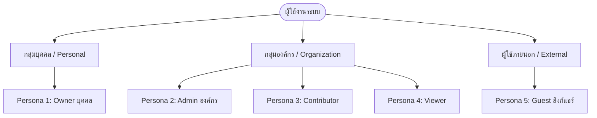
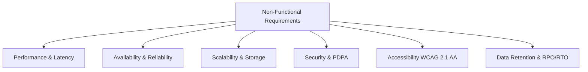
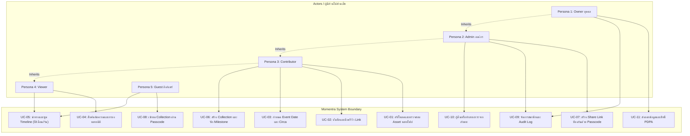
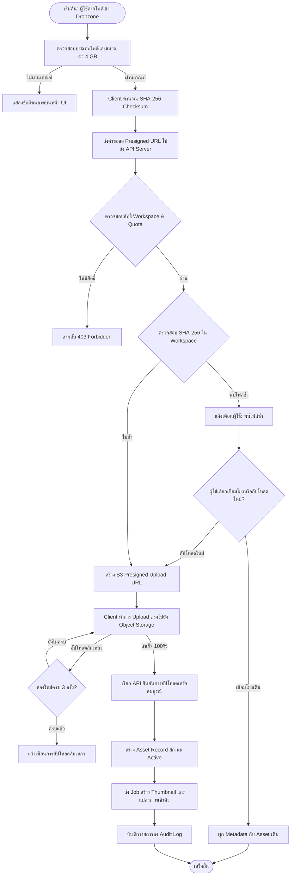
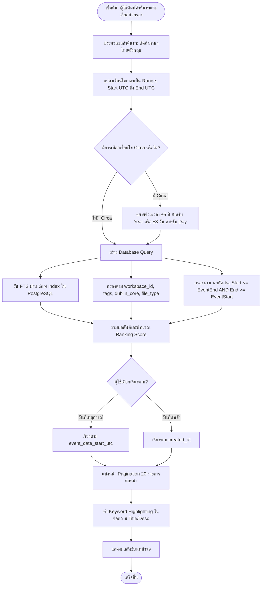
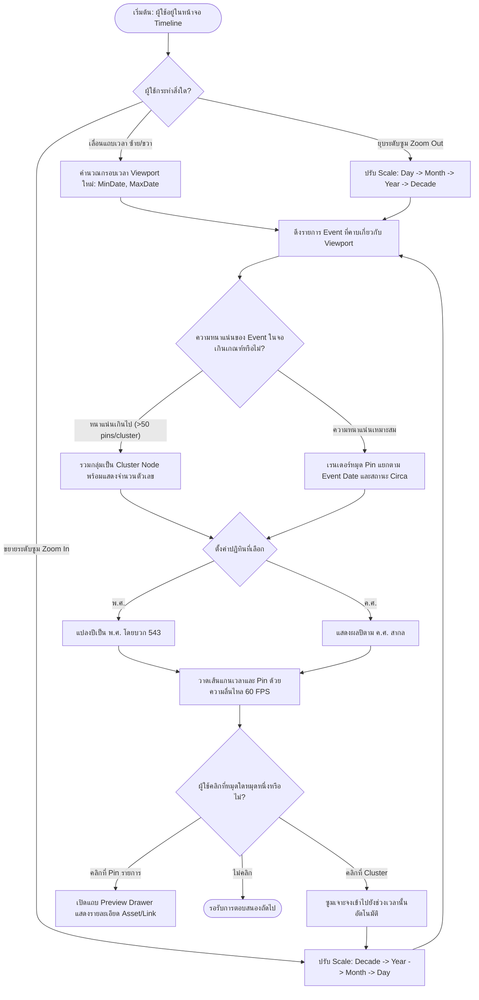

# Software Requirements Specification (SRS)
## โครงการ: Momentra (Historical Digital Asset Management — HDAM)
**รหัสเอกสาร:** MOMENTRA-SRS-01  
**เวอร์ชัน:** 1.0.0 (Baseline for Phase 1)  
**สถานะ:** Approved Baseline  
**บทบาทผู้จัดทำ:** Senior System Analyst / Solution Architect Team  
**วันที่มีผล:** 5 ตุลาคม 2026 (พ.ศ. 2569)  

---

## 1. Executive Summary & Problem Statement

### 1.1 Executive Summary
**Momentra** (เดิมชื่อ HDAM – Historical Digital Asset Management) คือแพลตฟอร์มบริหารจัดการสินทรัพย์ดิจิทัล (Digital Assets), ข้อมูลเชิงประวัติศาสตร์ (Information), และลิงก์อ้างอิง (Web Links) สำหรับบุคคล (Personal Archive) และองค์กร (Organization/Archive Institution) ภายใต้สถาปัตยกรรม Multi-tenant Workspace

หัวใจสำคัญที่สร้างความแตกต่างระหว่าง Momentra กับระบบ Cloud Storage หรือ DAM ทั่วไป คือ **"การผูกโยงทุกอ็อบเจกต์เข้ากับแกนเวลาของเหตุการณ์จริง (Historical Event Timeline)"** ระบบได้รับการออกแบบให้เข้าใจธรรมชาติของบันทึกประวัติศาสตร์ที่มีความไม่แน่นอนของเวลา (Date Imprecision) เช่น "พ.ศ. 2480", "circa พ.ค. 2510", หรือช่วงเหตุการณ์ "2516 - 2519" ควบคู่กับมาตรฐานการรักษาความถูกต้องของข้อมูลดิจิทัล (SHA-256 Checksum Verification), วงจรการเก็บรักษา (Soft-delete & Retention Policy), และการค้นหาที่แม่นยำ

### 1.2 Problem Statement
1. **การสูญหายของบริบทเวลาจริง (Loss of Historical Context):** บริการคลาวด์จัดเก็บไฟล์ทั่วไป (Google Drive, Dropbox, OneDrive) จัดเรียงและค้นหาไฟล์ตาม `created_at` (วันที่อัปโหลดเข้าเซิร์ฟเวอร์) หรือ `modified_at` ของระบบคอมพิวเตอร์ ซึ่งไม่มีความสัมพันธ์กับ "วันที่เหตุการณ์ในภาพหรือเอกสารเกิดขึ้นจริง"
2. **ความไม่สามารถจัดการเวลาที่คลุมเครือ (Inability to Handle Imprecise Dates):** ระบบฐานข้อมูลมาตรฐานบังคับให้ระบุ Datetime แบบเจาะจงระดับวินาที แต่ข้อมูลประวัติศาสตร์มักทราบเพียง "ปี", "เดือน-ปี", หรือ "ช่วงเวลาประมาณ (circa)" ทำให้ผู้บันทึกต้อง "เดาวันที่" ส่งผลให้ข้อมูลคลาดเคลื่อน
3. **ความเสี่ยงด้านความสมบูรณ์และการสูญหายของข้อมูล (Integrity & Data Loss Risks):** ระบบจัดเก็บไฟล์ทั่วไปไม่มีการตรวจสอบ Cryptographic Hash (SHA-256) เพื่อยืนยันว่าไฟล์ไม่ถูกดัดแปลงหรือเสียหาย (Bit rot) และไม่มีการบริหารจัดการ Retention ที่รัดกุมตามกฎหมายคุ้มครองข้อมูลส่วนบุคคล (PDPA)
4. **การขาดระบบสืบค้นแบบหลายมิติที่ผูกกับ Timeline:** ผู้ใช้งานไม่สามารถสืบค้นสินทรัพย์ดิจิทัลแบบเชื่อมโยงระหว่าง "คำค้นหา (Full-text/Metadata)", "ช่วงเวลาของประวัติศาสตร์", และ "หมวดหมู่/คอลเลกชัน" ได้ในหน้าจอเดียว

---

## 2. Stakeholders & Personas

ระบบ Momentra กำหนด Personas หลักไว้ 5 กลุ่ม เพื่อครอบคลุมการใช้งานทั้งบุคคลและองค์กร:

### Persona 1: คุณสมชาย (Individual Owner - เจ้าของคลังข้อมูลส่วนบุคคล/ครอบครัว)
* **บริบท:** อายุ 52 ปี เป็นนักสะสมภาพถ่ายเก่าและประวัติครอบครัว มีไฟล์ภาพสแกน เอกสารที่ดิน และวิดีโอเทปเก่าแปลงเป็นดิจิทัลกว่า 500 GB
* **เป้าหมาย:** บันทึกความทรงจำของตระกูล จัดเรียงภาพตามปี พ.ศ. ที่เกิดเหตุการณ์จริง แม้จำวันที่แน่นอนไม่ได้ และต้องการแชร์อัลบั้มให้ญาติเข้ามาดูโดยไม่เสี่ยงต่อการถูกลบหรือแก้ไข
* **Pain Point:** โฟลเดอร์ในคอมพิวเตอร์เรียงตามวันที่สแกนไฟล์ ทำให้ลำดับเวลาของบรรพบุรุษสลับกันไปหมด

### Persona 2: คุณนงลักษณ์ (Organization Admin - หัวหน้าฝ่ายจดหมายเหตุและสารสนเทศ)
* **บริบท:** อายุ 44 ปี ดูแลหอจดหมายเหตุของสถาบันการศึกษาและพิพิธภัณฑ์ มีผู้ร่วมงานหลายแผนก
* **เป้าหมาย:** บริหารจัดการ Workspace ขององค์กร, กำหนดสิทธิ์ผู้ใช้งาน (RBAC), ตรวจสอบ Audit Log การเข้าถึงและการแก้ไขไฟล์, จัดการโควตาพื้นที่บน Hostinger VPS/Object Storage, และปฏิบัติตาม พ.ร.บ. คุ้มครองข้อมูลส่วนบุคคล (PDPA)
* **Pain Point:** สมาชิกในทีมเคยเผลอลบไฟล์สำคัญ และไม่มีหลักฐานตรวจสอบย้อนหลังว่าใครเป็นผู้กระทำ

### Persona 3: คุณปิติ (Contributor - เจ้าหน้าที่บันทึกข้อมูลและนักวิจัย)
* **บริบท:** อายุ 28 ปี เจ้าหน้าที่ฝ่ายรวบรวมข้อมูล ต้องอัปโหลดไฟล์ครั้งละหลายร้อยไฟล์ต่อวัน ทั้งภาพถ่ายความละเอียดสูง เอกสารจดหมายเหตุ PDF และคลิปเสียงสัมภาษณ์
* **เป้าหมาย:** อัปโหลดไฟล์แบบ Batch (Multi-file Drag-and-Drop) โดยไม่สะดุด, ใส่ Metadata ตามมาตรฐาน Dublin Core ได้อย่างรวดเร็ว, ระบุวันที่เกิดเหตุการณ์แบบช่วงปีหรือ circa ได้, และบันทึกลิงก์ข่าวออนไลน์พร้อมรูปพรีวิวอัตโนมัติ
* **Pain Point:** การอัปโหลดไฟล์ขนาดใหญ่ผ่านหน้าเว็บมักล่มกลางคัน และการต้องมากรอกวันที่แบบระบุวัน/เดือนทั้งที่รู้แค่ปีทำให้เสียเวลาและได้ข้อมูลเท็จ

### Persona 4: คุณอรอนงค์ (Viewer - สมาชิกฝ่ายวิชาการ/ผู้สืบค้น)
* **บริบท:** อายุ 35 ปี นักวิจัยที่ต้องการค้นหาหลักฐานทางประวัติศาสตร์เพื่อเขียนบทความทางวิชาการ
* **เป้าหมาย:** ค้นหาข้อมูลแบบ Full-Text ทั้งภาษาไทยและอังกฤษ, คัดกรองตามช่วงเวลา (เช่น ทศวรรษ 2510 - 2520), ดูการจัดเรียงบน Timeline ที่ซูมดูระดับทศวรรษ ปี เดือน หรือวันได้, และ Export รายการอ้างอิงเป็น CSV/JSON
* **Pain Point:** ระบบค้นหาทั่วไปไม่ตัดคำภาษาไทย และไม่สามารถกรองเฉพาะเหตุการณ์ที่เกิดขึ้นในช่วงปีที่ต้องการศึกษาได้

### Persona 5: คุณไมเคิล (Guest - ผู้รับลิงก์แชร์ภายนอก)
* **บริบท:** นักวิจัยอิสระภายนอกองค์กร ได้รับลิงก์นิทรรศการดิจิทัลจากคุณนงลักษณ์
* **เป้าหมาย:** เข้าถึงและเปิดดูเนื้อหาใน Collection ที่ได้รับอนุญาตผ่านเว็บบราวเซอร์ได้ทันทีโดยไม่ต้องลงทะเบียนเป็นสมาชิก แต่ต้องปลอดภัยด้วย Passcode และมีวันหมดอายุของลิงก์ตามที่กำหนด
* **Pain Point:** ไม่อยากสมัครสมาชิกหลายขั้นตอนเพียงเพื่อเข้าไปเปิดดูเอกสารประวัติศาสตร์ชุดเดียว

---

## 3. Scope: In-scope / Out-of-scope / MVP vs Phase 2

| มิติการทำงาน (Feature Area) | MVP (Phase 1) - In Scope | Phase 2 - Future Roadmap |
| :--- | :--- | :--- |
| **Multi-Tenancy & Auth** | Workspace-based Isolation, RBAC (Owner, Admin, Contributor, Viewer), Session/JWT Auth | SSO (SAML 2.0 / OIDC), Enterprise SCIM User Provisioning |
| **Asset Ingestion** | Direct-to-Storage Presigned Upload, Batch Upload (สูงสุด 50 ไฟล์พร้อมกัน), SHA-256 Client-side & Server Verification | On-the-fly Video Transcoding, Automated Audio Waveform Extraction |
| **Link & Info Ingestion** | บันทึก URL, ดึง OpenGraph Metadata (Title, Desc, Image, Favicon) อัตโนมัติ, บันทึก Rich Text Notes | Web Archive Snapshot (บันทึก HTML/MHTML เต็มรูปแบบป้องกันเว็บปลายทางลบ) |
| **Timeline Engine** | `event_date` รองรับ 4 ระดับความแม่นยำ (`year`, `month`, `day`, `datetime`), ช่วงเวลา (`start_date`, `end_date`), แฟล็ก `is_circa`, ซูม Timeline (ทศวรรษ, ปี, เดือน, วัน), สลับมุมมอง พ.ศ./ค.ศ. | 3D Interactive Timeline, Geospatial Map Layer (GIS/Map Integration) |
| **Search Engine** | Level 1: PostgreSQL Full-Text Search (ตัดคำไทย/อังกฤษ), Faceted Filter (ช่วงเวลา, แท็ก, ชนิดไฟล์, Dublin Core) | Level 2: Semantic / Vector Search (Embeddings), Natural Language Q&A |
| **AI / Multimodal** | *Out of Scope สำหรับ Phase 1* | Level 3: Optical Character Recognition (OCR) สแกนเอกสารไทย/อังกฤษ, Speech-to-Text |
| **Security & Compliance** | Soft Delete (30 วัน Grace Period), Immutable Audit Trail, Protected Share Link (Passcode + Expiry), PDPA Data Export | Automated PII Redaction ในรูปภาพและเอกสาร, Hardware Security Module (HSM) |
| **Export & Reporting** | Export Metadata เป็น CSV/JSON, ดาวน์โหลด Asset เป็น ZIP Archive | Automated Archival PDF Generation, Dublin Core XML Export (OAI-PMH) |

---

## 4. Functional Requirements (แบ่งตาม 7 โมดูลหลัก)

### 4.1 โมดูลสินทรัพย์ดิจิทัล (FR-ASSET)

#### FR-ASSET-01: Multi-file Ingestion & Direct Storage Upload
* **คำอธิบาย:** ระบบต้องรองรับการเลือกและอัปโหลดไฟล์ดิจิทัลพร้อมกันได้สูงสุด 50 ไฟล์ต่อครั้ง (รองรับรูปภาพ JPG/PNG/TIFF/WEBP, เอกสาร PDF/DOCX, เสียง MP3/WAV, วิดีโอ MP4/MOV) ขนาดไฟล์สูงสุด 4 GB ต่อไฟล์ ผ่านสถาปัตยกรรม Direct-to-Storage Presigned URL
* **Priority (MoSCoW):** Must Have
* **Acceptance Criteria:**
  * **Given** ผู้ใช้ที่มีบทบาท Contributor หรือสูงกว่าอยู่ในหน้าอัปโหลดของ Workspace
  * **When** ผู้ใช้ทำการ Drag & Drop ไฟล์จำนวน 20 ไฟล์ (รวมขนาด 2.5 GB) เข้าสู่ Dropzone
  * **Then** ระบบต้องสร้าง Presigned Upload URL แยกแต่ละไฟล์, แสดงแถบ Progress Bar ระบุเปอร์เซ็นต์และความเร็วแยกรายไฟล์, อัปโหลดตรงไปยัง S3-compatible Storage โดยไม่ทำให้เว็บเซิร์ฟเวอร์หลักเกิดโหลดเกินพิกัด, และแสดงสถานะสำเร็จเมื่อทุกไฟล์อัปโหลดเสร็จสิ้น

#### FR-ASSET-02: Cryptographic Checksum (SHA-256) & Duplicate Detection
* **คำอธิบาย:** ทุก Asset ที่อัปโหลดต้องถูกคำนวณค่า SHA-256 Checksum โดยระบบต้องแจ้งเตือนเมื่อพบไฟล์ที่มี Checksum ซ้ำกันใน Workspace เดียวกัน พร้อมตัวเลือกให้ใช้ไฟล์เดิมหรือบันทึกเป็นสำเนาใหม่
* **Priority (MoSCoW):** Must Have
* **Acceptance Criteria:**
  * **Given** มีไฟล์ `historical_map.png` อยู่ในระบบแล้วด้วย Checksum `e3b0c44298fc1c149afbf4c8996fb92427ae41e4649b934ca495991b7852b855`
  * **When** ผู้ใช้อัปโหลดไฟล์ใหม่ชื่อ `map_copy.png` ซึ่งมีเนื้อหาไบนารีเหมือนกันทุกประการ
  * **Then** ระบบต้องคำนวณได้ค่า SHA-256 เดียวกัน, แสดงข้อความแจ้งเตือน "พบไฟล์ที่ตรงกันในระบบแล้ว (Duplicate Detected)", และให้ผู้ใช้เลือกว่าต้องการ "เชื่อมโยงกับ Asset เดิม" หรือ "ยืนยันการจัดเก็บซ้ำ"

#### FR-ASSET-03: Two-Tier Soft Delete & 30-Day Retention Lifecycle
* **คำอธิบาย:** เมื่อผู้ใช้สั่งลบ Asset ระบบต้องไม่ลบข้อมูลออกจากดิสก์ทันที แต่จะเปลี่ยนสถานะเป็น `soft_deleted` และย้ายเข้าสู่ถังขยะ (Trash) เป็นเวลา 30 วันบริบูรณ์ก่อนจะถูกทำลายถาวร (Hard Delete)
* **Priority (MoSCoW):** Must Have
* **Acceptance Criteria:**
  * **Given** Asset รหัส `AST-1001` อยู่ในสถานะ Active
  * **When** ผู้ใช้กดปุ่ม "ลบ Asset" และยืนยันการทำรายการ
  * **Then** ระบบต้องอัปเดต `deleted_at = NOW()` และ `status = 'TRASHED'`, Asset นั้นต้องไม่ปรากฏในหน้าค้นหาหรือ Timeline ปกติ, และระบบจะตั้งเวลา Background Job ให้ทำลายข้อมูลถาวรหลังจากเวลาผ่านไป 30 วัน (720 ชั่วโมง)

#### FR-ASSET-04: Asset Restoration & Manual Purge
* **คำอธิบาย:** เฉพาะผู้ใช้ระดับ Admin หรือ Owner สามารถกู้คืน Asset จากถังขยะ หรือสั่งลบถาวร (Purge) ก่อนครบกำหนด 30 วันได้
* **Priority (MoSCoW):** Must Have
* **Acceptance Criteria:**
  * **Given** ผู้ใช้ที่มีบทบาท Admin เปิดหน้ารายการ "ถังขยะ (Trash)"
  * **When** ผู้ใช้เลือก Asset และคลิก "กู้คืน (Restore)"
  * **Then** ระบบต้องเคลียร์ค่า `deleted_at = NULL`, คืนสถานะ `status = 'ACTIVE'`, และนำ Asset กลับมาแสดงใน Timeline และหน้าค้นหาทันทีภายใน 500 ms

---

### 4.2 โมดูลลิงก์และสารสนเทศภายนอก (FR-LINK)

#### FR-LINK-01: Link Submission & URL Validation
* **คำอธิบาย:** ระบบต้องรองรับการบันทึก URL ปลายทาง พร้อมตรวจสอบความถูกต้องของรูปแบบ URL (Scheme: HTTP/HTTPS) และ Domain Syntax
* **Priority (MoSCoW):** Must Have
* **Acceptance Criteria:**
  * **Given** ผู้ใช้อยู่ในฟอร์ม "เพิ่มลิงก์ข้อมูลใหม่"
  * **When** ผู้ใช้กรอก URL ที่ไม่ถูกต้อง เช่น `htp:/invalid-domain`
  * **Then** ระบบต้องแสดง Validation Error ทันที และไม่อนุญาตให้ส่งคำขอไปยังเซิร์ฟเวอร์

#### FR-LINK-02: OpenGraph Metadata Ingestion & Preview Caching
* **คำอธิบาย:** เมื่อกรอก URL ถูกต้อง ระบบต้องมี Background Worker ดึงข้อมูล OpenGraph/HTML Meta (Title, Description, Image Preview, Favicon, Canonical URL) ภายในเวลาไม่เกิน 5 วินาที และบันทึกเป็น Local Preview Cache
* **Priority (MoSCoW):** Must Have
* **Acceptance Criteria:**
  * **Given** ผู้ใช้กรอก URL บทความประวัติศาสตร์ที่รองรับ OpenGraph
  * **When** ผู้ใช้กดปุ่ม "ดึงข้อมูลตัวอย่าง (Fetch Preview)"
  * **Then** ระบบต้องแสดงชื่อบทความ รายละเอียด ย่อหน้า และรูปหน้าปกในพรีวิวการ์ดโดยอัตโนมัติ โดยผู้ใช้สามารถแก้ไขข้อความ Title และ Description เองได้ก่อนกดบันทึก

#### FR-LINK-03: Broken Link Periodic Health Check
* **คำอธิบาย:** ระบบต้องมี Scheduled Worker ตรวจสอบสถานะการเข้าถึงได้ (HTTP 200 vs 404/500) ของทุกลิงก์ในระบบทุก 7 วัน และติดป้ายเตือน "Link Broken" หากปลายทางไม่ตอบสนอง
* **Priority (MoSCoW):** Should Have
* **Acceptance Criteria:**
  * **Given** ลิงก์ `LNK-501` มี URL ปลายทางที่เซิร์ฟเวอร์ปิดตัวลง (ส่งกลับ HTTP 404)
  * **When** ระบบรัน Periodic Health Check ประจำสัปดาห์
  * **Then** ระบบต้องอัปเดตฟิลด์ `is_broken = true`, บันทึก `last_checked_at`, และแสดงสัญลักษณ์เตือนสีส้มบนหน้าจอเพื่อให้ผู้ดูแลตรวจสอบ

---

### 4.3 โมดูลเมทาดาทาและมาตรฐานจดหมายเหตุ (FR-META)

#### FR-META-01: Dublin Core 15 Standard Elements
* **คำอธิบาย:** Asset และ Link ทุกชิ้นต้องรองรับการบันทึก Metadata ตามมาตรฐาน Dublin Core 15 Elements ได้แก่: Title, Creator, Subject, Description, Publisher, Contributor, Date, Type, Format, Identifier, Source, Language, Relation, Coverage, Rights
* **Priority (MoSCoW):** Must Have
* **Acceptance Criteria:**
  * **Given** ผู้ใช้เปิดหน้าจัดการ Metadata ของ Asset
  * **When** ผู้ใช้กรอกข้อมูล Creator: "ศาสตราจารย์ ดร. ปรีดี", Subject: "การปฏิรูปการปกครอง", Language: "tha"
  * **Then** ระบบต้องบันทึกค่าลงในคอลัมน์ Metadata แบบ Structured JSON/Relational Schema พร้อมรองรับการนำไปใช้ทำ Faceted Filter

#### FR-META-02: Flexible Tagging System
* **คำอธิบาย:** ระบบต้องรองรับการกำหนด Tag แบบอิสระ (Free-text Tags) ร่วมกับระบบ Autocomplete เพื่อป้องกันการพิมพ์ซ้ำหรือสะกดผิด
* **Priority (MoSCoW):** Must Have
* **Acceptance Criteria:**
  * **Given** ในระบบมี Tag ชื่อ "สงครามโลกครั้งที่สอง" อยู่แล้ว
  * **When** ผู้ใช้เริ่มพิมพ์ "สงคราม" ในช่องเพิ่มแท็ก
  * **Then** ระบบต้องแสดง Suggestion Dropdown แนะนำแท็กที่มีอยู่เดิมภายใน 100 ms เพื่อให้คลิกเลือกได้ทันที

---

### 4.4 โมดูลประวัติศาสตร์และไทม์ไลน์ (FR-TIMELINE)

#### FR-TIMELINE-01: Imprecise Event Date Specification
* **คำอธิบาย:** ผู้ใช้ต้องสามารถระบุ `event_date` โดยเลือกความแม่นยำ (`date_precision`) ได้ 4 ระดับ: `year` (ระบุแค่ปี), `month` (ระบุเดือนและปี), `day` (ระบุวัน เดือน ปี), หรือ `datetime` (ระบุเวลาชั่วโมง/นาที) โดยระบบต้องแยกฟิลด์นี้ออกจาก `created_at` อย่างเด็ดขาด
* **Priority (MoSCoW):** Must Have
* **Acceptance Criteria:**
  * **Given** บันทึกเหตุการณ์ที่ทราบเพียงปี พ.ศ. 2500
  * **When** ผู้ใช้เลือก `date_precision = 'year'` และกรอกปี ค.ศ. 1957 (พ.ศ. 2500)
  * **Then** ระบบต้องยอมรับการบันทึกโดยไม่บังคับให้เลือกวันและเดือน, คำนวณ `event_date_start_utc = '1957-01-01T00:00:00Z'` และ `event_date_end_utc = '1957-12-31T23:59:59Z'` สำหรับการทำ Range Indexing ในฐานข้อมูล

#### FR-TIMELINE-02: Circa Flag & Date Range Modeling
* **คำอธิบาย:** ระบบต้องรองรับการกำหนดแฟล็ก `is_circa` (ระบุว่าเวลาเป็นค่าประมาณ) และรองรับเหตุการณ์ที่เป็นช่วงเวลา (`start_date` ถึง `end_date`)
* **Priority (MoSCoW):** Must Have
* **Acceptance Criteria:**
  * **Given** ผู้ใช้มีภาพถ่ายโบราณที่ประเมินว่าถ่ายช่วง "ประมาณปี 2470 - 2475"
  * **When** ผู้ใช้เปิดสวิตช์ `is_circa = true`, กำหนด `start_year = 1927`, `end_year = 1932`
  * **Then** ระบบต้องบันทึกเป็น Event Interval, แสดงผลในหน้าจอว่า "circa พ.ศ. 2470 – 2475", และจัดวางช่วงความกว้างบนแกน Timeline ครอบคลุมทั้ง 5 ปี

#### FR-TIMELINE-03: Multi-Scale Zoomable Timeline View
* **คำอธิบาย:** หน้าจอแสดงผล Timeline ต้องรองรับการปรับขยายมุมมอง (Zoom Level) ได้อย่างน้อย 4 ระดับ: ระดับศตวรรษ/ทศวรรษ (Decade), ระดับปี (Year), ระดับเดือน (Month), และระดับวัน (Day)
* **Priority (MoSCoW):** Must Have
* **Acceptance Criteria:**
  * **Given** ผู้ใช้อยู่ในมุมมอง Timeline ระดับทศวรรษ (แสดงช่วงปี 2500 - 2510)
  * **When** ผู้ใช้ทำการ Double-click หรือเลื่อนสไลเดอร์ซูมเข้าไปที่ปี 2505
  * **Then** Timeline ต้อง Transition ขยายสเกลแสดงแกนเวลา 12 เดือนของปี 2505 พร้อมปรับตำแหน่ง Pin ของเหตุการณ์และจัดกลุ่ม (Cluster) ข้อมูลภายในเวลาไม่เกิน 500 ms

#### FR-TIMELINE-04: Dual Calendar Display (พ.ศ. / ค.ศ.)
* **คำอธิบาย:** ระบบต้องเก็บข้อมูลในฐานข้อมูลเป็น คริสต์ศักราช (ค.ศ./UTC) เสมอ แต่ต้องรองรับการสลับมุมมองระหว่าง "พุทธศักราช (พ.ศ.)" และ "คริสต์ศักราช (ค.ศ.)" ได้ที่ UI ด้วยคลิกเดียว
* **Priority (MoSCoW):** Must Have
* **Acceptance Criteria:**
  * **Given** ระบบเก็บวันที่ `1932-06-24` ในฐานข้อมูล
  * **When** ผู้ใช้คลิกปุ่มสลับภาษา/ปฏิทินเป็น "ไทย (พ.ศ.)"
  * **Then** วันที่บนการ์ดและ Timeline ต้องเปลี่ยนการแสดงผลเป็น "24 มิถุนายน 2475" อย่างถูกต้องแม่นยำ (สูตร: ปี ค.ศ. + 543)

---

### 4.5 โมดูลการสืบค้น (FR-SEARCH)

#### FR-SEARCH-01: Bilingual Full-Text Search (FTS)
* **คำอธิบาย:** ระบบต้องรองรับการค้นหาข้อความภาษาไทยและภาษาอังกฤษครอบคลุม Title, Description, Dublin Core, และ Tags โดยรองรับการตัดคำภาษาไทยอย่างถูกต้อง
* **Priority (MoSCoW):** Must Have
* **Acceptance Criteria:**
  * **Given** ในฐานข้อมูลมีบันทึกที่มีคำว่า "การปฏิวัติสยาม" และ "รัฐธรรมนูญฉบับแรก"
  * **When** ผู้ใช้พิมพ์ค้นหาคำว่า "ปฏิวัติ"
  * **Then** ระบบต้องส่งผลลัพธ์รายการที่มีคำว่า "การปฏิวัติสยาม" กลับมาแสดงผลภายในเวลาไม่เกิน 800 ms ที่ขนาดข้อมูล 1,000,000 รายการ

#### FR-SEARCH-02: Multi-Dimensional Faceted Filtering
* **คำอธิบาย:** ผู้ใช้ต้องสามารถกรองผลการค้นหาพร้อมกันหลายมิติ ได้แก่: ช่วงเวลาเหตุการณ์ (`event_date_start` ถึง `event_date_end`), ประเภท Asset (Image, PDF, Video, Audio, Link), Tags, และ Collection
* **Priority (MoSCoW):** Must Have
* **Acceptance Criteria:**
  * **Given** ผู้ใช้ค้นหาคำว่า "แผนที่"
  * **When** ผู้ใช้ติ๊กเลือก Filter: ประเภท = "Image", ช่วงเวลา = "2450 - 2500", Tag = "กรุงเทพมหานคร"
  * **Then** ระบบต้องประมวลผลคำสั่ง Query รวมเงื่อนไขทั้งหมด และคืนรายการเฉพาะภาพแผนที่กรุงเทพฯ ที่เกิดขึ้นระหว่างปี 2450 ถึง 2500 เท่านั้น

#### FR-SEARCH-03: Result Highlighting & Sorting
* **คำอธิบาย:** ระบบต้องเน้นข้อความคำค้นหา (Keyword Highlighting) และอนุญาตให้ผู้ใช้เลือกการเรียงลำดับผลลัพธ์ได้ตาม: วันที่เหตุการณ์จริง (เก่าสุดไปใหม่สุด / ใหม่สุดไปเก่าสุด) หรือ วันที่นำเข้าระบบ (`created_at`)
* **Priority (MoSCoW):** Should Have
* **Acceptance Criteria:**
  * **Given** ผลการค้นหาแสดงบนหน้าจอ
  * **When** ผู้ใช้เลือก Sort By = "Event Date (Oldest First)"
  * **Then** รายการต้องถูกจัดเรียงตาม `event_date_start_utc` จากอดีตที่สุดขึ้นมาก่อน โดยคำค้นหาที่ตรงกันต้องแสดงแถบไฮไลต์สีเหลืองเด่นชัด

---

### 4.6 โมดูลการจัดการสิทธิ์และคอลเลกชัน (FR-ACCESS)

#### FR-ACCESS-01: Multi-tenant Workspace Isolation
* **คำอธิบาย:** ระบบต้องแยกข้อมูลระหว่างแต่ละ Workspace อย่างเด็ดขาดผ่าน `workspace_id` ในทุกตารางหลัก และบังคับตรวจสิทธิ์ในระดับ API Middleware และ Row-Level Security (RLS)
* **Priority (MoSCoW):** Must Have
* **Acceptance Criteria:**
  * **Given** ผู้ใช้ A อยู่ใน Workspace 1 และไม่มีสิทธิ์ใน Workspace 2
  * **When** ผู้ใช้ A พยายามส่งคำขอ API `GET /api/v1/assets/AST-999` ซึ่งเป็นของ Workspace 2
  * **Then** ระบบต้องปฏิเสธคำขอและส่งกลับ HTTP Status Code `403 Forbidden` หรือ `404 Not Found` โดยไม่เปิดเผยข้อมูลใดๆ ของ Workspace 2 ออกไป

#### FR-ACCESS-02: Role-Based Access Control (RBAC)
* **คำอธิบาย:** ระบบต้องกำหนดสิทธิ์ผู้ใช้งานภายใน Workspace ออกเป็น 4 ระดับ: Owner, Admin, Contributor, Viewer
* **Priority (MoSCoW):** Must Have
* **Matrix สิทธิ์:**
  | ความสามารถ (Capability) | Owner | Admin | Contributor | Viewer | Guest Link |
  | :--- | :---: | :---: | :---: | :---: | :---: |
  | จัดการสมาชิกและลบ Workspace | Yes | No | No | No | No |
  | ดู Audit Log / คืนค่าจากถังขยะ | Yes | Yes | No | No | No |
  | อัปโหลด / แก้ไข Asset และ Link | Yes | Yes | Yes | No | No |
  | ค้นหาและดู Timeline ใน Workspace | Yes | Yes | Yes | Yes | No |
  | ดูเฉพาะ Collection ที่แชร์ให้ | Yes | Yes | Yes | Yes | Yes |

#### FR-ACCESS-03: Curated Collections & Milestones
* **คำอธิบาย:** ผู้ใช้ระดับ Contributor ขึ้นไปสามารถรวมกลุ่ม Asset และ Link เข้าเป็น "Collection" เฉพาะกิจ และสามารถปักหมุดเหตุการณ์สำคัญให้เป็น "Milestone" เด่นบน Timeline ได้
* **Priority (MoSCoW):** Must Have
* **Acceptance Criteria:**
  * **Given** ผู้ใช้เลือก Asset จำนวน 15 รายการ
  * **When** ผู้ใช้คลิก "สร้าง Collection" ตั้งชื่อว่า "จดหมายเหตุ 2475"
  * **Then** ระบบต้องสร้าง Collection ใหม่ และผูกโยงรายการทั้ง 15 รายการเข้าด้วยกัน โดยไม่ทำสำเนาไฟล์ไบนารีซ้ำซ้อน

#### FR-ACCESS-04: Secure Expirable Sharing Link with Passcode
* **คำอธิบาย:** ระบบต้องรองรับการสร้างลิงก์สาธารณะสำหรับแชร์ Collection โดยสามารถกำหนดรหัสผ่าน (Passcode) และวันหมดอายุ (Expiration Date) ได้
* **Priority (MoSCoW):** Must Have
* **Acceptance Criteria:**
  * **Given** Admin ต้องการแชร์ Collection ให้ผู้เชี่ยวชาญภายนอก
  * **When** Admin สั่งสร้าง Share Link กำหนด Passcode "Mmt@2026" และหมดอายุใน 7 วัน
  * **Then** ผู้รับลิงก์เมื่อเปิด URL จะต้องกรอก Passcode ให้ถูกต้องจึงจะสามารถดูเนื้อหาได้ และเมื่อพ้นกำหนด 7 วัน ลิงก์ดังกล่าวจะเข้าถึงไม่ได้ทันที

---

### 4.7 โมดูลการตรวจสอบและการปฏิบัติตามกฎหมาย (FR-AUDIT)

#### FR-AUDIT-01: Immutable Audit Trail
* **คำอธิบาย:** ทุกการกระทำที่สำคัญ (Create, Read, Update, Delete, Export, Share, Login) ต้องถูกบันทึกลงใน Audit Log ที่ไม่สามารถแก้ไขหรือลบได้ (Append-only)
* **Priority (MoSCoW):** Must Have
* **Acceptance Criteria:**
  * **Given** สมาชิกในระบบทำการแก้ไขวันที่ของ Asset
  * **When** การแก้ไขเสร็จสมบูรณ์
  * **Then** ระบบต้องบันทึก Record ลงใน Audit Table ระบุ: `actor_id`, `action`, `resource_type`, `resource_id`, `before_state`, `after_state`, `ip_address`, `user_agent`, `timestamp_utc`

#### FR-AUDIT-02: Comprehensive Data & Metadata Export
* **คำอธิบาย:** ผู้ใช้ระดับ Admin ขึ้นไปต้องสามารถสั่ง Export ข้อมูล Metadata เป็น CSV/JSON และสั่งดาวน์โหลดไฟล์ Asset ดั้งเดิมทั้งหมดเป็น ZIP Archive ได้
* **Priority (MoSCoW):** Must Have
* **Acceptance Criteria:**
  * **Given** Admin อยู่ในหน้าตั้งค่า Workspace
  * **When** Admin สั่ง "Export All Metadata (JSON)"
  * **Then** ระบบต้องประมวลผลและสร้างไฟล์ JSON มาตรฐานให้ดาวน์โหลดเสร็จสิ้นภายใน 15 วินาที สำหรับข้อมูล 10,000 รายการ

#### FR-AUDIT-03: PDPA Compliance Actions (Right to Erasure & Access)
* **คำอธิบาย:** ระบบต้องมีกระบวนการรองรับสิทธิของเจ้าของข้อมูลส่วนบุคคล (Data Subject Rights) ตามกฎหมาย PDPA รวมถึงสิทธิ์ในการขอรับข้อมูล และสิทธิ์ในการขอให้ลบข้อมูลส่วนบุคคล (Right to be Forgotten)
* **Priority (MoSCoW):** Must Have
* **Acceptance Criteria:**
  * **Given** ผู้ใช้งานยื่นคำร้องขอลบบัญชีและข้อมูลส่วนบุคคล
  * **When** ระบบดำเนินการคำร้อง
  * **Then** ข้อมูล PII ทั้งหมดของผู้ใช้ต้องถูก Anonymize/Hard Delete ออกจากระบบภายใน 30 วันตามกรอบเวลาของกฎหมาย

---

## 5. User Stories (26 เรื่อง ครอบคลุมทุกมิติ)

### หมวดการจัดการ Asset และ Ingestion
1. **US-01 (Multi-file Upload):** As a Contributor, I want to drag and drop up to 50 files simultaneously so that I can ingest historical archives in bulk without repeating the upload process manually.
2. **US-02 (Upload Progress & Cancellation):** As a Contributor, I want to see real-time progress bars for each uploading file and have the option to pause or cancel individual files so that I can manage large uploads effectively.
3. **US-03 (Checksum Deduplication):** As a Contributor, I want the system to alert me if an uploaded file matches an existing SHA-256 hash in the workspace so that I don't waste storage space or create confusing duplicate records.
4. **US-04 (Asset Preview):** As a Viewer, I want to preview high-resolution images, stream audio, and read PDFs directly in the browser so that I don't have to download large files to my local machine just to view them.
5. **US-05 (Asset Soft Delete):** As a Contributor, I want to move obsolete assets to the Trash with a 30-day recovery window so that accidental deletions can be safely reversed.
6. **US-06 (Trash Purge & Restore):** As an Organization Admin, I want to view all items in the Trash and restore them or immediately purge them so that I maintain full control over our organization's digital assets.

### หมวดการจัดการลิงก์และข้อมูลภายนอก
7. **US-07 (Link Ingestion with OpenGraph):** As a Contributor, I want to paste a web URL and have the system automatically fetch its title, description, and preview image so that I can catalog online historical references with minimal manual typing.
8. **US-08 (Broken Link Alert):** As an Organization Admin, I want to receive alerts or see indicators on broken external URLs so that I can update or archive dead reference links.
9. **US-09 (Rich-text Historical Context):** As a Contributor, I want to attach rich-text notes and citations to an ingested link or asset so that researchers understand the historical significance and provenance of the material.

### หมวดเวลาประวัติศาสตร์และ Timeline
10. **US-10 (Imprecise Year-only Date):** As a Contributor, I want to record an event date specifying only the year (e.g., 2480 B.E. / 1937 C.E.) so that I am not forced to invent an arbitrary month and day for historical records.
11. **US-11 (Circa Uncertainty Flag):** As a Contributor, I want to mark an event date as "circa" (approximate) with an uncertainty buffer so that viewers clearly understand the date is an estimation.
12. **US-12 (Historical Date Range):** As a Contributor, I want to enter an event spanning a date range (e.g., World War II in Southeast Asia from 1941 to 1945) so that the asset represents an ongoing era rather than a single point in time.
13. **US-13 (Zoomable Timeline):** As a Viewer, I want to smoothly zoom the timeline view between Decades, Years, Months, and Days so that I can explore historical events from both macro and micro perspectives.
14. **US-14 (Dual Calendar Toggle):** As a Viewer, I want to toggle the timeline display between Buddhist Era (พ.ศ.) and Common Era (ค.ศ.) with a single click so that I can read the dates in my preferred cultural standard.
15. **US-15 (Milestone Pinning):** As an Organization Admin, I want to designate major historical events as "Milestones" on the timeline so that critical turning points stand out visually from regular assets.

### หมวดการค้นหาและคัดกรอง
16. **US-16 (Thai Full-Text Search):** As a Viewer, I want to search in Thai natural language and find assets containing those terms even within compound words so that I can locate historical references without missing relevant records.
17. **US-17 (Date Range Filter):** As a Viewer, I want to filter assets that took place between two specific historical dates regardless of their date precision so that I can research a focused time period.
18. **US-18 (Faceted Metadata Search):** As a Viewer, I want to narrow search results simultaneously by format, creator, tags, and workspace collection so that I can quickly pinpoint the exact archive I need.
19. **US-19 (Search Result Sorting):** As a Viewer, I want to sort search results chronologically by historical event date (earliest to latest) or by recording date so that I can examine the evolution of events in proper sequence.

### หมวดคอลเลกชัน การจัดกลุ่ม และการแชร์
20. **US-20 (Curate Collection):** As a Contributor, I want to group assets and links into curated thematic collections (e.g., "The Constitutional Transition") so that researchers can view a coherent body of work.
21. **US-21 (Passcode-Protected Share Link):** As an Organization Admin, I want to share a collection via a public URL protected by a passcode and expiration date so that authorized external partners can view it securely.
22. **US-22 (Guest Collection Viewing):** As a Guest, I want to access a shared collection link, enter the passcode, and browse the assets on a timeline without creating an account so that my access experience is frictionless.

### หมวด Multi-tenancy การจัดการสิทธิ์ และความปลอดภัย
23. **US-23 (Workspace Switching):** As an Individual Owner who is also a Contributor in an institutional archive, I want to switch between my Personal Workspace and Organization Workspace from a single account so that my personal and work collections remain completely separate.
24. **US-24 (Role Assignment):** As an Organization Admin, I want to invite team members via email and assign them specific roles (Admin, Contributor, Viewer) so that our archive enforces the principle of least privilege.
25. **US-25 (Audit Log Inspection):** As an Organization Admin, I want to view an immutable audit log of all file uploads, modifications, downloads, and deletions so that we comply with institutional compliance standards.
26. **US-26 (Archive Export & Backup):** As an Owner, I want to export all workspace metadata as JSON/CSV and download a ZIP of all original binary assets so that our archive is never locked into a single vendor and can be backed up offline.

---

## 6. Non-Functional Requirements (NFRs พร้อมตัวเลขวัดผลได้)

### 6.1 Performance (ประสิทธิภาพและการตอบสนอง)
* **NFR-PERF-01 (Search Latency):** การค้นหาแบบ Full-Text Search พร้อม Faceted Filter ในคลังข้อมูลขนาด **1,000,000 รายการ** ต้องส่งมอบผลลัพธ์หน้าแรก (20 รายการ) ภายในเวลา **น้อยกว่า 800 มิลลิวินาที** (P95 Latency < 1.0 วินาที)
* **NFR-PERF-02 (Timeline Rendering):** การเรนเดอร์และจัดกลุ่ม Node บนหน้าจอ Timeline สำหรับเหตุการณ์ไม่เกิน **500 Nodes ต่อ Viewport** ต้องใช้เวลาเรนเดอร์บน Browser **ไม่เกิน 500 มิลลิวินาที** ที่ความเร็วเฟรมเรตไม่ต่ำกว่า 55 FPS
* **NFR-PERF-03 (API Response Time):** API Endpoint ทั่วไป (CRUD สำหรับ Metadata และข้อมูล Workspace) ต้องมีค่าตอบสนองเฉลี่ย (P95) **ไม่เกิน 300 มิลลิวินาที** ภายใต้โหลดปกติ
* **NFR-PERF-04 (Asset Ingestion Throughput):** การสร้าง Presigned URL และลงทะเบียน Metadata ต้องใช้เวลา **ไม่เกิน 200 มิลลิวินาทีต่อไฟล์** โดยความเร็วในการอัปโหลดไฟล์ขนาดใหญ่ (สูงสุด 4 GB) ขึ้นอยู่กับ Bandwidth ของ Client และ Object Storage โดยไม่ผ่าน CPU/RAM ของ Hostinger VPS

### 6.2 Availability & Reliability (ความพร้อมใช้งานและความเสถียร)
* **NFR-AVAIL-01 (Uptime SLA):** ระบบต้องมีความพร้อมใช้งาน (System Availability) ไม่ต่ำกว่า **99.9% ต่อเดือน** (ยอมรับ Unplanned Downtime ได้ไม่เกิน 43.8 นาทีต่อเดือน)
* **NFR-AVAIL-02 (Fault Tolerance):** หาก Background Worker ล่มหรือบริการดึง OpenGraph ภายนอกไม่ตอบสนอง ระบบหลักต้องไม่หยุดชะงัก (Graceful Degradation) โดยสามารถบันทึก URL ไว้ก่อนและจัดคิวทำ Retry แบบ Exponential Backoff

### 6.3 Scalability (การขยายตัวของระบบ)
* **NFR-SCALE-01 (Concurrent Users):** สถาปัตยกรรม Modular Monolith บน Hostinger VPS ต้องรองรับ Concurrent Users พร้อมกันอย่างน้อย **1,000 Concurrent Active Users** โดยใช้การบริหาร Connection Pooling (pgBouncer / Prisma connection limits)
* **NFR-SCALE-02 (Storage Capacity):** สถาปัตยกรรมระบบต้องรองรับปริมาณข้อมูลเริ่มต้น **5 TB** และสามารถขยายตัว (Scale out) สู่ **50 TB** ในปีถัดไปได้อย่างไร้รอยต่อ ผ่านการต่อขยาย S3-compatible Object Storage

### 6.4 Security & Privacy (ความปลอดภัยและการคุ้มครองข้อมูล)
* **NFR-SEC-01 (Encryption):** 
  * ข้อมูลระหว่างการรับส่ง (Data in Transit) ต้องเข้ารหัสด้วยโปรโตคอล **TLS 1.3** เท่านั้น
  * ข้อมูลและไฟล์ที่จัดเก็บบนดิสก์ (Data at Rest) ต้องเข้ารหัสด้วยอัลกอริทึม **AES-256**
* **NFR-SEC-02 (Multi-tenant Isolation):** ต้องป้องกัน Data Leakage ข้าม Workspace 100% โดยทุก Database Query ต้องมีเงื่อนไข `workspace_id` กำกับ พร้อมบังคับใช้ **PostgreSQL Row-Level Security (RLS)** เป็นด่านป้องกันสองชั้น
* **NFR-SEC-03 (Cryptographic Integrity):** ทุก Asset ต้องจัดเก็บค่า **SHA-256 Checksum** ความยาว 64 ตัวอักษร และมีระบบตรวจสอบ Integrity Verification เป็นระยะเพื่อป้องกันการถูกแก้ไขหรือการเน่าเสียของข้อมูลดิจิทัล (Silent Bit Rot)
* **NFR-SEC-04 (Brute Force Protection):** การเข้าถึง Share Link ที่มี Passcode ต้องจำกัดอัตราการลองรหัส (Rate Limiting) สูงสุด **5 ครั้งต่อ 15 นาทีต่อ 1 IP Address** มิฉะนั้นจะถูกบล็อกชั่วคราว

### 6.5 PDPA & Compliance (การปฏิบัติตามกฎหมายคุ้มครองข้อมูลส่วนบุคคล)
* **NFR-PDPA-01 (Right to Access & Portability):** ระบบต้องสามารถสร้างไฟล์ส่งออกข้อมูลส่วนบุคคล (Machine-readable JSON/CSV) ให้แก่ผู้ร้องขอได้ภายในเวลา **ไม่เกิน 15 วินาที** สำหรับข้อมูล 10,000 รายการ
* **NFR-PDPA-02 (Right to Erasure / Retention):** เมื่อผู้ใช้ร้องขอลบข้อมูล ข้อมูลต้องถูกตัดสิทธิ์การเข้าถึงทันทีและทำลายถาวร (Secure Shredding) ภายใน **ไม่เกิน 30 วัน**
* **NFR-PDPA-03 (Consent & Audit Immutability):** บันทึกความยินยอมและ Audit Log ต้องเป็นแบบ Append-only ไม่สามารถแก้ไขย้อนหลังได้ และจัดเก็บไว้อย่างน้อย **365 วัน** ตามข้อกำหนดทางกฎหมาย

### 6.6 Accessibility (การเข้าถึงสำหรับทุกคน)
* **NFR-ACC-01 (WCAG 2.1 Level AA):** ส่วนติดต่อผู้ใช้งาน (UI) ทั้งหมดต้องผ่านเกณฑ์มาตรฐาน **WCAG 2.1 ระดับ AA**:
  * อัตราส่วนคอนทราสต์ของสีข้อความกับพื้นหลัง (Color Contrast Ratio) ต้อง **ไม่น้อยกว่า 4.5:1** สำหรับข้อความปกติ และ **3.0:1** สำหรับข้อความขนาดใหญ่
  * ทุกฟังก์ชันบน Timeline และ Dropzone ต้องสามารถควบคุมได้ผ่าน **Keyboard Navigation 100%** (Tab, Shift+Tab, Enter, Escape, Arrow Keys)
  * รูปภาพและสัญลักษณ์ต้องมี `alt` text และ ARIA labels ที่อ่านได้ด้วย Screen Reader ทั้งภาษาไทยและอังกฤษ

### 6.7 Data Retention & Backup (RPO & RTO)
* **NFR-BCP-01 (Recovery Point Objective - RPO):** จุดสูญหายของข้อมูลที่ยอมรับได้ (RPO) ต้อง **น้อยกว่าหรือเท่ากับ 1 ชั่วโมง** ผ่านระบบ PostgreSQL Write-Ahead Logging (WAL) ร่วมกับ Snapshot สำรองข้อมูลรายชั่วโมง
* **NFR-BCP-02 (Recovery Time Objective - RTO):** ระยะเวลาในการกู้คืนระบบกลับสู่สภาวะปกติ (RTO) ในกรณีเกิดภัยพิบัติเซิร์ฟเวอร์ล่ม ต้อง **ไม่เกิน 4 ชั่วโมง** โดยมี Automated Infrastructure Scripts และ Backup Restoration Pipeline

---

## 7. Business Rules และ Domain Glossary

### 7.1 Business Rules (กฎเกณฑ์ทางธุรกิจที่ห้ามละเมิด)

* **BR-01 (Strict Event Date vs Created Date Separation):** ห้ามนำ `created_at` (เวลาที่อ็อบเจกต์ถูกสร้างในคอมพิวเตอร์) มาใช้แทนหรือปะปนกับ `event_date` (เวลาที่เหตุการณ์ประวัติศาสตร์เกิดขึ้นจริง) โดยเด็ดขาด การจัดเรียง Timeline ต้องใช้ `event_date` เสมอ
* **BR-02 (Date Precision & Range Interval Normalization):** วันที่ที่บันทึกต้องถูก Normalize เข้าสู่ช่วงเวลาปิด `[event_date_start_utc, event_date_end_utc]` เสมอ เพื่อให้ Database ทำ B-Tree Indexing ได้:
  * ถ้า `date_precision = 'year'` (เช่น ค.ศ. 1950) -> `start = '1950-01-01T00:00:00Z'`, `end = '1950-12-31T23:59:59Z'`
  * ถ้า `date_precision = 'month'` (เช่น มิ.ย. 1932) -> `start = '1932-06-01T00:00:00Z'`, `end = '1932-06-30T23:59:59Z'`
  * ถ้า `date_precision = 'day'` (เช่น 24 มิ.ย. 1932) -> `start = '1932-06-24T00:00:00Z'`, `end = '1932-06-24T23:59:59Z'`
* **BR-03 (Circa Buffer Rule):** เมื่อระบุแฟล็ก `is_circa = true` ระบบจะแสดงสัญลักษณ์ `c.` หรือ `circa` และขยายช่วง Tolerance ในการค้นหา (Default Tolerance: ขยาย ±5 ปี สำหรับการระบุระดับปี, ±3 วัน สำหรับการระบุระดับวัน) เว้นแต่ผู้ใช้จะระบุช่วง Range ชัดเจน
* **BR-04 (Gregorian Base Storage):** ฐานข้อมูลจัดเก็บปีเป็น คริสต์ศักราช (Common Era / ค.ศ.) และเวลาในหน่วย UTC เสมอ การแปลงเป็น พุทธศักราช (พ.ศ.) และ Timezone `Asia/Bangkok` (+07:00) จะกระทำที่ UI Presentation Layer เท่านั้น
* **BR-05 (Asset Immutability & Duplicate Handling):** เนื้อหาไบนารีของไฟล์ Asset เมื่ออัปโหลดแล้วถือเป็น Immutable หากมีการแก้ไขรูปภาพหรืออัปโหลดไฟล์ใหม่ทับ จะต้องสร้างเป็น Asset Record หรือ Asset Version ใหม่เสมอ โดยไฟล์ที่มี SHA-256 ตรงกันใน Workspace จะถูกตั้งข้อสงสัยว่าซ้ำ
* **BR-06 (Two-Tier Soft Delete):** การลบ Asset หรือ Link จะเปลี่ยนสถานะเป็น Soft Delete และมีระยะเวลา Grace Period 30 วัน ในช่วงเวลานี้สามารถกู้คืนได้ และเมื่อครบ 30 วัน ระบบจะทำลายถาวรทั้ง Metadata และ Object Storage Binary
* **BR-07 (Tenant Isolation at Ingress):** ทุก Request ที่เข้ามาในระบบต้องระบุ `workspace_id` ที่ผู้ใช้มีสิทธิ์เข้าถึง (ยกเว้น Public Share Link ที่มี Token เฉพาะ) คำขอใดที่ไม่มีสิทธิ์ใน `workspace_id` นั้นต้องถูกปฏิเสธทันทีที่ Gateway/Middleware

### 7.2 Domain Glossary (พจนานุกรมคำศัพท์โดเมน)

| คำศัพท์ (Term) | คำจำกัดความ (Definition) |
| :--- | :--- |
| **Asset** | ชิ้นงานสินทรัพย์ดิจิทัลที่เป็นไฟล์ไบนารี เช่น ไฟล์รูปภาพ (Images), เอกสารสแกน (PDF), เสียง (Audio), วิดีโอ (Video) ที่มีค่า Checksum กำกับ |
| **Link** | รายการบันทึกการอ้างอิงข้อมูลบนอินเทอร์เน็ตที่เก็บ URL พร้อมข้อมูล OpenGraph Preview และ Snapshot Metadata |
| **Event** | แกนกลางของเหตุการณ์ที่เกิดขึ้นในประวัติศาสตร์ ซึ่งสามารถผูกโยงเข้ากับ Asset หรือ Link หนึ่งชิ้นขึ้นไป |
| **Event Date** | วันและเวลาที่เหตุการณ์จริงในประวัติศาสตร์เกิดขึ้น มีความยืดหยุ่นตามระดับความแม่นยำ (`date_precision`) |
| **Created At** | วันและเวลาของระบบคอมพิวเตอร์ที่ข้อมูลชิ้นนั้นถูกบันทึกเข้าสู่ฐานข้อมูล Momentra |
| **Date Precision** | ระดับความละเอียดของเวลาเหตุการณ์ ประกอบด้วย 4 ระดับ: `year`, `month`, `day`, `datetime` |
| **Circa (c.)** | สัญลักษณ์บ่งชี้ว่าวันเวลาของเหตุการณ์เป็นเวลาโดยประมาณ ไม่สามารถระบุได้แน่ชัดตามหลักฐานประวัติศาสตร์ |
| **Collection** | กลุ่มของ Asset และ Link ที่ถูกรวบรวมและจัดหมวดหมู่ตามหัวข้อเรื่องหรือการศึกษาเฉพาะกิจ |
| **Milestone** | จุดหมุดหมายสำคัญในประวัติศาสตร์ที่ถูกเน้นย้ำบน Timeline ให้มีสัญลักษณ์โดดเด่นกว่าเหตุการณ์ทั่วไป |
| **Workspace** | ขอบเขตการแบ่งแยกข้อมูล (Tenant Boundary) ที่แยกทรัพยากร สิทธิ์ และข้อมูลของแต่ละบุคคลหรือองค์กรออกจากกันอย่างสิ้นเชิง |
| **Checksum (SHA-256)** | รหัสแฮช 256 บิตที่คำนวณจากไบนารีของไฟล์เพื่อยืนยันความสมบูรณ์และป้องกันการดัดแปลงข้อมูล |
| **Dublin Core (DCMI)** | มาตรฐานเมทาดาทาสากล 15 องค์ประกอบที่ใช้ในการจำแนกและจัดหมวดหมู่สารสนเทศและจดหมายเหตุ |

---

## 8. Mermaid Diagrams

### 8.1 Use Case Diagram (ภาพรวมการใช้งานระบบ Momentra)

---

### 8.2 Activity Diagram 1: Multi-file Asset Ingestion & Checksum Flow
กระบวนการอัปโหลดไฟล์ขนาดใหญ่แบบ Batch โดยใช้ Direct-to-Storage และตรวจสอบ SHA-256

---

### 8.3 Activity Diagram 2: Imprecise Timeline & Faceted Search Flow
กระบวนการสืบค้นข้อมูลที่ผสมผสานระหว่าง Full-Text Search ภาษาไทย และการคำนวณช่วงเวลาที่มีความไม่แน่นอน

---

### 8.4 Activity Diagram 3: Timeline Navigation & Zoom Flow
กระบวนการปรับซูมแกนเวลาและจัดกลุ่มข้อมูล (Clustering) จากระดับทศวรรษลงสู่ระดับวัน

---

## 9. Requirement Traceability Matrix (RTM)

ตารางเชื่อมโยงระหว่าง **วัตถุประสงค์ 3 ประการของโครงการ** สู่ **Functional Requirements** และ **User Stories**:

| วัตถุประสงค์โครงการ (Project Objectives) | โมดูลและรหัสข้อกำหนด (FR Codes) | รหัสเรื่องราวผู้ใช้ (User Story IDs) | การทดสอบการยอมรับ (Acceptance Test Ref) |
| :--- | :--- | :--- | :--- |
| **วัตถุประสงค์ข้อ 1: จัดเก็บ Information และ Link ต่างๆ** | FR-LINK-01 (URL Input) FR-LINK-02 (OpenGraph Ingestion) FR-LINK-03 (Broken Link Check) FR-META-01 (Dublin Core Metadata) FR-META-02 (Tagging System) | US-07, US-08, US-09, US-18, US-20 | TC-LINK-01 (Link Metadata Validation) TC-LINK-02 (OpenGraph Ingestion Test) TC-META-01 (Dublin Core Schema Check) |
| **วัตถุประสงค์ข้อ 2: จัดเก็บ Asset (รูปภาพ บทความ วิดีโอ เสียง เอกสาร และอื่นๆ)** | FR-ASSET-01 (Multi-file Upload) FR-ASSET-02 (SHA-256 Checksum) FR-ASSET-03 (Two-Tier Soft Delete) FR-ASSET-04 (Restoration & Purge) FR-ACCESS-01 (Workspace Isolation) FR-ACCESS-02 (RBAC Roles) FR-AUDIT-01 (Immutable Audit Log) FR-AUDIT-02 (Archive Export) FR-AUDIT-03 (PDPA Compliance) | US-01, US-02, US-03, US-04, US-05, US-06, US-23, US-24, US-25, US-26 | TC-AST-01 (Batch Upload & Presigned URL) TC-AST-02 (SHA-256 Deduplication Test) TC-AST-03 (30-day Retention Lifecycle) TC-SEC-01 (Multi-tenant RLS Leak Test) TC-PDPA-01 (Data Erasure Verification) |
| **วัตถุประสงค์ข้อ 3: สืบค้นได้ และจัดเรียงเป็น Timeline/Roadmap ตามวันเวลา** | FR-TIMELINE-01 (Imprecise Date) FR-TIMELINE-02 (Circa & Range) FR-TIMELINE-03 (Zoomable Timeline) FR-TIMELINE-04 (Dual Calendar พ.ศ./ค.ศ.) FR-SEARCH-01 (Bilingual FTS) FR-SEARCH-02 (Faceted Filtering) FR-SEARCH-03 (Result Highlighting) FR-ACCESS-03 (Curated Collections) FR-ACCESS-04 (Expirable Share Link) | US-10, US-11, US-12, US-13, US-14, US-15, US-16, US-17, US-19, US-21, US-22 | TC-TIME-01 (Imprecise Date Interval Query) TC-TIME-02 (Circa Tolerance Expansion) TC-TIME-03 (Timeline Zoom & Cluster Test) TC-SCH-01 (Thai Word Segmentation Search) TC-SCH-02 (Multi-criteria Faceted Query) TC-ACC-01 (Share Link Passcode & Expiry) |

---

## 10. Architectural Decisions, Assumptions, Open Questions, Risks, Next Step

### 10.1 Key Architecture Decision Records (ADRs) Summary

#### ADR 001: Historical Imprecise Date Normalization into Time Intervals
* **Context:** ประวัติศาสตร์มีวันเวลาที่ไม่แน่นอน เช่น ทราบเพียงปี ทราบเป็นช่วง หรือเป็นค่าประมาณ (circa) ซึ่งไม่สามารถเก็บเป็น Timestamp จุดเดียวเพื่อทำ Index ได้
* **Decision:** แปลงทุกค่าของ `event_date` ให้เป็นคู่ช่วงเวลาปิด `[event_date_start_utc, event_date_end_utc]` ควบคู่กับ Metadata ฟิลด์ `date_precision`, `is_circa`, และ `is_range`
* **Consequences:** ทำให้ฐานข้อมูลสามารถใช้ GiST Index หรือ Compound B-Tree Index สืบค้นช่วงเวลาตัดกันได้อย่างรวดเร็วมาก แต่ต้องมี Date Normalization Service ใน Application Layer

#### ADR 002: Direct-to-Storage Ingestion with Client/Server SHA-256 Verification
* **Context:** ไฟล์ Asset มีขนาดใหญ่ (สูงสุด 4 GB) หากส่งผ่าน Application Server บน Hostinger VPS จะเกิดปัญหา RAM Exhaustion และ Connection Timeout
* **Decision:** Client คำนวณ SHA-256 บน Browser และขอ Presigned Upload URL เพื่ออัปโหลดตรงไปยัง S3-compatible Object Storage จากนั้น Backend Worker จะตรวจสอบความถูกต้องซ้ำ
* **Consequences:** ลดภาระเซิร์ฟเวอร์หลักได้อย่างมหาศาล รองรับผู้ใช้พร้อมกันได้สูง แต่จำเป็นต้องมีกระบวนการลบไฟล์ตกค้าง (Garbage Collection) หากผู้ใช้อัปโหลดไม่สำเร็จ

#### ADR 003: Multi-tenant Workspace Isolation via Logical RLS on PostgreSQL
* **Context:** ระบบรองรับทั้งบุคคลและองค์กรในฐานข้อมูลเดียวกัน ต้องป้องกันการรั่วไหลของข้อมูลข้าม Workspace 100%
* **Decision:** ใช้ Single Database Multi-tenancy ทุกตารางหลักมี `workspace_id` และบังคับเปิดใช้งาน PostgreSQL Row-Level Security (RLS) ร่วมกับการกรองที่ Middleware
* **Consequences:** ควบคุมต้นทุนและสำรองข้อมูลง่าย แต่ต้องระมัดระวังการเขียน Query ใน Data Access Layer ทุกจุดต้องระบุ Tenant Context เสมอ

#### ADR 004: Standardized Dublin Core 15 Elements for Archival Metadata
* **Context:** สารสนเทศทางประวัติศาสตร์และจดหมายเหตุต้องการมาตรฐานที่เป็นสากล เพื่อรองรับการแลกเปลี่ยนข้อมูลและจัดหมวดหมู่ในอนาคต
* **Decision:** นำองค์ประกอบ Dublin Core 15 Metadata Elements มากำหนดเป็น Schema พื้นฐานสำหรับ Asset และ Link
* **Consequences:** โครงสร้างข้อมูลเป็นมาตรฐานสากล รองรับการทำงานของนักจดหมายเหตุ แต่ฟอร์มกรอกข้อมูลอาจมีความซับซ้อน จึงต้องออกแบบ UI ให้มีโหมด Simple และ Advanced

---

### 10.2 Assumptions (สมมติฐาน)
1. การ Deploy บน Hostinger จะใช้เครื่อง **Hostinger KVM VPS** (ระบบปฏิบัติการ Ubuntu Linux 64-bit พร้อมติดตั้ง Docker & Docker Compose) ซึ่งมีทรัพยากรขั้นต่ำ 2–4 vCPU, 4–8 GB RAM
2. การจัดเก็บ Asset Binary จะเชื่อมต่อไปยัง S3-compatible Object Storage (เช่น Hostinger Object Storage, Cloudflare R2, หรือ AWS S3) เพื่อแยก Workload ออกจากเซิร์ฟเวอร์ฐานข้อมูล
3. ผู้ใช้งานระบบในประเทศไทยใช้งาน Timezone `Asia/Bangkok` (UTC+07:00) และนิยมอ่านวันที่ประวัติศาสตร์ในรูป พุทธศักราช (พ.ศ.) แต่ยอมรับการเก็บเป็น ค.ศ./UTC ในฐานข้อมูล

### 10.3 Open Questions (ประเด็นเปิด)
1. ในกรณีที่หน่วยงานมีคำสั่งขอ Export ข้อมูล Asset ขนาดใหญ่ระดับ 100 GB ทางองค์กรต้องการให้สร้างลิงก์ดาวน์โหลดแยกเป็นชิ้นส่วน (Multi-part ZIP) หรือดาวน์โหลดผ่าน Direct Object Storage Bucket? *(สามารถจัดการใน Phase 1 สรุปที่ Multi-part ZIP)*
2. ใน Phase ถัดไป (Phase 2) หากมีการเพิ่ม Vector Search ทางทีมผู้บริหารต้องการใช้ PostgreSQL pgvector บน Hostinger VPS เดิม หรือต้องการต่อขยาย External Vector Database API?

### 10.4 Risks & Mitigation Strategies (ความเสี่ยงและแนวทางแก้ไข)

| รหัสความเสี่ยง (Risk ID) | รายละเอียดความเสี่ยง (Risk Description) | ผลกระทบ (Impact) | โอกาสเกิด (Likelihood) | แนวทางแก้ไขและป้องกัน (Mitigation Strategy) |
| :--- | :--- | :---: | :---: | :--- |
| **RSK-01** | หน่วยความจำบน Hostinger VPS ไม่เพียงพอเมื่อรัน Full-Text Search พร้อมกัน | สูง | ปานกลาง | ปรับแต่ง PostgreSQL Memory Config (`work_mem`, `shared_buffers`), ติดตั้ง Connection Pooler (pgBouncer), และแยก Object Storage ออกภายนอก |
| **RSK-02** | การตัดคำภาษาไทยใน PostgreSQL FTS อาจไม่ครอบคลุมคำศัพท์โบราณหรือคำเฉพาะ | ปานกลาง | สูง | ออกแบบ Application-level Pre-tokenization Service โดยใช้พจนานุกรมประวัติศาสตร์ไทย และบันทึกคำที่ตัดแล้วลง Search Vector Column ก่อนทำ Index |
| **RSK-03** | ผู้ใช้เผลอเปิดเผยข้อมูลลับจากการสร้าง Public Share Link | สูง | ต่ำ | บังคับให้ตั้งวันหมดอายุของลิงก์แชร์ไม่เกิน 30 วันเป็นค่า Default และแสดงสัญลักษณ์เตือนความปลอดภัยบนหน้าจออย่างชัดเจน |
| **RSK-04** | ไฟล์ขนาดใหญ่ (4 GB) อาจอัปโหลดค้างหรือล้มเหลวหากสัญญาณเครือข่ายหลุด | ปานกลาง | ปานกลาง | นำโปรโตคอล S3 Multipart / Chunked Resumable Upload มาใช้งาน เพื่อให้อัปโหลดต่อจากจุดเดิมได้ทันทีโดยไม่ต้องเริ่มใหม่ |

---

### 10.5 Next Step (ขั้นตอนถัดไป)
ส่งมอบเอกสาร **Phase 1: Requirement Analysis (SRS)** เพื่อรับรองและเข้าสู่ **Phase 2: System Architecture & Database Design** ซึ่งจะครอบคลุม:
1. การจัดทำ Entity-Relationship Diagram (ERD) และ PostgreSQL Data Definition Language (DDL) รองรับ Range Indexing
2. การออกแบบ API Contract (OpenAPI/Swagger Specification)
3. การวางผังสถาปัตยกรรม Clean Architecture / Modular Monolith และโครงสร้างโฟลเดอร์สำหรับพัฒนาต่อไป
