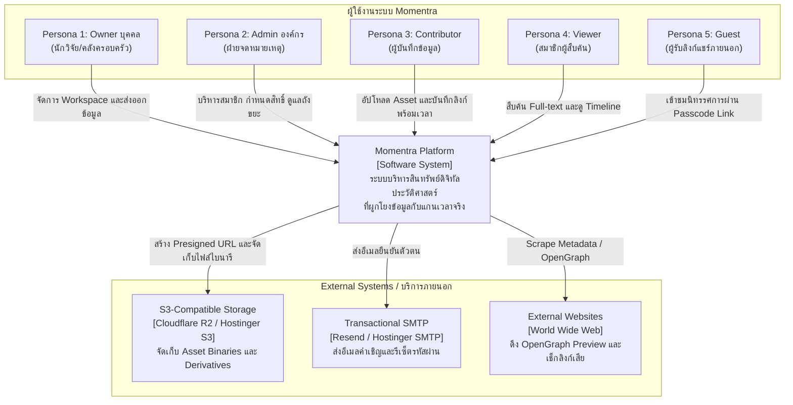
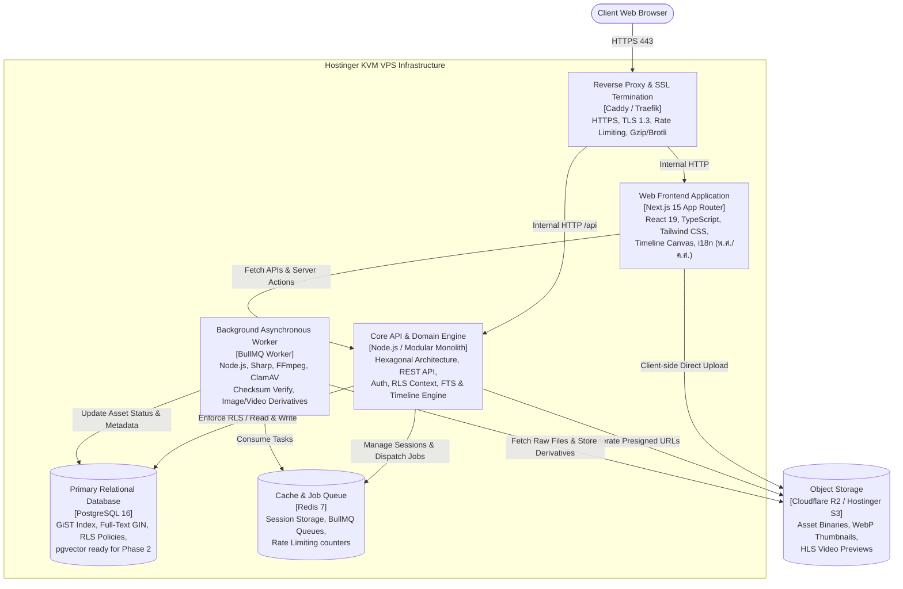
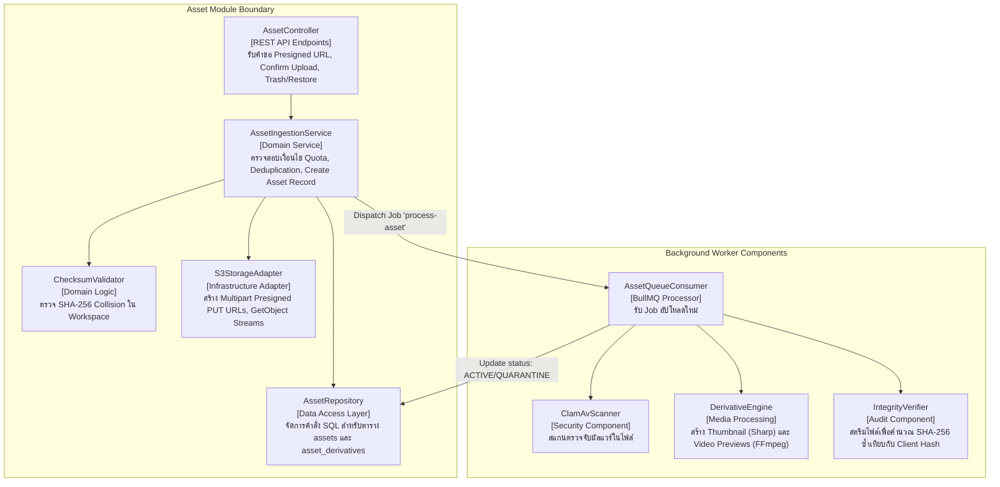
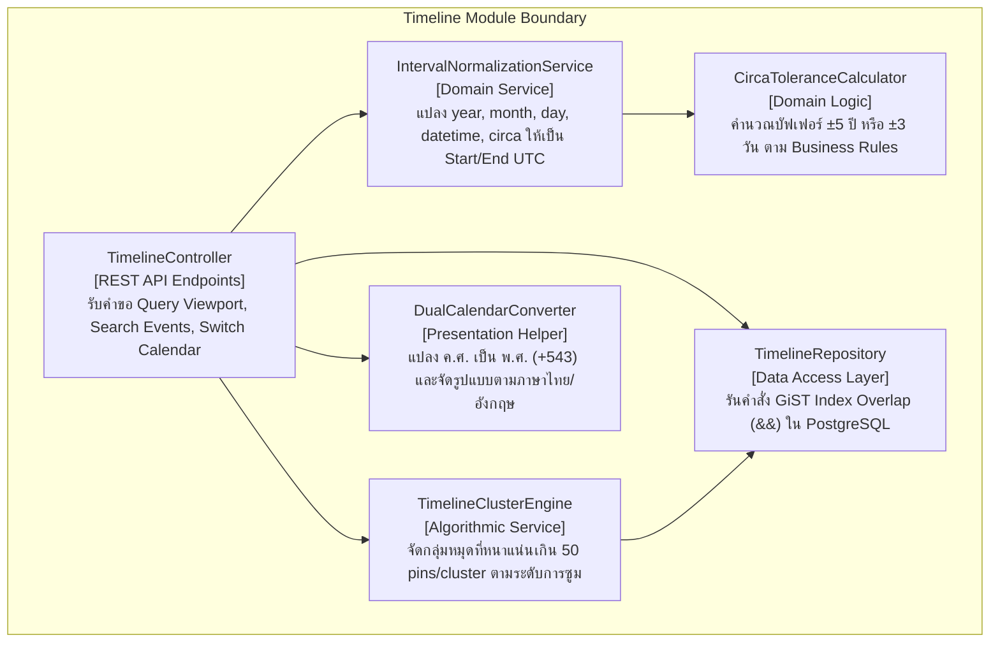
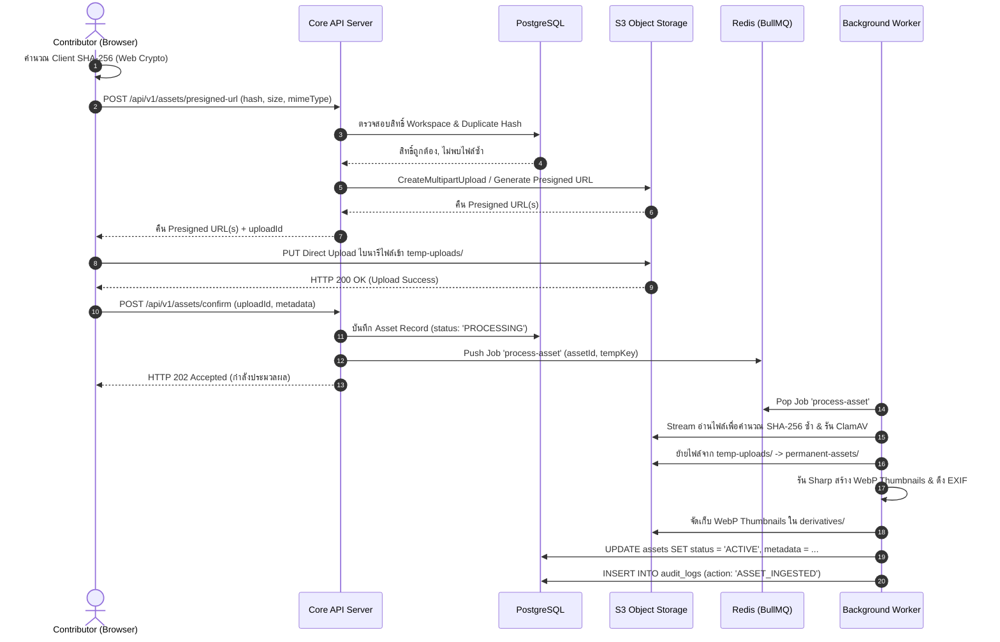
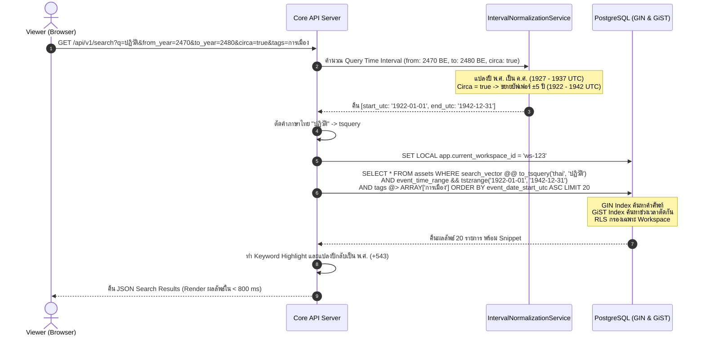
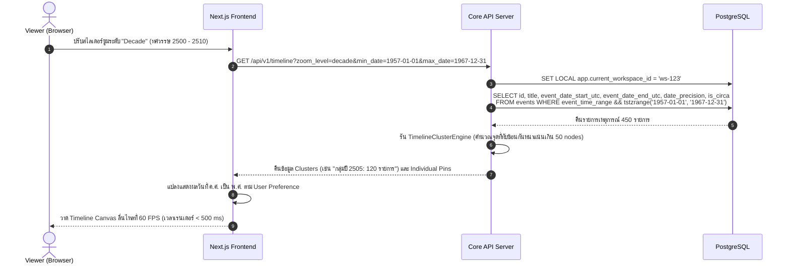
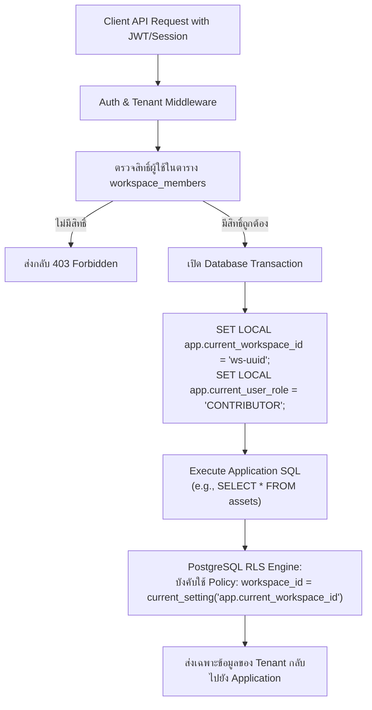

# System Architecture Document (SAD)
## โครงการ: Momentra (Historical Digital Asset Management — HDAM)
**รหัสเอกสาร:** MOMENTRA-ARCH-02  
**เวอร์ชัน:** 1.0.0 (Phase 2 Architecture Baseline)  
**สถานะ:** Approved Baseline  
**บทบาทผู้จัดทำ:** Senior Solution Architect (ประสบการณ์ 25 ปี)  
**สอดคล้องกับ:** [docs/01-srs.md](file:///c:/atgv/momentra/docs/01-srs.md)  
**วันที่มีผล:** 5 ตุลาคม 2026 (พ.ศ. 2569)  

---

## 1. Architecture Style: Modular Monolith vs Microservices

### 1.1 การวิเคราะห์เปรียบเทียบเชิงสถาปัตยกรรม (Trade-off Matrix)

ในการพัฒนา Momentra สำหรับระยะ MVP จนถึงการรองรับผู้ใช้ 1,000 คน และพื้นที่ 5 TB ในปีแรก โดยมีทีมงาน 2–5 คน และใช้ทรัพยากรบน **Hostinger KVM VPS** เราได้เปรียบเทียบสถาปัตยกรรม 2 รูปแบบหลัก:

| มิติการประเมิน (Evaluation Criteria) | ทางเลือก A: Microservices Architecture | ทางเลือก B: Modular Monolith Architecture (เลือก) | ผลกระทบต่อ Momentra |
| :--- | :--- | :--- | :--- |
| **Operational Complexity (ความซับซ้อนในการดูแล)** | สูงมาก (ต้องใช้ Kubernetes, Service Mesh, Distributed Tracing, API Gateway แยกเครื่อง) | ต่ำถึงปานกลาง (รันบน Docker Compose ชุดเดียว ดูแลผ่าน VPS ตัวเดียวได้) | ทีม 2–5 คนไม่ควรแบกรับ Infra overhead ที่ไม่จำเป็น |
| **Network Latency & Performance** | มี Network Overhead ทุกครั้งที่คุยข้าม Service (5–20 ms ต่อ Hop) | เรียกผ่าน In-memory Function Calls (< 0.5 ms) | สอดคล้องกับ **NFR-PERF-03 (P95 < 300ms)** และ **NFR-PERF-01** |
| **Data Consistency & Transactions** | Complex (ต้องใช้ 2PC หรือ Saga Pattern เสี่ยงข้อมูลคลาดเคลื่อน) | ACID Database Transactions สมบูรณ์แบบด้วย PostgreSQL | สำคัญมากต่อระบบจดหมายเหตุและการสลับสิทธิ์ Workspace |
| **Resource Efficiency (RAM/CPU บน VPS)** | กินแรมสูงมาก (แต่ละ Service มี Runtime/JVM/Node ของตัวเอง รวม 6–10 GB) | ใช้แรมน้อย (Node.js/Next.js Core ใช้ 1–2 GB, Worker 1–2 GB) | รันบน Hostinger VPS ขนาด 4–8 vCPU / 16 GB ได้เสถียร |
| **Development Velocity (ความเร็วในการส่งมอบ)** | ช้าในช่วงแรกเนื่องจาก Boilerplate, CI/CD และ Contract Management | รวดเร็วมาก ใช้ Shared Types/Schemas (TypeScript) ร่วมกันได้ทั้งโปรเจกต์ | ลดระยะเวลา Time-to-Market ของ MVP |
| **Evolution Path (การแยกตัวในอนาคต)** | แยกอยู่แล้ว | ออกแบบ Domain Boundary อิสระ สามารถแยก Service ได้เมื่อถึงเวลา | ไม่ปิดกั้นการเติบโตในอนาคต |

### 1.2 ข้อสรุปและการตัดสินใจ (Architectural Decision)
ทีมสถาปัตยกรรมเลือก **Modular Monolith Architecture** โดยแยก Process ออกเป็น 2 ส่วนหลัก:
1. **Web & Core API Process (Next.js + NestJS/Modular Core):** รองรับ Web Traffic, การจัดการสิทธิ์, Timeline Rendering, และ Search Query
2. **Decoupled Background Worker (BullMQ + Redis):** ทำหน้าที่ประมวลผล Asset หนักๆ (SHA-256 Checksum, Sharp Image Resizing, FFmpeg Video Previews, ClamAV Antivirus) แบบ Asynchronous

> **อ้างอิง ADR:** [ADR-001: Modular Monolith Architecture Pattern](file:///c:/atgv/momentra/docs/adr/ADR-001-modular-monolith-architecture.md)

---

## 2. C4 Model Architecture Diagrams

### 2.1 C4 Level 1: System Context Diagram
แสดงภาพรวมความสัมพันธ์ระหว่างผู้ใช้งานระบบ Momentra กับระบบภายนอก



---

### 2.2 C4 Level 2: Container Diagram
แสดงส่วนประกอบระดับ Container ภายในระบบ Momentra ที่ติดตั้งบน Hostinger VPS



---

### 2.3 C4 Level 3: Component Diagram — Asset Module
แสดงโครงสร้างภายในของโมดูลจัดการสินทรัพย์ดิจิทัล (Asset Ingestion & Lifecycle)



---

### 2.4 C4 Level 3: Component Diagram — Timeline Module
แสดงโครงสร้างภายในของโมดูลไทม์ไลน์และเครื่องมือคำนวณเวลาประวัติศาสตร์ (Historical Timeline Engine)



---

## 3. Tech Stack Recommendation & Detailed Comparison

เพื่อความคล่องตัวในการบำรุงรักษาโดยทีมขนาด 2–5 คน และความคุ้มค่าสูงสุดบน Hostinger VPS ทีมงานได้ทำการประเมินเทคโนโลยีอย่างน้อย 2 ทางเลือกในทุกชั้น:

### 3.1 Frontend Layer

| ด้านที่พิจารณา | ทางเลือก 1: Next.js 15 App Router + React 19 (เลือก) | ทางเลือก 2: Single Page Application (Vite + React) |
| :--- | :--- | :--- |
| **สถาปัตยกรรม** | Hybrid SSR / Static Export / React Server Components | Client-Side Rendering (CSR) 100% |
| **SEO & Sharing** | ดีเยี่ยม (รองรับ Dynamic OpenGraph Tags สำหรับหน้า Public Shared Collections) | ด้อยกว่า (บอตของ Facebook/Twitter อ่าน SPA ลำบาก ต้องทำ SSR แยก) |
| **Code Sharing** | แชร์ Type, Zod Schemas และ Date Calculators กับ Backend ได้ 100% | ต้องตั้ง Monorepo และแพ็กเป็น Library แยก |
| **Performance** | รองรับ Streaming SSR ช่วยเรนเดอร์หน้าจอเริ่มต้นได้เร็ว | โหลด Bundle ครั้งแรกใหญ่ อาจช้าบนเน็ตมือถือ |
| **สรุปผลการเลือก** | **เลือก Next.js 15:** ตอบโจทย์เรื่อง Public Share Links และการแชร์ Domain Code |

### 3.2 Backend & API Layer

| ด้านที่พิจารณา | ทางเลือก 1: Node.js (TypeScript) Modular Core (เลือก) | ทางเลือก 2: Python (FastAPI) | ทางเลือก 3: Go (Golang) |
| :--- | :--- | :--- | :--- |
| **ภาษา & ทักษะ** | TypeScript 100% ภาษาเดียวทั้งระบบ | Python (เด่นด้าน AI แต่ต้องสลับบริบทภาษา) | Go (เร็วมาก แต่การเขียน Domain Logic ซับซ้อนกว่า) |
| **Memory Footprint** | ~150–300 MB ต่อ Worker | ~200–400 MB ต่อ Worker | ~30–80 MB ต่อ Worker |
| **ความเร็วในการพัฒนา** | สูงมาก (ใช้ Zod, Prisma/Drizzle และ Type Safety ต่อเนื่อง) | ปานกลางถึงสูง | ปานกลาง (Boilerplate ค่อนข้างเยอะ) |
| **การดูแลรักษา (2–5 คน)** | ง่ายที่สุด ทีม Full-stack ดูแลได้ทั้งหน้าบ้านและหลังบ้าน | ต้องมีคนเชี่ยวชาญ Python แยก | ต้องมีคนเชี่ยวชาญ Go แยก |
| **สรุปผลการเลือก** | **เลือก Node.js / TypeScript Modular Architecture:** สอดคล้องกับขนาดทีม |

### 3.3 Database Layer

| ด้านที่พิจารณา | ทางเลือก 1: PostgreSQL 16+ (เลือก) | ทางเลือก 2: MySQL 8.0 | ทางเลือก 3: MongoDB 7.0 |
| :--- | :--- | :--- | :--- |
| **Range Indexing** | Native `tstzrange` + **GiST Index** (O(log N)) | ไม่มี Native Range Index (ต้อง B-Tree 2 คอลัมน์) | ไม่มี Native Range Index ที่มีประสิทธิภาพเทียบเท่า |
| **Multi-tenancy** | **Native Row-Level Security (RLS)** ในเคอร์เนล | ต้องเขียน WHERE ใน Application Code เอง | ต้องกรองผ่าน Application Code |
| **Search Capabilities** | Full-Text Search (GIN) + **pgvector** สำหรับ Phase 2 | Full-Text Search มีข้อจำกัด | Atlas Search (เสียค่าบริการคลาวด์เพิ่ม) |
| **สรุปผลการเลือก** | **เลือก PostgreSQL 16+:** เป็นตัวเลือกเดียวที่ตอบโจทย์ Range GiST, RLS และ pgvector ในตัวเดียว |

> **อ้างอิง ADR:** [ADR-002: Relational Database Strategy with PostgreSQL, GiST Index, and RLS](file:///c:/atgv/momentra/docs/adr/ADR-002-relational-database-postgresql-rls.md)

### 3.4 Object Storage Layer

| ด้านที่พิจารณา | ทางเลือก 1: Cloudflare R2 (เลือก) | ทางเลือก 2: AWS S3 Standard | ทางเลือก 3: Hostinger Object Storage |
| :--- | :--- | :--- | :--- |
| **ค่าจัดเก็บ (Storage Fee)** | $0.015 / GB / เดือน ($75 สำหรับ 5 TB) | $0.023 / GB / เดือน ($115 สำหรับ 5 TB) | $0.012 / GB / เดือน (~$60 สำหรับ 5 TB) |
| **ค่าส่งออกข้อมูล (Egress Fee)** | **$0.00 (ฟรีค่า Egress 100%)** | $0.09 / GB ($180 หากโหลด 2 TB/เดือน) | มีค่าทราฟฟิกตามแพ็กเกจ |
| **ความเข้ากันได้** | S3-Compatible API สมบูรณ์แบบ | ออริจินัล S3 API | S3-Compatible API |
| **Global CDN Edge** | อยู่บนเครือข่าย Cloudflare ทั่วโลก | ต้องซื้อ CloudFront เพิ่ม | โฮสต์ใน Data Center เดียว |
| **สรุปผลการเลือก** | **เลือก Cloudflare R2 (หรือ Hostinger S3):** ป้องกันปัญหางบบานปลายจากค่า Bandwidth Egress |

> **อ้างอิง ADR:** [ADR-003: Object Storage Strategy with S3-compatible Direct Presigned Upload](file:///c:/atgv/momentra/docs/adr/ADR-003-object-storage-direct-presigned-upload.md)

### 3.5 Search Engine Strategy (MVP vs Future)

| ด้านที่พิจารณา | ทางเลือก 1: PostgreSQL FTS + GIN (เลือก MVP) | ทางเลือก 2: Meilisearch | ทางเลือก 3: OpenSearch / Elasticsearch |
| :--- | :--- | :--- | :--- |
| **Infra Footprint บน VPS** | **0 MB (ใช้ DB ตัวเดิม ไม่ต้องเปิด Container เพิ่ม)** | ~250–500 MB RAM | ~2,048–4,096 MB RAM (หนักเกินไปสำหรับ VPS) |
| **การทำงานร่วมกับ GiST** | รัน FTS + Range Overlap ใน SQL เดียวกันได้ทันที | ต้อง Query 2 รอบ แล้วนำผลมา Intersect กัน | ต้อง Sync ข้อมูลผ่าน Logstash/Debezium |
| **ความเร็วในข้อมูล 1M แถว** | 300–600 ms (ผ่านเกณฑ์ NFR-PERF-01 < 800ms) | < 100 ms | < 100 ms |
| **Phase 2 Expansion** | เปิด Extension `pgvector` ทำ Hybrid Search ได้ทันที | ยังไม่รองรับ Vector สมบูรณ์ | รองรับ Vector สมบูรณ์แต่เปลืองทรัพยากร |
| **สรุปผลการเลือก** | **เลือก PostgreSQL FTS สำหรับ Phase 1** และต่อยอดเป็น **pgvector ใน Phase 2** |

> **อ้างอิง ADR:** [ADR-004: Hybrid Search Engine Strategy](file:///c:/atgv/momentra/docs/adr/ADR-004-search-engine-strategy-fts-to-pgvector.md)

### 3.6 Queue & Background Worker Layer

| ด้านที่พิจารณา | ทางเลือก 1: Redis 7 + BullMQ (เลือก) | ทางเลือก 2: Python Celery + RabbitMQ |
| :--- | :--- | :--- |
| **ภาษา Runtime** | TypeScript/Node.js (แชร์โค้ด Domain Logic ได้) | Python (แยกอีก Stack) |
| **Memory Footprint** | ต่ำมาก (Redis กินแรมเพียง ~50–100 MB) | ปานกลางถึงสูง (RabbitMQ + Celery Workers) |
| **ฟีเจอร์การควบคุม** | Job Progress Bar, Exponential Retry, Delayed Jobs, Concurrency Control | ครบถ้วน |
| **สรุปผลการเลือก** | **เลือก Redis + BullMQ:** เรียบง่าย ดูแลสะดวก และรองรับการรายงาน Progress ไปยังหน้าเว็บ |

---

## 4. File Upload & Ingestion Architecture

เพื่อรองรับการอัปโหลดไฟล์ขนาดใหญ่ (สูงสุด 4 GB ต่อไฟล์) และป้องกันปัญหา Server Memory Exhaustion บน Hostinger VPS ระบบนำสถาปัตยกรรม **Client Direct Presigned Upload with Asynchronous Worker Pipeline** มาใช้งาน:

```mermaid
flowchart TD
    subgraph ClientStage[1. Client Browser Stage]
        Drop[Drag & Drop Files] --> LocalHash[คำนวณ Client SHA-256 แบบ Chunks]
        LocalHash --> CheckSize{ขนาดไฟล์ > 100 MB?}
    end

    subgraph APIGateway[2. API Coordination Stage]
        CheckSize -- ไม่เกิน 100 MB --> ReqPut[ขอ Presigned Single PUT URL]
        CheckSize -- เกิน 100 MB --> ReqMulti[ขอ S3 Multipart Presigned URLs]
        ReqPut & ReqMulti --> ValQuota[ตรวจสิทธิ์ Workspace & Storage Quota]
        ValQuota --> ReturnUrls[ส่ง Signed URLs กลับไปที่ Browser]
    end

    subgraph DirectStorage[3. Direct Storage Ingestion]
        ReturnUrls --> UploadDirect[Browser อัปโหลดตรงเข้า S3 'temp-uploads/']
        UploadDirect --> ClientDone[Browser แจ้ง API: 'Upload Complete']
    end

    subgraph AsyncWorker[4. BullMQ Background Pipeline]
        ClientDone --> PushQueue[API นำ Job เข้าคิว 'process-asset']
        PushQueue --> WorkerPick[Worker ดึงงานไปประมวลผล]
        
        WorkerPick --> Step1[1. Stream คำนวณ SHA-256 ซ้ำเทียบกับ Client Hash]
        Step1 --> Step2[2. ClamAV สแกนตรวจจับไวรัสและมัลแวร์]
        Step2 --> Step3{ผ่านการตรวจความปลอดภัย?}
        
        Step3 -- ไม่ผ่าน --> MoveQuarantine[ย้ายไฟล์เข้า 'quarantine/' และแจ้งเตือน Admin]
        Step3 -- ผ่านสมบูรณ์ --> MovePerm[ย้ายไฟล์เข้า 'permanent-assets/{ws_id}/{hash}']
        
        MovePerm --> Step4[3. สกัด Metadata: EXIF, กว้าง/ยาว, ความยาวเสียง/วิดีโอ]
        Step4 --> Step5[4. สร้าง Derivatives:]
        Step5 --> MakeThumb[Sharp: สร้าง WebP Thumbnails 320px, 800px, 1600px]
        Step5 --> MakeVideo[FFmpeg: สร้าง Video Preview HLS 720p / Waveform]
        
        MakeThumb & MakeVideo --> UpdateDB[อัปเดต DB: status = 'ACTIVE']
        UpdateDB --> NotifyUI[แจ้งเตือนหน้า UI ผ่าน WebSocket/Polling]
    end
```

### รายละเอียดทางเทคนิคของไปป์ไลน์:
1. **Client-side Chunked Hashing:** ใช้ Web Crypto API สตรีมอ่านไฟล์เป็นบล็อกขนาด 2 MB เพื่อคำนวณ SHA-256 บน Browser โดยไม่ทำให้ UI กระตุก
2. **S3 Multipart Upload (100 MB – 4 GB):** ตัดแบ่งชิ้นส่วนละ 20–50 MB สามารถทำ Concurrent Uploads 3–5 ชิ้นส่วนพร้อมกัน และรองรับการทำ Resumable เมื่อเน็ตหลุด
3. **Quarantine & Virus Scan:** หาก ClamAV ตรวจพบ Signature ไวรัส ไฟล์จะถูกกักกันทันที สถานะในฐานข้อมูลจะถูกตั้งเป็น `QUARANTINED` และส่งการแจ้งเตือนความปลอดภัยไปยัง Admin
4. **Optimized Derivatives:** รูปภาพความละเอียดสูงต้นฉบับจะถูกเก็บรักษาไว้โดยไม่มีการดัดแปลง (Preservation copy) ขณะที่ไฟล์ที่นำมาแสดงผลบนเว็บจะเป็นภาพ WebP แบบ Progressive โหลดเร็ว

---

## 5. End-to-End Data Flows (Sequence Diagrams)

### 5.1 Flow 1: Asset Upload & Verification Sequence
ลำดับการทำงานตั้งแต่ผู้ใช้เลือกไฟล์ จนกระทั่งไฟล์พร้อมแสดงผลบนไทม์ไลน์



---

### 5.2 Flow 2: Imprecise Historical Search Sequence
การทำงานของการสืบค้นแบบหลายมิติที่ผสานระหว่างคำค้นภาษาไทยและช่วงเวลาที่ไม่แน่นอน



---

### 5.3 Flow 3: Timeline Navigation & Zoom Sequence
การเรนเดอร์และจัดกลุ่มหมุดเหตุการณ์ตามมุมมองการซูม



---

## 6. Multi-Tenancy Strategy (Row-Level Security)

Momentra เลือกใช้สถาปัตยกรรม **Logical Multi-tenancy via Row-Level Security (RLS)** ในฐานข้อมูล PostgreSQL เดียวกัน



### เหตุผลและข้อดีของการใช้ RLS:
1. **การป้องกันข้อผิดพลาดของนักพัฒนา (Bulletproof Defense):** แม้นักพัฒนาจะเผลอเขียนคำสั่ง `SELECT * FROM assets` โดยลืมใส่ `WHERE workspace_id = ...` ฐานข้อมูล PostgreSQL จะดักจับและกรองให้เหลือเฉพาะแถวของ Workspace ปัจจุบันโดยอัตโนมัติ
2. **ประสิทธิภาพและต้นทุนบน VPS:** การแยก Database หรือ Schema ต่อ Tenant (Physical/Schema Isolation) จะกินหน่วยความจำมหาศาลเมื่อมี Workspace มากกว่า 500 แห่ง แต่ Row-Level RLS ใช้ทรัพยากรคงที่ ไม่เปลือง RAM ของ Hostinger VPS
3. **การสำรองข้อมูลที่คล่องตัว:** สำรองข้อมูลและกู้คืน (Backup & Restore) ได้ในฐานข้อมูลเดียว ผ่านเครื่องมือมาตรฐาน `pg_dump` และ WAL Archiving

---

## 7. Cross-Cutting Concerns

### 7.1 Structured Logging & Correlation ID
* ใช้ไลบรารี **Pino** บันทึก Log ในรูปแบบ Structured JSON ลง `stdout` เพื่อให้ Docker Log Driver จัดการได้ง่าย
* ทุกคำขอ HTTP ขาเข้าจะถูกสลักรหัส **Correlation ID (`x-correlation-id`)** หากไม่มี Client ส่งมา ระบบจะสร้าง UUIDv4 ใหม่ และส่งต่อรหัสนี้ไปในทุก Log Entry และคำสั่งใน Background Worker เพื่อให้สามารถสืบหาต้นตอข้อผิดพลาด (Root Cause Analysis) ข้ามกระบวนการได้อย่างแม่นยำ

### 7.2 Configuration Management
* จัดการค่าคอนฟิกูเรชันผ่าน Environment Variables (`.env`) โดยบังคับตรวจสอบความถูกต้องด้วย **Zod Schema Validation** ทันทีที่ระบบเริ่มทำงาน (Boot-time Type Check) หากตัวแปรสำคัญขาดหายหรือมีรูปแบบผิด ระบบจะ Fail-fast ทันที พร้อมแสดงข้อความผิดพลาดที่ชัดเจน

### 7.3 Standardized Error Handling (RFC 7807)
* การตอบกลับข้อผิดพลาดของ REST API ทั้งหมดต้องเป็นไปตามมาตรฐาน **RFC 7807 (Problem Details for HTTP APIs)**:
```json
{
  "type": "https://momentra.app/errors/duplicate-asset",
  "title": "Duplicate Asset Detected",
  "status": 409,
  "detail": "An asset with SHA-256 hash 'e3b0c442...' already exists in this workspace.",
  "instance": "/api/v1/assets/presigned-url",
  "correlationId": "f47ac10b-58cc-4372-a567-0e02b2c3d479",
  "invalidParams": []
}
```

### 7.4 Internationalization & Localization (i18n)
* **Frontend:** ใช้ `next-intl` รองรับ 2 ภาษาหลัก: ภาษาไทย (`th`) และภาษาอังกฤษ (`en`)
* **Timezone & Calendar Conversion:** ยึดถือ Timezone `Asia/Bangkok` (+07:00) เป็นค่าเริ่มต้น และแปลงปี พ.ศ. (ปี ค.ศ. + 543) ใน Presentation Helper Service แยกขาดจาก Data Access Layer

### 7.5 Monitoring & Health Checks
* ติดตั้ง Endpoint `/api/health/live` (ตรวจสอบว่าโปรเซสรันอยู่) และ `/api/health/ready` (ตรวจสอบการเชื่อมต่อ PostgreSQL, Redis, และ S3 Storage)
* ใช้ **Uptime Kuma** (ติดตั้งแยกบน VPS หรือเครื่องมอนิเตอร์ภายนอก) ยิงตรวจสถานะทุก 60 วินาที พร้อมแจ้งเตือนผ่าน LINE Notify หรือ Telegram ทันทีที่พบ Downtime

---

## 8. Scalability, Capacity & Monthly Cost Estimation

### 8.1 ตัวเลขประมาณการทรัพยากร (Baseline Capacity)
* **ผู้ใช้งานปีแรก:** 1,000 Active Accounts (~100–200 Concurrent Active Users)
* **ปริมาณไฟล์จัดเก็บเริ่มต้น:** 5 TB (ขยายตัวประมาณ 10–15 TB ภายใน 2 ปี)
* **ขนาดไฟล์สูงสุด:** 4 GB ต่อไฟล์ (ไฟล์วิดีโอ/เสียงประวัติศาสตร์)
* **แบนด์วิดท์ดาวน์โหลดเฉลี่ย:** ประมาณ 50–100 GB ต่อวัน (~1.5–3.0 TB ต่อเดือน)

### 8.2 ตารางประมาณการค่าใช้จ่ายโครงสร้างพื้นฐานรายเดือน (Monthly Infrastructure Cost)

| รายการทรัพยากร (Resource Item) | รายละเอียดสเปก (Specification) | ผู้ให้บริการ (Provider) | ค่าใช้จ่ายโดยประมาณ (USD/เดือน) | ค่าใช้จ่ายโดยประมาณ (บาท/เดือน) |
| :--- | :--- | :--- | :---: | :---: |
| **Compute & Database Server** | Hostinger KVM 4 VPS (4 vCPU, 16 GB RAM, 200 GB NVMe, 4 TB Bandwidth) | Hostinger | $12.99 | ~480 บาท |
| **Object Storage (5 TB)** | จัดเก็บ Asset Binaries 5,000 GB ($0.015 / GB) | Cloudflare R2 | $75.00 | ~2,775 บาท |
| **Data Egress Bandwidth** | ดาวน์โหลด 2–3 TB ต่อเดือน | Cloudflare R2 | **$0.00 (ฟรี)** | **0 บาท** |
| **Edge CDN & DDoS Protection** | Cloudflare Free Tier (แคชภาพและป้องกันบอต) | Cloudflare | $0.00 | 0 บาท |
| **Transactional Email** | ส่งคำเชิญและรีเซ็ตรหัสผ่าน (ไม่เกิน 3,000 ฉบับ/เดือน) | Resend (Free Tier) | $0.00 | 0 บาท |
| **โดเมนและ SSL** | โดเมนเนม `.app` หรือ `.org` + Let's Encrypt Wildcard SSL | Hostinger / Cloudflare | $1.50 | ~55 บาท |
| **รวมค่าใช้จ่ายทั้งหมดต่อเดือน** | *(ระบบพร้อมใช้งานเต็มรูปแบบ รองรับ 5 TB)* | | **~$89.49 / เดือน** | **~3,310 บาท / เดือน** |

> **การควบคุมงบประมาณ:** การเลือกใช้ **Cloudflare R2** ช่วยตัดค่า Egress Bandwidth ออกไปทั้งหมด ทำให้งบประมาณรายเดือนนิ่งและคงที่อยู่ที่ประมาณ **3,300 บาท/เดือน** ซึ่งคุ้มค่าอย่างยิ่งสำหรับองค์กรและไม่บานปลาย

---

## 9. Monorepo Project Folder Structure

ระบบ Momentra จัดโครงสร้างโปรเจกต์แบบ **Monorepo** โดยใช้เครื่องมือ **Turborepo** และ **pnpm workspaces** เพื่อความสะดวกในการแชร์ TypeScript Types, Zod Schemas และ Domain Logic:

```
momentra/
├── apps/
│   ├── web/                        # Next.js 15 App Router (Frontend UI)
│   │   ├── src/
│   │   │   ├── app/                # App Router Routes & Server Actions
│   │   │   │   ├── [locale]/       # i18n dynamic route (th/en)
│   │   │   │   │   ├── (auth)/     # Login, Register, Forgot Password
│   │   │   │   │   ├── (workspace)/# Workspace Dashboard, Timeline, Assets
│   │   │   │   │   └── share/[id]/ # Public Guest Share Collection View
│   │   │   ├── components/         # React UI Components
│   │   │   │   ├── timeline/       # Zoomable Canvas/DOM Timeline Engine
│   │   │   │   ├── upload/         # Multi-file Dropzone with Chunked SHA-256
│   │   │   │   └── common/         # Modals, Drawers, Buttons
│   │   │   └── hooks/              # Custom React Hooks
│   │   ├── Dockerfile
│   │   └── package.json
│   │
│   ├── api/                        # Core API & Domain Engine (Modular Monolith)
│   │   ├── src/
│   │   │   ├── modules/            # Domain Modules (Strict Boundaries)
│   │   │   │   ├── asset/          # Ingestion, Presigned URL, Checksum, Trash
│   │   │   │   ├── link/           # Link Ingestion, OpenGraph Scraper
│   │   │   │   ├── metadata/       # Dublin Core 15, Tagging Service
│   │   │   │   ├── timeline/       # Interval Normalizer, Circa Buffer, Clusters
│   │   │   │   ├── search/         # PostgreSQL FTS, Faceted Filtering, Highlighting
│   │   │   │   ├── access/         # Workspace, Members, RBAC, Share Tokens
│   │   │   │   └── audit/          # Immutable Audit Log Writer & Exporter
│   │   │   ├── middlewares/        # Auth, Workspace RLS Context, Correlation ID
│   │   │   └── main.ts             # Application Bootstrap
│   │   ├── Dockerfile
│   │   └── package.json
│   │
│   └── worker/                     # Asynchronous Asset Processing Worker
│       ├── src/
│       │   ├── processors/         # BullMQ Job Processors
│       │   │   ├── checksum.processor.ts
│       │   │   ├── antivirus.processor.ts
│       │   │   ├── thumbnail.processor.ts (Sharp)
│       │   │   └── video.processor.ts (FFmpeg)
│       │   └── worker.ts           # Worker Entrypoint
│       ├── Dockerfile
│       └── package.json
│
├── packages/                       # Shared Internal Packages
│   ├── database/                   # Database Schemas, Migrations & RLS Helpers
│   │   ├── prisma/ or drizzle/     # ORM Schema & Migrations
│   │   ├── sql/                    # Custom GiST Indexes & RLS Policies
│   │   └── src/index.ts
│   │
│   ├── domain/                     # Pure Business Logic & Calculation (Zero Dependencies)
│   │   ├── src/
│   │   │   ├── time/               # Date Normalization, Circa Buffer, พ.ศ. Calc
│   │   │   ├── dublincore/         # Dublin Core 15 Validation Schemas
│   │   │   └── index.ts
│   │   └── package.json
│   │
│   ├── ui/                         # Shared Design System / Tailwind Tokens
│   ├── config/                     # Shared ESLint, Prettier, TypeScript Configs
│   └── types/                      # Shared DTOs and API Contracts
│
├── docker/                         # Deployment & Local Development
│   ├── docker-compose.yml          # Production Compose (Caddy, Web, API, Worker, DB, Redis)
│   ├── docker-compose.dev.yml      # Local Development Compose
│   └── Caddyfile                   # Reverse Proxy Configuration with Auto-HTTPS
│
├── docs/                           # Documentation & Architecture Decision Records
│   ├── 01-srs.md
│   ├── 02-architecture.md
│   └── adr/
│       ├── ADR-001-modular-monolith-architecture.md
│       ├── ADR-002-relational-database-postgresql-rls.md
│       ├── ADR-003-object-storage-direct-presigned-upload.md
│       ├── ADR-004-search-engine-strategy-fts-to-pgvector.md
│       ├── ADR-005-multi-tenant-auth-and-rbac.md
│       └── ADR-006-historical-time-interval-normalization.md
│
├── .env.example
├── pnpm-workspace.yaml
└── turbo.json
```

---

## 10. Quality Gate Verification, Assumptions, Open Questions & Risks

### 10.1 Quality Gate Phase 2 Checklist

- [x] **ทุก NFR ใน SRS มีคำตอบเชิงสถาปัตยกรรม:**
  - NFR-PERF-01 (Search < 800ms) -> PostgreSQL GIN Index + Thai Tokenization (ADR-004)
  - NFR-PERF-02 (Timeline < 500ms) -> GiST Range Indexing + Viewport Clustering (ADR-002, ADR-006)
  - NFR-PERF-03 (API P95 < 300ms) -> Modular Monolith In-memory Function Calls (ADR-001)
  - NFR-PERF-04 (Asset Upload) -> Client Direct S3 Presigned URL (ADR-003)
  - NFR-AVAIL-01 (99.9% Uptime) -> Docker Compose Auto-restart + Caddy Reverse Proxy
  - NFR-SCALE-01 (1,000 Concurrent Users) -> Hostinger KVM VPS + pgBouncer Connection Pooling
  - NFR-SCALE-02 (5 TB -> 50 TB Storage) -> S3-compatible Object Storage (Cloudflare R2)
  - NFR-SEC-01 & NFR-SEC-02 -> TLS 1.3, AES-256 at Rest, PostgreSQL RLS Policy (ADR-002, ADR-005)
  - NFR-SEC-03 (Integrity) -> Two-Tier SHA-256 Checksum Calculation (Client + Worker)
  - NFR-PDPA-01 & NFR-PDPA-02 -> Soft Delete 30 วัน + Script Shredding
  - NFR-ACC-01 -> Next.js + Accessible UI (WCAG 2.1 AA)
  - NFR-BCP-01 & NFR-BCP-02 -> PostgreSQL WAL Archiving (RPO <= 1h, RTO <= 4h)
- [x] **มี ADR สำหรับ Database, Storage, Search, Auth ครบถ้วน:**
  - Database: `ADR-002`
  - Storage: `ADR-003`
  - Search: `ADR-004`
  - Auth: `ADR-005`
  - เสริมด้วย Architecture Style (`ADR-001`) และ Time Normalization (`ADR-006`)
- [x] **ประเมินค่าใช้จ่ายรายเดือนแล้วและอยู่ในงบ:**
  - รวมทั้งหมด ~$89.49 / เดือน (~3,310 บาท/เดือน) สำหรับระบบพร้อมจัดเก็บ 5 TB โดยไม่มีบิลแบนด์วิดท์บานปลาย

---

### 10.2 Architectural Decision Records (ADRs) Index
1. [ADR-001: Modular Monolith Architecture Pattern](file:///c:/atgv/momentra/docs/adr/ADR-001-modular-monolith-architecture.md)
2. [ADR-002: Relational Database Strategy with PostgreSQL, GiST Index, and RLS](file:///c:/atgv/momentra/docs/adr/ADR-002-relational-database-postgresql-rls.md)
3. [ADR-003: Object Storage Strategy with S3-compatible Direct Presigned Upload](file:///c:/atgv/momentra/docs/adr/ADR-003-object-storage-direct-presigned-upload.md)
4. [ADR-004: Hybrid Search Engine Strategy (PostgreSQL FTS to pgvector)](file:///c:/atgv/momentra/docs/adr/ADR-004-search-engine-strategy-fts-to-pgvector.md)
5. [ADR-005: Multi-tenant Auth & Role-Based Access Control (RBAC)](file:///c:/atgv/momentra/docs/adr/ADR-005-multi-tenant-auth-and-rbac.md)
6. [ADR-006: Historical Time Interval Normalization for Imprecise Timelines](file:///c:/atgv/momentra/docs/adr/ADR-006-historical-time-interval-normalization.md)

---

### 10.3 Assumptions (สมมติฐาน)
1. เซิร์ฟเวอร์หลักคือ **Hostinger KVM 4 หรือ KVM 8 VPS (Ubuntu 22.04/24.04 LTS)** พร้อมสิทธิ์ Root Access เต็มรูปแบบสำหรับติดตั้ง Docker Engine และ Docker Compose
2. การคำนวณ SHA-256 บน Browser ของ Client รองรับ Web Crypto API (มีในเว็บบราวเซอร์สมัยใหม่ทุกตัว เช่น Chrome, Safari, Edge, Firefox)
3. สัญญาณเครือข่ายของผู้ใช้มีความเร็วเพียงพอต่อการอัปโหลดไฟล์ขนาดใหญ่ไปยัง Cloudflare R2 โดยมีระบบ S3 Multipart ช่วยรองรับการตัดช่วงเมื่อสัญญาณหลุด

### 10.4 Open Questions (ประเด็นเปิด)
1. สำหรับกระบวนการ ClamAV Antivirus ใน Background Worker บน VPS ขนาด 16 GB RAM แนะนำให้รันเป็น Daemon ขนาดเบา หรือเปิดให้สแกนเฉพาะไฟล์ประเภท `.pdf`, `.docx`, `.zip` เพื่อประหยัด CPU สำหรับไฟล์ภาพขนาดใหญ่? *(แนะนำในเบื้องต้น: สแกนเอกสารและไฟล์โปรแกรมเป็นหลัก)*
2. ในการทำ Video Preview สำหรับไฟล์วิดีโอ 4 GB ต้องการให้จำกัดความยาวของ Preview คลิปตัวอย่างที่ 60 วินาที หรือแปลงเป็น Full HLS Stream? *(สถาปัตยกรรมปัจจุบันออกแบบให้สร้าง 60-second HLS Preview เพื่อประหยัดพื้นที่และ CPU ของ Worker)*

### 10.5 Risks & Mitigation Strategies (ความเสี่ยงทางสถาปัตยกรรมและมาตรการรับมือ)

| รหัสความเสี่ยง | ความเสี่ยงทางสถาปัตยกรรม | ผลกระทบ | การบรรเทาและแก้ไข (Mitigation) |
| :--- | :--- | :---: | :--- |
| **RSK-ARCH-01** | Worker ใช้ CPU/RAM พุ่งสูงขณะรัน FFmpeg แปลงวิดีโอ 4 GB จนกระทบ Web API | สูง | กำหนด Docker Resource Limits (`cpus: "2.0"`, `memory: "4g"`) บน Container ของ Worker ไม่ให้แย่งทรัพยากรของ PostgreSQL และ Web |
| **RSK-ARCH-02** | ไฟล์ตกค้างใน `temp-uploads/` กรณีผู้ใช้อัปโหลดไม่เสร็จหรือปิดจอ | ปานกลาง | ตั้งค่า S3 Bucket Lifecycle Rule ให้ลบอ็อบเจกต์ใน `temp-uploads/` ทิ้งอัตโนมัติหากมีอายุเกิน 24 ชั่วโมง |
| **RSK-ARCH-03** | การรั่วไหลของข้อมูลระหว่าง Tenant หาก Application มี Bug | สูงมาก | ใช้ PostgreSQL Row-Level Security (RLS) บังคับในระดับเคอร์เนลของฐานข้อมูล แม้โค้ดจะพลาด RLS ก็ยังบล็อกการอ่านข้าม Workspace |
| **RSK-ARCH-04** | Latency การค้นหาข้อความภาษาไทยที่มีคำเฉพาะทางประวัติศาสตร์ | ปานกลาง | ใช้ Pre-tokenization Service สกัดคำศัพท์ก่อนบันทึกลง `tsvector` และใช้ GIN Index ร่วมกับ Trigram (`pg_trgm`) |

---

### 10.6 Next Step (ขั้นตอนถัดไป)
สถาปัตยกรรมระบบได้รับการออกแบบและจัดทำเอกสารเสร็จสมบูรณ์ พร้อมก้าวสู่ **Phase 3: Database & Data Modeling Design** ซึ่งจะครอบคลุม:
1. การสร้าง **Entity-Relationship Diagram (ERD)** ฉบับสมบูรณ์
2. การเขียนไฟล์ **Prisma / Drizzle Schema** และ **SQL Migration Scripts** (สร้าง Tables, Types, Enums, GiST Indexes, Triggers และ RLS Policies)
3. การเขียน Unit Test Cases สำหรับ **Date Normalization Logic** ในระดับ Domain Package
