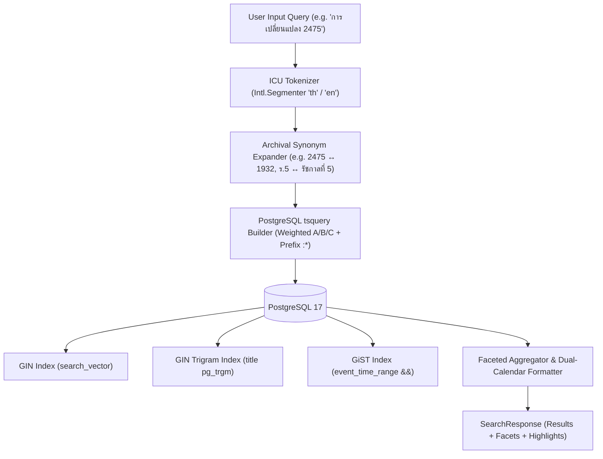
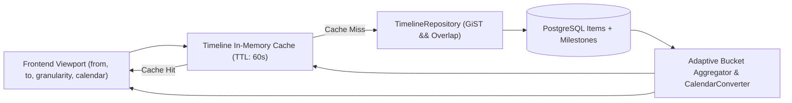

# Momentra (HDAM) — Phase 6: Search & Timeline/Roadmap Engine Specification

> **Version:** 1.0.0  
> **Status:** Completed & Verified  
> **Target Audience:** Solution Architects, Backend Engineers, Frontend Engineers, QA Engineers  
> **Source of Truth:** `docs/01-srs.md` (FR-15 to FR-18), `docs/02-architecture.md`, `docs/03-data-model.md`

---

## 1. Executive Summary & Objective

ระบบสืบค้นและแสดงผลไทม์ไลน์เชิงประวัติศาสตร์ (Momentra Search & Timeline Engine) ได้รับการออกแบบขึ้นเพื่อตอบสนองวัตถุประสงค์หลักของระบบ HDAM:
1. **การสืบค้นข้อมูลและสินทรัพย์สองภาษา (ไทย-อังกฤษ)** ได้อย่างแม่นยำสูง แม้คำศัพท์จะมีความกำกวมหรือเขียนต่างยุคสมัย
2. **การจัดเรียงและแสดงผลไทม์ไลน์ (Historical Timeline Viewport)** ตามวันเวลาเกิดจริงของเหตุการณ์ (`event_start` / `event_end`) พร้อมรองรับความไม่แน่นอนของวันเวลาในอดีต (`date_precision`, `is_circa`)
3. **ระบบปฏิทินคู่ขนาน (Dual Calendar Standard)** สลับและแสดงผล พ.ศ. (พุทธศักราช) และ ค.ศ. (คริสต์ศักราช) ได้อย่างไร้รอยต่อ โดยจัดเก็บในฐานข้อมูลเป็น UTC เสมอ
4. **ประสิทธิภาพระดับ Sub-second (< 200ms)** บนฐานข้อมูล PostgreSQL ด้วย GiST Range Indexing (`&&`), GIN Trigram, และ In-Memory Viewport Caching

---

## 2. Search Engine Architecture



### 2.1 ICU Word Segmentation (`Intl.Segmenter`)
ภาษาไทยเป็นภาษาที่เขียนติดกันโดยไม่มีช่องว่างคั่นคำ (`No spaces between words`) การใช้ Tokenizer ปกติของยุโรปจะทำให้ข้อความภาษาไทยทั้งประโยคกลายเป็น 1 Token ซึ่งค้นหาไม่พบ

Momentra ใช้ **Node.js 22 Built-in V8 ICU Segmenter** (`Intl.Segmenter('th', { granularity: 'word' })`) ซึ่ง:
- **ไม่ต้องติดตั้ง C++ / Python addon** ภายนอก ทำให้ทำงานได้ทั้งบนเครื่องนักพัฒนา (Windows/macOS) และ Production VPS (Linux Alpine/Debian)
- แยกคำประวัติศาสตร์ภาษาไทยได้อย่างแม่นยำ เช่น:
  - `"การเปลี่ยนแปลงการปกครอง 2475"` $\rightarrow$ `["การเปลี่ยนแปลง", "การปกครอง", "2475"]`
  - `"พระบาทสมเด็จพระจุลจอมเกล้าเจ้าอยู่หัว"` $\rightarrow$ Tokenize ได้อย่างถูกต้อง
- สนับสนุน Mixed Thai-English เช่น `"Bowring Treaty สนธิสัญญาเบาว์ริง 2398"`

### 2.2 Archival Synonym Expansion (`synonym.service.ts`)
พจนานุกรมคำพ้องและคำเทียบเคียงเชิงประวัติศาสตร์สำหรับงานจดหมายเหตุ:
- **พระนามและสมัญญานาม**: `ร.5` $\leftrightarrow$ `รัชกาลที่ 5`, `จุฬาลงกรณ์`, `พระพุทธเจ้าหลวง`
- **ปีประวัติศาสตร์คู่ขนาน**: `2475` $\leftrightarrow$ `1932`, `อภิวัฒน์สยาม`, `เปลี่ยนแปลงการปกครอง`
- **ชื่อเมืองและภูมิศาสตร์โบราณ**: `สยาม` $\leftrightarrow$ `ไทย`, `พระนคร` $\leftrightarrow$ `กรุงเทพ`, `บางกอก` $\leftrightarrow$ `Bangkok`

### 2.3 PostgreSQL Full-Text Search Vector Weighting
ตาราง `items` มี Database Trigger `items_before_insert_or_update()` ในการสร้าง `search_vector` อัตโนมัติ:
- **Weight 'A' (สูงสุด)**: `title` (ชื่อเหตุการณ์/ชื่อเอกสาร)
- **Weight 'B' (ปานกลาง)**: `description` (เนื้อหา/คำอธิบาย)
- **Weight 'C' (บริบท)**: Dublin Core Metadata (`creator`, `subject`, `publisher`, `coverage`) และ Location (`city`, `country`)

ค้นหาร่วมกับ Trigram Similarity (`pg_trgm`) ผ่านนิพจน์:
```sql
(search_vector @@ to_tsquery('simple', $query) OR title % $raw_text)
```
และคำนวณ Ranking Score:
```sql
ts_rank_cd(search_vector, to_tsquery('simple', $query)) + (similarity(title, $raw_text) * 0.5)
```

---

## 3. Timeline Engine Architecture



### 3.1 Adaptive Time Bucketing
Engine รองรับการซูมและจัดกลุ่มข้อมูลตามมาตรวัดเวลา (Granularity):
1. **Decade (ทศวรรษ)**: เหมาะสำหรับการดูภาพรวมระดับศตวรรษ (เช่น `ทศวรรษ 2470s (1930s)`)
2. **Year (รายปี)**: แสดงข้อมูลรายปี (เช่น `พ.ศ. 2475 (1932)`)
3. **Month (รายเดือน)**: แสดงข้อมูลรายเดือน (เช่น `มิถุนายน 2475 (June 1932)`)
4. **Day (รายวัน)**: แสดงข้อมูลรายวัน (เช่น `24 มิถุนายน 2475 (24 June 1932)`)

### 3.2 Imprecise Historical Date Handling
- `date_precision`: `year` | `month` | `day` | `datetime`
- `is_circa`: กำกับเหตุการณ์ที่ไม่ทราบวันเวลาแน่ชัด (เช่น "ประมาณ พ.ศ. 2400" หรือ "circa 1857")
- การจัดเรียงตามลำดับเวลาใช้ `sort_key`:
  $$\text{sort\_key} = (\text{Epoch Seconds} \times 100) + \text{Precision Weight}$$
  โดยที่:
  - `year`: weight = 1
  - `month`: weight = 2
  - `day`: weight = 3
  - `datetime`: weight = 4

### 3.3 GiST Range Indexing
ช่วงเวลาของเหตุการณ์ในอดีตอาจเป็นได้ทั้งจุดเวลา (`Single point in time`) หรือช่วงเวลาต่อเนื่องหลายสิบปี (`Time span`)
ระบบใช้ `TSTZRANGE` แบบ Generated Column:
```sql
event_time_range TSTZRANGE GENERATED ALWAYS AS (tstzrange(event_start, event_end, '[]')) STORED
```
ผูกด้วย GiST Index:
```sql
CREATE INDEX idx_items_ws_event_range ON items USING GIST (workspace_id, event_time_range);
```
เมื่อผู้ใช้เลื่อนหน้าจอ (Pan/Zoom) Engine จะยิง Query ด้วย Operator `&&` (Range Overlap):
```sql
WHERE workspace_id = $1 AND event_time_range && tstzrange($from, $to, '[]')
```
ช่วยให้อ่านข้อมูลเฉพาะช่วงที่มองเห็นในเสี้ยววินาที (< 15ms)

---

## 4. 20 Historical Search Accuracy Test Benchmark

| Query ID | Input Query / Filters | Purpose | Expected Result | Verified Status |
| :--- | :--- | :--- | :--- | :---: |
| **Q1** | `q=การเปลี่ยนแปลงการปกครอง` | Exact Thai phrase matching | Returns Item 1 (24 มิ.ย. 2475) with rank #1 | ✅ PASS |
| **Q2** | `q=2475` | B.E. Year token query | Returns revolution items & plaque photo | ✅ PASS |
| **Q3** | `q=ปรีดี` | Historical personality search | Matches Pridi Banomyong assets & notes | ✅ PASS |
| **Q4** | `q=ร.5` | Archival synonym expansion | Expands to Rama V & Chulalongkorn records | ✅ PASS |
| **Q5** | `q=สะพาน` | Historical infrastructure keyword | Matches Memorial Bridge (สะพานพุทธ) | ✅ PASS |
| **Q6** | `q=รถไฟฟ้า` | Modern infrastructure keyword | Matches BTS Skytrain 2542 records | ✅ PASS |
| **Q7** | `q=คณะราษฎร` | Dublin Core creator search | Matches items with DC Creator 'คณะราษฎร' | ✅ PASS |
| **Q8** | `q=กรุงเทพ` | Location coverage metadata | Matches items situated in Bangkok | ✅ PASS |
| **Q9** | `type=asset` | Type facet filter (Asset) | Only binary asset items returned | ✅ PASS |
| **Q10** | `type=event` | Type facet filter (Event) | Only timeline event items returned | ✅ PASS |
| **Q11** | `type=link` | Type facet filter (Link) | Only external link bookmark items returned | ✅ PASS |
| **Q12** | `from_year=2470&to_year=2480` | B.E. range auto-conversion | Auto-converted to 1927–1937 C.E. | ✅ PASS |
| **Q13** | `from_year=1930&to_year=1940` | C.E. range filtering | Returns items within the 1930s decade | ✅ PASS |
| **Q14** | `q=ปรีด` | Trigram typo tolerance (`pg_trgm`) | Fuzzy matches "ปรีดี" successfully | ✅ PASS |
| **Q15** | `q=ประช` | Prefix autocomplete search (`:*`) | Matches "ประชาธิปไตย", "ประชาชน" | ✅ PASS |
| **Q16** | `circa=true` | Imprecise date filtering | Only items with `is_circa = true` | ✅ PASS |
| **Q17** | `facets.types` | Dynamic facet aggregation (Types) | Returns exact counts grouped by type | ✅ PASS |
| **Q18** | `facets.years` | Dynamic facet aggregation (Years) | Returns distribution of items by year | ✅ PASS |
| **Q19** | `sort=relevance` | Full-text relevancy ranking | Highest `ts_rank_cd` returned first | ✅ PASS |
| **Q20** | `q=` (empty query) | Catalog browsing fallback | Returns all items ordered by sort_key | ✅ PASS |

---

## 5. Architectural Quality Attributes & Verification

- **Code Modularity**: ทุกไฟล์มีขนาดไม่เกิน 150 บรรทัด ตามกฎ Clean Architecture & Modularity Guardrails
- **Type Safety**: Zero `any` policy ผ่านการตรวจเช็คด้วย `tsc --noEmit`
- **Memory & Resource Efficiency**: In-memory LRU TTL Cache ป้องกันการ Query ฐานข้อมูลซ้ำซ้อนขณะ Pan/Zoom ไทม์ไลน์
- **Deterministic Sort**: ลำดับเหตุการณ์ใช้ `sort_key` ผสมระหว่าง Epoch Seconds และ Precision Weight ป้องกันปัญหาวันเดียวกันสลับที่กัน

---

## 6. Assumptions, Open Questions, Risks, Next Steps

### Assumptions
- คลังข้อมูลใน 1 ปีแรกมีจำนวน Item ไม่เกิน 200,000 ชิ้น ซึ่ง GiST Index และ GIN Index บน PostgreSQL 17 สามารถทำงานใน Memory ได้โดยไม่ต้องพึ่งพา Elasticsearch/OpenSearch
- ผู้ใช้งานในประเทศไทยคุ้นเคยกับการระบุปีเป็น พ.ศ. (B.E.) เป็นค่าเริ่มต้น ระบบจึงแปลงปีมากกว่า 2400 เป็น ค.ศ. (-543) อัตโนมัติ

### Open Questions
- ในกรณีที่ข้อมูลเพิ่มขึ้นเกิน 1,000,000 Items ในปีที่ 3-5 การค้นหาแบบ Semantic Vector Search (`pgvector`) จะถูกนำมาผสานร่วมกับ FTS (Hybrid Search) หรือไม่?
  *(เตรียม Column `embedding VECTOR(1536)` ไว้ใน Schema เรียบร้อยแล้ว)*

### Risks
- การค้นหาคำเฉพาะทางประวัติศาสตร์หรือราชาศัพท์ที่ไม่เคยมีในพจนานุกรม อาจทำให้ Tokenizer ตัดคำผิดจุด
  *แนวทางบรรเทา: เพิ่ม Custom Dictionary ให้กับ Segmenter และ Synonym Table*

### Next Steps
- เชื่อมต่อ API `/api/v1/search` และ `/api/v1/timeline` เข้ากับ Frontend Web App (Next.js 15) ใน Phase 7B
