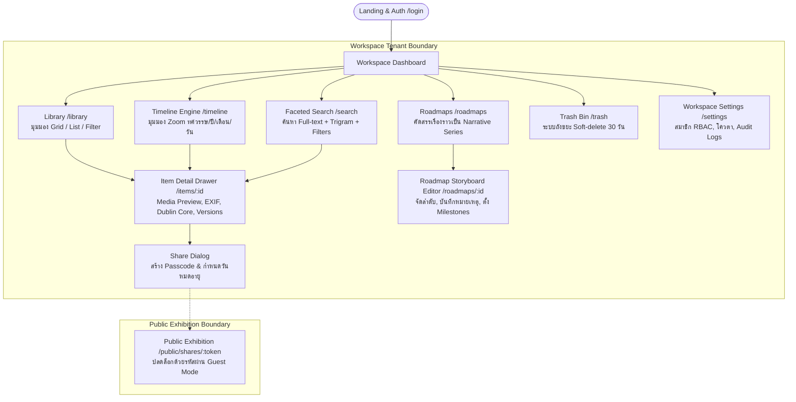
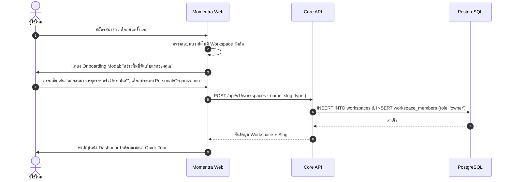
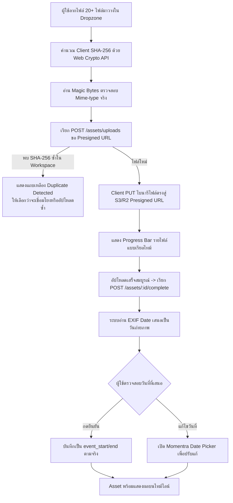
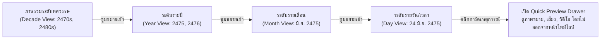

# Momentra (HDAM) — UX/UI Design Specification
## เอกสารการออกแบบประสบการณ์และส่วนต่อประสานผู้ใช้ (Phase 7A)

> **รหัสเอกสาร:** MOMENTRA-UX-07A  
> **เวอร์ชัน:** 1.0.0 (Phase 7A Baseline)  
> **วิสัยทัศน์ UX:** *"เก็บง่าย หาเจอ เห็นเป็นเรื่องราว"* (Frictionless Ingestion, Multi-dimensional Retrieval, Vivid Historical Continuity)  
> **บทบาทผู้จัดทำ:** Senior UX/UI Designer & Solution Architect Team  
> **สอดคล้องกับ:** [docs/01-srs.md](file:///c:/atgv/momentra/docs/01-srs.md), [docs/02-architecture.md](file:///c:/atgv/momentra/docs/02-architecture.md), [api/openapi.yaml](file:///c:/atgv/momentra/api/openapi.yaml)  

---

## 1. Information Architecture (IA) และ Sitemap

ระบบ **Momentra** ออกแบบโครงสร้างสารสนเทศแบบ **Context-Aware Multi-Tenant** โดยแบ่งระดับการทำงานออกเป็น 4 ระดับ:
1. **Global Layer**: ระบบยืนยันตัวตน, โปรไฟล์ผู้ใช้, สลับ Workspace, การตั้งค่าบัญชี
2. **Workspace Tenant Layer**: พื้นที่ทำงานหลักขององค์กรหรือบุคคล จัดสรรพื้นที่จัดเก็บ (Storage Quota), จัดการสมาชิก (RBAC) และถังขยะ (Trash)
3. **Exploration & Management Layer**: หน้ารายการเนื้อหา (Library), หน้าสืบค้นหลายมิติ (Search), ไทม์ไลน์ไดนามิก (Timeline), และเรื่องราวที่คัดสรร (Roadmap)
4. **Public Exhibition Layer**: หน้าแสดงผลนิทรรศการสาธารณะสำหรับ Guest ที่ได้รับลิงก์พร้อมรหัสผ่าน (Passcode Share)

### 1.1 Sitemap Diagram



### 1.2 URL Routing Hierarchy (Next.js 15 App Router)

```
app/
├── [locale]/                          # 'th' | 'en' (สลับภาษา UI)
│   ├── (auth)/
│   │   └── login/                     # เข้าสู่ระบบ (OIDC / Credentials)
│   ├── (workspace)/
│   │   └── [workspaceSlug]/           # สโคป Workspace ปัจจุบัน
│   │       ├── dashboard/             # หน้าแรก Dashboard สรุปภาพรวม
│   │       ├── library/               # คลังสินทรัพย์และลิงก์ (Grid/List)
│   │       ├── timeline/              # ไทม์ไลน์เชิงโต้ตอบ (Interactive Canvas)
│   │       ├── search/                # หน้าสืบค้นหลายมิติ (Faceted Search)
│   │       ├── roadmaps/              # หน้ารายการ Roadmap
│   │       │   └── [id]/              # หน้าจัดลำดับและเล่าเรื่อง (Story Editor)
│   │       ├── items/[id]/            # หน้ารายละเอียดเต็มจอ (Deep Link)
│   │       ├── trash/                 # ถังขยะและประวัติรอทำลาย 30 วัน
│   │       └── settings/              # จัดการสมาชิก, โควตา, Audit Trail
│   └── (public)/
│       └── shares/[token]/            # หน้าชมนิทรรศการสาธารณะ (Guest View)
```

---

## 2. User Flows ของการทำงานหลัก (8 Core Scenarios)

### Flow 1: Onboarding & สร้าง Workspace


---

### Flow 2: Multi-file Batch Upload & EXIF Suggestion Confirmation
ผู้ใช้อัปโหลดรูปภาพและเอกสารพร้อมกัน 20+ ไฟล์ พร้อมการตรวจสอบความถูกต้องตั้งแต่หน้าบ้าน


---

### Flow 3: บันทึกลิงก์และสารสนเทศภายนอก (Link Ingestion)
1. ผู้ใช้คลิกปุ่ม **"+ เพิ่มลิงก์ข้อมูล"** (Add Link) จากแถบเมนูด้านบน
2. ผู้ใช้วาง URL เช่น `https://digital.nlt.go.th/archive/srikrung`
3. เบราว์เซอร์ตรวจสอบรูปแบบ URL ทันที หากถูกต้อง จะเรียก `POST /api/v1/links`
4. ระบบ Backend ส่งคำขอผ่าน Worker ที่ปลอดภัย (SSRF Protection: บล็อก Private IP) เพื่อดึง OpenGraph (ชื่อบทความ, ย่อหน้า, รูปภาพหน้าปก, โดเมน)
5. หน้าจอแสดง Card Preview ให้ผู้ใช้เห็นภายใน 2 วินาที
6. ผู้ใช้สามารถแก้ไขหัวข้อ คำอธิบาย และกำหนด **"วันที่เกิดเหตุการณ์ของเนื้อหาในลิงก์"** (ไม่ใช่แค่วันที่แปะลิงก์)
7. กด **"บันทึกลงคลัง"** ลิงก์จะถูกผูกเข้ากับแกนเวลาประวัติศาสตร์ทันที

---

### Flow 4: ระบุวันที่เหตุการณ์แบบไม่แน่นอน (The Momentra Time Machine)
แก้ปัญหาหลักของงานประวัติศาสตร์และจดหมายเหตุที่ไม่ทราบวันเวลาที่แน่ชัด:
1. ผู้ใช้เปิดหน้าต่างตั้งค่าเวลา `event_date`
2. **เลือกระดับความแม่นยำ (Date Precision)**:
   - **ปี (Year)**: เหมาะสำหรับเอกสารโบราณ เช่น *"พ.ศ. 2475"* (ระบบบันทึกครอบคลุม 1 ม.ค. ถึง 31 ธ.ค.)
   - **เดือน (Month)**: เหมาะสำหรับเหตุการณ์ที่ทราบเดือน เช่น *"มิถุนายน 2475"*
   - **วัน (Day)**: ทราบวันชัดเจน เช่น *"24 มิถุนายน 2475"*
   - **เวลา (Datetime)**: ทราบชั่วโมงนาที เช่น *"24 มิถุนายน 2475 เวลา 05:00 น."*
3. **เปิดตัวเลือกช่วงเวลา (Date Range Toggle)**:
   - กรณีเป็นเหตุการณ์ยาวนาน เช่น *"สงครามโลกครั้งที่สอง 2482 – 2488"*
4. **ตัวเลือกประมาณการณ์ (Circa Checkbox)**:
   - หากไม่แน่ใจ ให้ติ๊กถูก *"ประมาณการณ์ (Circa)"* ระบบจะติดป้าย `[ประมาณ]` หน้าวันที่ เพื่อความถูกต้องทางจดหมายเหตุ
5. **สลับปฏิทิน พ.ศ. ⇄ ค.ศ.**:
   - ผู้ใช้สลับดูปี พ.ศ. หรือ ค.ศ. ได้ทันที โดยระบบคำนวณส่วนต่าง 543 ปีอัตโนมัติ

---

### Flow 5: ค้นหาและกรองข้อมูลหลายมิติ (Faceted Search)
1. ผู้ใช้พิมพ์คำค้นใน Search bar เช่น `"รัฐธรรมนูญ"`
2. ระบบตัดคำภาษาไทยและอังกฤษผ่าน Tokenizer และแสดง **Autocomplete Suggestions**
3. ผลลัพธ์แสดงการ์ดรายการพร้อม **Highlight แท็ก `<mark>`** ในส่วนของชื่อเรื่องและข้อความเนื้อหา
4. ด้านซ้ายแสดง **Faceted Filters** (พร้อมตัวเลขนับจำนวน):
   - ประเภทข้อมูล: รูปภาพ (12), เอกสาร PDF (8), ลิงก์บทความ (5)
   - แท็ก: #การเมือง (15), #พระนคร (9), #สนธิสัญญา (4)
   - ช่วงเวลา: แถบเลื่อน (Slider) เลือกช่วงปี พ.ศ. 2470 – 2500
5. การคลิก Facet ตัวใดจะอัปเดตผลลัพธ์ทันทีภายใน 150 ms แบบ Instant Filtering

---

### Flow 6: สำรวจไทม์ไลน์เชิงลึก (Interactive Timeline Exploration)


---

### Flow 7: สร้างและจัดลำดับเรื่องราว (Curating Roadmap / Storyboard)
1. ผู้ใช้เลือกเมนู **"Roadmaps"** แล้วกด **"+ สร้างเรื่องราวใหม่"**
2. ตั้งชื่อ เช่น *"เส้นทางประวัติศาสตร์การเปลี่ยนแปลงการปกครอง"*
3. หน้าจอแบ่งเป็น 2 ฝั่ง:
   - ฝั่งซ้าย: **Item Tray** ค้นหาและดึง Asset จากคลังมาวาง
   - ฝั่งขวา: **Story Canvas** พื้นที่จัดเรียงลำดับการเล่าเรื่อง
4. ผู้ใช้ลาก Item เข้ามาวาง สามารถสลับตำแหน่ง (Drag & Drop Reordering)
5. ในแต่ละจุด สามารถเพิ่ม **Curator Note** (บันทึกบทบรรยายของผู้คัดสรร) เพื่ออธิบายบริบทเพิ่มเติม
6. กำหนด **Milestone Markers** (แถบสีคั่นช่วงเวลาสำคัญ)
7. กด **"Preview Exhibition"** เพื่อดูตัวอย่างในโหมดนำเสนอ

---

### Flow 8: แชร์นิทรรศการพร้อมรหัสผ่าน (Passcode Guest Share)
1. ผู้ใช้กดปุ่ม **"แชร์ (Share)"** บน Roadmap หรือ Collection
2. ระบบเปิดกล่องการตั้งค่าการแชร์:
   - ตั้งค่าความเป็นส่วนตัว: ลิงก์สาธารณะแบบมีรหัสผ่าน (Passcode Protected)
   - กำหนดรหัสผ่าน 4–8 หลัก (เช่น `1932`)
   - กำหนดวันหมดอายุของลิงก์ (เช่น 7 วัน, 30 วัน หรือไม่มีวันหมดอายุ)
   - สิทธิ์ของผู้เข้าชม: ดูได้อย่างเดียว (Read-only Viewer)
3. ระบบสร้างลิงก์ `https://momentra.app/th/shares/sh_9b2e7c` พร้อมปุ่มคลิกคัดลอกลิงก์
4. เมื่อบุคคลภายนอกเปิดลิงก์ จะพบหน้าจอ Minimalist ให้ใส่รหัสผ่าน
5. เมื่อปลดล็อกสำเร็จ จะเข้าชมผลงานในรูปแบบ **Full-Screen Historical Exhibition UI** ที่สะอาดตา ไม่มีปุ่มแก้ไขของระบบมารบกวน

---

## 3. Wireframes และ Layout Mockups (8 หน้าจอหลัก)

### 3.1 หน้าจอ Workspace Dashboard
หน้ารวมภาพรวมของคลังข้อมูล กิจกรรมล่าสุด และสถิติความหนาแน่นตามกาลเวลา

```
+----------------------------------------------------------------------------------------------------+
| [MOMENTRA]  Workspace: [หอจดหมายเหตุสยาม v]     (Q) ค้นหาทุกสิ่ง (Ctrl+K)    [+ สร้าง v]  [🔔] [User] |
+----------------------------------------------------------------------------------------------------+
|  [🏠 หน้าแรก]   [📚 คลังข้อมูล]   [⏳ ไทม์ไลน์]   [🧭 Roadmaps]   [🗑️ ถังขยะ]        [⚙️ ตั้งค่าพื้นที่] |
+----------------------------------------------------------------------------------------------------+
|                                                                                                    |
|  ยินดีต้อนรับกลับมา, คุณสมชาย                                   พื้นที่จัดเก็บ: 14.2 GB / 50 GB (28%)|
|  ------------------------------------------------------------- [====================..........]    |
|                                                                                                    |
|  +-- [สรุปด่วน] ---------------------------------------------------------------------------------+ |
|  |  [ สินทรัพย์ทั้งหมด: 1,420 ชิ้น ]    [ ลิงก์บันทึก: 312 รายการ ]    [ หมุดหมายสำคัญ: 18 แห่ง ]  | |
|  +-----------------------------------------------------------------------------------------------+ |
|                                                                                                    |
|  +-- [แกนเวลาจำลอง (Timeline Mini-Map: พ.ศ. 2400 - 2500)] ---------------------------------------+ |
|  |   ความหนาแน่น:                                                                                | |
|  |       ||        |||||       |||||||||||||         ||||          |||              ||       | |
|  |   ----+---------+-----------+-------------+---------+-------------+---------------+-------   | |
|  |   2400         2420        2440          2460      2475 (สูงสุด)  2480            2500       | |
|  |   [ คลิกที่นี่เพื่อเปิดไทม์ไลน์ฉบับเต็ม -> ]                                                    | |
|  +-----------------------------------------------------------------------------------------------+ |
|                                                                                                    |
|  +-- [รายการอัปเดตล่าสุด] -----------------------------+  +-- [การดำเนินการด่วน (Quick Actions)] -+ |
|  | * ภาพถ่ายสะพานพุทธฯ (พ.ศ. 2475)                    |  |  [ + อัปโหลดหลายไฟล์ (Drag & Drop) ]  | |
|  |   โดย สมชาย • 10 นาทีที่แล้ว • [รูปภาพ]             |  |  [ + เพิ่มลิงก์สารสนเทศภายนอก ]      | |
|  | * บันทึกสนธิสัญญาเบาว์ริง (พ.ศ. 2398)              |  |  [ + สร้างไทม์ไลน์เรื่องราว (Roadmap) ]| |
|  |   โดย ดร. อรอนงค์ • 2 ชม. ที่แล้ว • [เอกสาร PDF]   |  |  [ + กำหนดหมุดหมายสำคัญ (Milestone) ]  | |
|  | * บันทึกวิทยุกระจายเสียงประกาศอภิวัฒน์               |  +-------------------------------------+ |
|  |   โดย นงลักษณ์ • เมื่อวานนี้ • [เสียง Audio]         |  +-- [สมาชิกในพื้นที่ทำงาน] ----------+ |
|  +----------------------------------------------------+  |  (S) สมชาย (Owner)  (O) อรอนงค์ (Admin)| |
|                                                           |  [ + เชิญสมาชิกใหม่ ]                  | |
|                                                           +----------------------------------------+ |
+----------------------------------------------------------------------------------------------------+
```

---

### 3.2 หน้าจอคลังข้อมูล (Content Library: Grid & List Mode)
จุดศูนย์กลางของการจัดการ Asset และ Link พร้อมเครื่องมือกรองขั้นสูง

```
+----------------------------------------------------------------------------------------------------+
|  คลังข้อมูล (Library)  •  1,420 รายการ                       [ มุมมอง: [田 ตาราง] [☰ รายการ] ]     |
|  ------------------------------------------------------------------------------------------------- |
|  [ ค้นหาในคลังนี้...      ] [ ประเภท: ทั้งหมด v ] [ แท็ก: ทั้งหมด v ] [ ปี: พ.ศ. 2470-2480 v ] [เรียง: วันที่ v]|
+-------------------+--------------------------------------------------------------------------------+
| ตัวกรองย่อย       | [x เลือกทั้งหมด]  [ ส่งออก (Export) ] [ เพิ่มแท็กกลุ่ม ] [ ย้ายลงถังขยะ ]        |
| ----------------- | ------------------------------------------------------------------------------ |
| [ ] รูปภาพ (840)  | +-------------------+  +-------------------+  +-------------------+  +-----------+ |
| [ ] เอกสาร (320)  | | [รูปภาพสะพานพุทธ] |  | [หน้า 1 นสพ.ศรีกรุง]  | | [คลิปเสียงประกาศ] |  | [แผนที่]   | |
| [ ] วิดีโอ (120)  | | [📷 ภาพถ่าย]      |  | [📰 ลิงก์เว็บ]    |  | [🎙️ เสียง]         |  | [🗺️ รูป]   | |
| [ ] เสียง (80)    | |                   |  |                   |  |                   |  |           | |
| [ ] บันทึก (60)   | | 6 เม.ย. 2475      |  | 25 มิ.ย. 2475     |  | 24 มิ.ย. 2475     |  | พ.ศ. 2440 | |
|                   | | พระพุทธยอดฟ้าฯ    |  | ข่าวการเปลี่ยนแปลง|  | คณะราษฎรแถลงฯ     |  | [ประมาณ]  | |
| ความแม่นยำเวลา:   | | #พระนคร #สะพาน    |  | #หนังสือพิมพ์     |  | #ประวัติศาสตร์    |  | #แผนที่สยาม| |
| (*) ทั้งหมด       | +-------------------+  +-------------------+  +-------------------+  +-----------+ |
| ( ) ระบุวันชัดเจน |                                                                                |
| ( ) ระบุแค่ปี/เดือน| +-------------------+  +-------------------+  +-------------------+  +-----------+ |
| ( ) มีป้ายประมาณ  | | [สนธิสัญญาเบาว์ริง] |  | [ภาพถ่ายรัชกาลที่ 5] |  | [วิดีโอพิธีเปิด]   |  | [บันทึก]  | |
|                   | | [📄 PDF 14 หน้า]   |  | [📷 ฟิล์มกระจก]   |  | [🎬 วิดีโอ 1080p] |  | [📝 โน้ต]  | |
| โครงการ/หมวดหมู่: | |                   |  |                   |  |                   |  |           | |
| [ ทศวรรษ 2470 ]   | | 18 เม.ย. 2398     |  | พ.ศ. 2440 [ประมาณ]|  | 1 ม.ค. 2482       |  | 10 ธ.ค. 75| |
| [ ยุคปฏิรูป ]     | | ฉบับภาษาอังกฤษ    |  | เสด็จประพาสยุโรป  |  | วันขึ้นปีใหม่สยาม |  | วันรัฐธรรมนูญ |
|                   | +-------------------+  +-------------------+  +-------------------+  +-----------+ |
|                   |                                                     [ < หน้า 1 จาก 71 > ]       |
+-------------------+--------------------------------------------------------------------------------+
```

---

### 3.3 หน้าจอ Item Detail Drawer / Modal
เปิดขึ้นมาทางด้านขวาเมื่อคลิกที่ Item โดยไม่สูญเสียบริบทของหน้ารายการเดิม

```
+----------------------------------------------------------------------------------+ [X ปิดหน้าต่าง] -+
|  [📷 รูปภาพ]  ภาพถ่ายประวัติศาสตร์การเปิดสะพานปฐมบรมราชานุสรณ์ (สะพานพุทธฯ)                          |
+----------------------------------------------------------------------------------------------------+
|  +--------------------------------------------------+  +-- ข้อมูลประวัติศาสตร์และเวลา ------------+ |
|  |                                                  |  |  วันที่เกิดเหตุการณ์ (Event Date):       | |
|  |                                                  |  |  [🗓️ 6 เมษายน พ.ศ. 2475 (1932)]           | |
|  |               [ พรีวิวภาพความละเอียดสูง ]           |  |  ความแม่นยำ: วันที่ชัดเจน (Day Precision) | |
|  |               (รองรับ Zoom / Pan / Inspect)       |  |  ความแน่นอน: แน่นอน 100% (Not Circa)      | |
|  |                                                  |  |  ปฏิทินที่ใช้: สุริยคติไทย / คริสต์ศักราช | |
|  |                                                  |  +-----------------------------------------+ |
|  +--------------------------------------------------+  +-- เมทาดาทาจดหมายเหตุ (Dublin Core) -----+ |
|  | [🔍 ซูม 100%] [⬇️ ดาวน์โหลดต้นฉบับ (Signed URL)]    |  |  ผู้สร้าง (Creator): กรมรถไฟหลวง           | |
|  +--------------------------------------------------+  |  หัวเรื่อง (Subject): สะพานพระพุทธยอดฟ้า    | |
|                                                        |  สิทธิ์ (Rights): สาธารณสมบัติ (Public)    | |
|  +-- ข้อมูลไฟล์และเทคนิค (Asset Specs) ---------------+  |  ภาษา (Language): ไทย (tha)                | |
|  | ขนาดไฟล์: 4.8 MB | ชนิด: image/jpeg (3840 x 2160)   |  +-----------------------------------------+ |
|  | ค่าแฮช SHA-256: e3b0c44298fc1c149afbf4c8996fb9242...|  +-- แท็กและบุคคล (Tags & Entities) -------+ |
|  | กล้อง/EXIF: ดึงเมื่อ 2026-10-05 (สแกนจากฟิล์มกระจก)  |  |  [#สะพานพุทธ x] [#พระนคร x] [#2475 x]     | |
|  +----------------------------------------------------+  |  [ + เพิ่มแท็ก... ]                        | |
|                                                        +-----------------------------------------+ |
|  +-- การดำเนินการ: [ 🔗 คัดลอกลิงก์แชร์ ]  [ 🧭 เพิ่มลง Roadmap ]  [ ✏️ แก้ไขข้อมูล ]  [ 🗑️ ส่งลงถังขยะ ] --+ |
+----------------------------------------------------------------------------------------------------+
```

---

### 3.4 หน้าต่างอัปโหลดหลายไฟล์ (Multi-file Upload Drawer & Resumable Queue)

```
+----------------------------------------------------------------------------------------------------+
|  อัปโหลดสินทรัพย์ดิจิทัล (Upload Digital Assets)                                    [ _ ย่อ ] [X ปิด] |
+----------------------------------------------------------------------------------------------------+
|  +-----------------------------------------------------------------------------------------------+ |
|  |                     [ ☁️ ลากและวางไฟล์ที่นี่ หรือ คลิกเพื่อเลือกไฟล์ ]                           | |
|  |            รองรับ: รูปภาพ (JPG, PNG, TIFF), วิดีโอ (MP4, MOV), เสียง (WAV, MP3), เอกสาร (PDF)     | |
|  |                    ขนาดสูงสุด 4 GB ต่อไฟล์ • มีระบบตรวจสอบไฟล์ซ้ำอัตโนมัติ                      | |
|  +-----------------------------------------------------------------------------------------------+ |
|                                                                                                    |
|  รายการกำลังอัปโหลด (3 ไฟล์กำลังประมวลผล • 1 ไฟล์เสร็จสิ้น)                     [ ยกเลิกทั้งหมด ]  |
|  ------------------------------------------------------------------------------------------------- |
|  1. historical_map_bangkok_1932.tiff (142 MB)                                                     |
|     [============================================.......] 78% (12 MB/s) • เหลือเวลา 3 วิ           |
|     สถานะ: กำลังส่งข้อมูลไบนารีตรงเข้า S3 Storage [กำลังคำนวณ Checksum SHA-256...]                |
|                                                                                                    |
|  2. interview_veteran_ww2_audio.wav (850 MB)                                                      |
|     [=====================..............................] 35% (8.5 MB/s) • เหลือเวลา 1 นาที        |
|     สถานะ: อัปโหลดแบบ Multipart Chunk 7/20 [Pause ชั่วคราว] [X ยกเลิก]                             |
|                                                                                                    |
|  3. newspaper_srikrung_june1932.pdf (18 MB)                                                        |
|     [===================================================] 100% • เสร็จสมบูรณ์                      |
|     สถานะ: ตรวจพบวันที่จากเอกสาร: 24 มิ.ย. 2475 -> [ กดยืนยันวันที่ ] [ แก้ไขวันที่ ]             |
|                                                                                                    |
|  4. photo_palace_duplicate.jpg (3.2 MB)                                                            |
|     [!] ตรวจพบไฟล์ซ้ำ (Duplicate Detected) ด้วย SHA-256: ตรงกับ Item "พระบรมมหาราชวัง พ.ศ. 2450"  |
|     ทางเลือก: [ เชื่อมโยงเป็นไฟล์ซ้ำ ]  [ อัปโหลดเป็นเวอร์ชันใหม่ ]  [ ยกเลิกไฟล์นี้ ]             |
+----------------------------------------------------------------------------------------------------+
```

---

### 3.5 หน้าจอไทม์ไลน์เชิงโต้ตอบ (Interactive Timeline Canvas)
แกนกลางของระบบที่นำเสนอข้อมูลตามวันเวลาจริง พร้อมฮิสโตแกรมบอกความหนาแน่น

```
+----------------------------------------------------------------------------------------------------+
|  ไทม์ไลน์ประวัติศาสตร์ (Timeline)                     [ ซูม: ( ) ทศวรรษ  (*) ปี  ( ) เดือน  ( ) วัน ]|
|  มุมมอง: พ.ศ. 2470 – พ.ศ. 2480 (ค.ศ. 1927 – 1937)     [ ปฏิทิน: [*พ.ศ.] [ค.ศ.] ]  [ตัวกรอง: ทั้งหมด v]|
+----------------------------------------------------------------------------------------------------+
|  [ ฮิสโตแกรมแสดงความหนาแน่นของข้อมูล (Density Heatmap) ]                                           |
|       _          _                   _ _█_ _                                                       |
|     _█ █_      _█ █ █_             _█ █ █ █ █_                                                     |
|  --+-----+----+-------+-----------+-----------+-------------------------------------------------   |
|    2470       2472                2475 (Peak: 48 items)                          2480              |
+----------------------------------------------------------------------------------------------------+
|  [🚩 หมุดหมาย: การอภิวัฒน์สยาม (24 มิ.ย. 2475 - 10 ธ.ค. 2475) แถบสีแดงเน้นช่วงเวลา ]                |
+----------------------------------------------------------------------------------------------------+
|  <<< เลื่อนไปอดีต                                                                   เลื่อนไปอนาคต >>>|
|                                                                                                    |
|  +-- [ปี พ.ศ. 2474 (1931)] --+  +-- [ปี พ.ศ. 2475 (1932)] ---------------------------------------+ |
|  | (12 รายการ)               |  | (48 รายการ) • หมุดหมายสำคัญแห่งประวัติศาสตร์                    | |
|  |                           |  |                                                                 | |
|  | +-----------------------+ |  | +-------------------------+     +-----------------------------+ | |
|  | | [รูป] พระคลังข้างที่   | |  | | [รูป] 24 มิ.ย. 2475    |     | [รูป] 10 ธ.ค. 2475          | | |
|  | | 15 พ.ย. 2474          | |  | | ประกาศคณะราษฎร ฉบับที่ 1 |     | พิธีพระราชทานรัฐธรรมนูญ     | | |
|  | | #การคลัง #สยาม        | |  | | ลานพระบรมรูปทรงม้า       |     | พระที่นั่งอนันตสมาคม        | | |
|  | +-----------------------+ |  | +-------------------------+     +-----------------------------+ | |
|  |                           |  |                                                                 | |
|  | +-----------------------+ |  | +-------------------------+     +-----------------------------+ | |
|  | | [เอกสาร] แผนงบประมาณ  | |  | | [หนังสือพิมพ์] มิ.ย. 75 |     | [แผนผัง] พ.ศ. 2475 [ประมาณ] | | |
|  | | พ.ศ. 2474 [ระบุแค่ปี]  | |  | | ข่าวศรีกรุง ฉบับพิเศษ   |     | แผนที่เขตพระนครชั้นใน       | | |
|  | +-----------------------+ |  | +-------------------------+     +-----------------------------+ | |
|  +---------------------------+  +-----------------------------------------------------------------+ |
|                                                                                                    |
+----------------------------------------------------------------------------------------------------+
```

---

### 3.6 หน้าจอสร้างและเรียบเรียงเรื่องราว (Curated Roadmap Editor)

```
+----------------------------------------------------------------------------------------------------+
|  [<- กลับ]  เรื่องราว: วิวัฒนาการสถาปัตยกรรมพระนครหลัง 2475              [ บันทึกร่าง ] [🚀 เผยแพร่/แชร์ ]|
+----------------------------------------------------------------------------------------------------+
|  คลังข้อมูลสำหรับเลือก (Item Tray)  |  ผืนผ้าใบจัดลำดับเรื่องราว (Story Canvas)                       |
|  [ ค้นหาไอเทมเพื่อนำมาเล่า...    ]  |  ----------------------------------------------------------- |
|  ---------------------------------  |  จุดที่ 1 • หมุดหมายเริ่มต้น (Milestone)                     |
|  * [รูป] หมุดคณะราษฎร (2475)       |  +---------------------------------------------------------+ |
|    [+ ลากลงแคนวาส]                 |  | [รูปภาพ] พิธีวางศิลาฤกษ์อนุสาวรีย์ประชาธิปไตย (พ.ศ. 2482)  | |
|                                    |  | วันที่: 24 มิถุนายน พ.ศ. 2482 • โดย: จอมพล ป. พิบูลสงคราม   | |
|  * [รูป] อาคารศาลฎีกาเดิม (2484)   |  | ------------------------------------------------------- | |
|    [+ ลากลงแคนวาส]                 |  | [📝 บันทึกคำบรรยายภัณฑารักษ์ (Curator Annotation)]       | |
|                                    |  | "การเริ่มก่อสร้างอนุสาวรีย์บนถนนราชดำเนินกลาง เพื่อเป็น    | |
|  * [เอกสาร] บันทึกแบบแปลน รร.เสนาฯ |  | สัญลักษณ์ของระบอบใหม่ ออกแบบโดย ศิลป์ พีระศรี..."        | |
|    [+ ลากลงแคนวาส]                 |  +---------------------------------------------------------+ |
|                                    |                             |                                 |
|  * [คลิป] พิธีเปิดอนุสาวรีย์ (83)  |                             v (เชื่อมโยงตามกาลเวลา 2 ปีถัดมา) |
|    [+ ลากลงแคนวาส]                 |  จุดที่ 2 • อาคารและสถานที่                                 |
|                                    |  +---------------------------------------------------------+ |
|                                    |  | [รูปภาพ] โรงแรมรัตนโกสินทร์และอาคารราชดำเนิน (พ.ศ. 2485) | |
|                                    |  | วันที่: พ.ศ. 2485 [ประมาณ] • สถาปัตยกรรมแบบ Art Deco    | |
|                                    |  | ------------------------------------------------------- | |
|                                    |  | [📝 เพิ่มคำบรรยายจุดนี้...                             ] | |
|                                    |  +---------------------------------------------------------+ |
+------------------------------------+---------------------------------------------------------------+
```

---

### 3.7 หน้าผลการค้นหาแบบหลายมิติ (Faceted Search Results)

```
+----------------------------------------------------------------------------------------------------+
|  [🔍 ค้นหา: "รัฐธรรมนูญ"                                                    ] [ ปุ่มล้างคำค้น (X) ] |
|  ผลการค้นหา: พบ 142 รายการ (0.042 วินาที)                [ จัดเรียงตาม: ความเกี่ยวข้องสูงสุด (Relevance) v ]|
+-------------------+--------------------------------------------------------------------------------+
| ตัวกรอง (Facets)  | ผลลัพธ์การค้นหา (หน้า 1 จาก 8)                                                 |
| ----------------- | ------------------------------------------------------------------------------ |
| ประเภท:           | 1. [รูปภาพ] พิธีพระราชทาน<mark>รัฐธรรมนูญ</mark>แห่งราชอาณาจักรสยาม พุทธศักราช 2475|
| [x] รูปภาพ (84)   |    🗓️ 10 ธันวาคม พ.ศ. 2475 (1932)  •  พระที่นั่งอนันตสมาคม                      |
| [ ] เอกสาร (42)   |    รายละเอียด: พระบาทสมเด็จพระปกเกล้าเจ้าอยู่หัว ทรงลงพระปรมาภิไธยใน...        |
| [ ] ลิงก์ (16)    |    แท็ก: #<mark>รัฐธรรมนูญ</mark> #ประชาธิปไตย #พระราชพิธี                     |
|                   |    [ ดูรายละเอียด ]  [ ดูบนไทม์ไลน์ ]  [ เพิ่มใน Roadmap ]                         |
| ช่วงเวลา (ปี พ.ศ.):| ------------------------------------------------------------------------------ |
| [ 2475 ] - [ 2490]| 2. [เอกสาร PDF] สมุด<mark>รัฐธรรมนูญ</mark>ฉบับสมบูรณ์และคำอธิบายมาตราสำคัญ    |
| (เลื่อนสไลเดอร์)  |    🗓️ พ.ศ. 2475 (ระบุระดับปี)  •  จัดพิมพ์โดย โรงพิมพ์กองสลาก                   |
|                   |    ข้อความที่ตรงกัน: "...มาตรา ๑ อำนาจสูงสุดของประเทศนั้นเป็นของราษฎรทั้งหลาย..." |
| บุคคลสำคัญ:       |    แท็ก: #กฎหมาย #สมุดไทย                                                      |
| [ ] พระปกเกล้า(31)| ------------------------------------------------------------------------------ |
| [ ] พระยาพหลฯ (18)| 3. [ลิงก์บทความ] ประวัติความเป็นมาของวัน<mark>รัฐธรรมนูญ</mark>ไทย             |
| [ ] ปรีดี (24)    |    🌐 digital.parliament.go.th • ดึงข้อมูลเมื่อ 2 วันที่แล้ว                    |
+-------------------+--------------------------------------------------------------------------------+
```

---

### 3.8 หน้าจอตั้งค่าพื้นที่ทำงานและจัดการสมาชิก (Settings & Members)

```
+----------------------------------------------------------------------------------------------------+
|  การตั้งค่าพื้นที่ทำงาน (Workspace Settings) : หอจดหมายเหตุสยาม                                    |
|  [ ข้อมูลทั่วไป ]   [* สมาชิกและสิทธิ์ (RBAC) ]   [ พื้นที่จัดเก็บ & โควตา ]   [ บันทึก Audit Log ]|
+----------------------------------------------------------------------------------------------------+
|                                                                                                    |
|  สมาชิกในพื้นที่ทำงาน (ทั้งหมด 4 คน)                                  [ + เชิญสมาชิกใหม่ด้วยอีเมล ]|
|  ------------------------------------------------------------------------------------------------- |
|  ชื่อ - นามสกุล               อีเมล                  บทบาทสิทธิ์ (Role)       วันที่เข้าร่วม  การจัดการ |
|  ------------------------------------------------------------------------------------------------- |
|  สมชาย วิจิตรานันท์ (คุณ)     somchai@momentra.app   [ เจ้าของ (Owner)      v] 1 ม.ค. 2569    [ - ]     |
|  ดร. อรอนงค์ สุทธิประภา      oranong@univ.ac.th     [ ผู้ดูแล (Admin)      v] 3 ม.ค. 2569    [ ถอดถอน ]|
|  นงลักษณ์ รัตนเจริญผล        nonglak@archives.or.th [ ผู้ร่วมงาน (Contrib) v] 5 ม.ค. 2569    [ ถอดถอน ]|
|  ปิติ พงษ์สยาม               piti@archives.or.th    [ ผู้เข้าชม (Viewer)   v] 10 ก.พ. 2569   [ ถอดถอน ]|
|                                                                                                    |
|  +-- คำอธิบายสิทธิ์ (Role Matrix Summary) -------------------------------------------------------+ |
|  | * เจ้าของ (Owner): จัดการทุกอย่าง รวมถึงลบ Workspace และถ่ายโอนความเป็นเจ้าของ                  | |
|  | * ผู้ดูแล (Admin): จัดการสมาชิก, อัปโหลด/ลบข้อมูล, กู้คืนถังขยะ, ปรับแต่งการตั้งค่า             | |
|  | * ผู้ร่วมงาน (Contributor): อัปโหลด Asset, บันทึกลิงก์, แก้ไขเฉพาะรายการที่ตนเองสร้าง          | |
|  | * ผู้เข้าชม (Viewer): ค้นหาและดูข้อมูลบน Timeline ได้อย่างเดียว (Read-only)                     | |
|  +-----------------------------------------------------------------------------------------------+ |
|                                                                                                    |
|  +-- พื้นที่จัดเก็บและถังขยะ (Storage & Retention) -----------------------------------------------+ |
|  | ปริมาณการใช้งาน: 14.2 GB จากโควตา 50.0 GB (เหลือพื้นที่ 35.8 GB)                               | |
|  | รายการในถังขยะ: 6 รายการ (จะถูกลบถาวรหลัง 30 วันตามนโยบาย PDPA) [ ดูรายการในถังขยะ -> ]        | |
|  +-----------------------------------------------------------------------------------------------+ |
+----------------------------------------------------------------------------------------------------+
```

---

## 4. คอมโพเนนต์หัวใจสำคัญ: The Imprecise Historical Date Picker

คอมโพเนนต์นี้ถูกออกแบบขึ้นมาเพื่อแก้ไขปัญหาที่ระบบปฏิทินมาตรฐานไม่เคยรองรับ: **"การระบุวันเวลาในอดีตที่มีระดับความไม่แน่นอนและใช้สองปฏิทินควบคู่กัน"**

### 4.1 โครงสร้างและส่วนควบคุมของคอมโพเนนต์

```
+-- [ กำหนดวันเวลาของเหตุการณ์ (Historical Event Date) ] ------------------------------------+
|                                                                                            |
|  1. เลือกระดับความละเอียด (Date Precision Tab):                                            |
|     +--------------+--------------+--------------+--------------+                          |
|     |  ( ) ปี      |  ( ) เดือน   |  [*] วัน     |  ( ) เวลา    |                          |
|     |  (Year Only) |  (Year-Month)|  (Full Date) |  (Datetime)  |                          |
|     +--------------+--------------+--------------+--------------+                          |
|                                                                                            |
|  2. เลือกระบบปฏิทินที่ต้องการกรอก (Dual Calendar Selector):                                 |
|     [ * พุทธศักราช (พ.ศ.) ]      [ คริสต์ศักราช (ค.ศ.) ]                                    |
|                                                                                            |
|  3. กรอกข้อมูลวันเวลา (แสดงผลตาม Precision ที่เลือก):                                      |
|     วัน: [ 24 v ]   เดือน: [ มิถุนายน v ]   ปี: [ 2475 ]  (คริสต์ศักราชคำนวณอัตโนมัติ: 1932)  |
|                                                                                            |
|  4. ตัวเลือกเพิ่มเติมด้านความแน่นอน:                                                        |
|     [ ] เป็นช่วงเวลาเหตุการณ์ (Date Range: มีวันเริ่มต้น และ วันสิ้นสุด)                     |
|     [*] ประมาณการณ์ (Circa: ติดป้าย "ประมาณ" หน้ารายการ)                                   |
|                                                                                            |
|  +-- ผลลัพธ์ที่จะแสดงผลให้ผู้ใช้เห็น (Live Preview Badge) -------------------------------+ |
|  |  ข้อความภาษาไทย:   "ประมาณ 24 มิถุนายน พ.ศ. 2475"                                      | |
|  |  ข้อความภาษาอังกฤษ: "Circa 24 June 1932"                                                | |
|  |  ค่าจัดเก็บในระบบ:  1932-06-24T00:00:00Z ถึง 1932-06-24T23:59:59Z (UTC)                | |
|  +---------------------------------------------------------------------------------------+ |
+--------------------------------------------------------------------------------------------+
```

### 4.2 กฎความถูกต้องและการทำงานเบื้องหลัง (Business Rules)
1. **Dynamic Form Fields**:
   - ถ้าเลือก `year`: แสดงเฉพาะช่องกรอกปี (พ.ศ. หรือ ค.ศ.) ช่องวันและเดือนจะถูกซ่อนอัตโนมัติ
   - ถ้าเลือก `month`: แสดงช่องเลือกเดือนและกรอกปี
   - ถ้าเลือก `day`: แสดง วัน, เดือน, ปี
   - ถ้าเลือก `datetime`: แสดง วัน, เดือน, ปี พร้อมช่องระบุเวลา (ชั่วโมง:นาที)
2. **Instant Calendar Synchronization**:
   - ผู้ใช้สามารถพิมพ์ปีเป็น พ.ศ. (เช่น `2475`) ระบบจะแปลงเป็น ค.ศ. (`1932`) ส่งไปเก็บในฐานข้อมูลตามกฎ ค.ศ. = พ.ศ. - 543 เสมอ
3. **Range Validation**:
   - หากเปิดใช้งานโหมดช่วงเวลา ระบบจะบังคับตรวจสอบ `event_end >= event_start` หากผู้ใช้ใส่วันสิ้นสุดก่อนวันเริ่มต้น ฟอร์มจะแสดงข้อความแจ้งเตือนสีแดงทันทีก่อนกดยืนยัน

---

## 5. Design Tokens และระบบการจัดแต่งหน้าจอ (Styling System)

เพื่อสะท้อนความรู้สึก **"คุณค่าทางประวัติศาสตร์ (Heritage) ผสานกับความแม่นยำแห่งยุคดิจิทัล (Digital Precision)"** จึงเลือกใช้โทนสีคลาสสิกที่สุขุม ทรงคุณค่า และดูสบายตาในระยะยาว

### 5.1 Color Palette (Heritage & Modern Slate)

| Token Name | Light Mode Value | Dark Mode Value | การนำไปใช้งาน |
| :--- | :--- | :--- | :--- |
| `--color-primary-base` | `#1E293B` (Slate 800) | `#F8FAFC` (Slate 50) | สีตัวหนังสือหลัก, หัวเว็บ, ปุ่ม Primary |
| `--color-primary-surface` | `#0F172A` (Slate 900) | `#020617` (Slate 950) | แถบเครื่องมือหลัก, แถบเมนูด้านข้าง |
| `--color-accent-amber` | `#D97706` (Amber 600) | `#F59E0B` (Amber 500) | สีเน้นประวัติศาสตร์, ป้ายประมาณการณ์ (Circa), Highlight |
| `--color-milestone-rose` | `#E11D48` (Rose 600) | `#FB7185` (Rose 400) | หมุดหมายสำคัญบนไทม์ไลน์ (Milestones) |
| `--color-surface-card` | `#FFFFFF` (Pure White) | `#1E293B` (Slate 800) | พื้นหลังการ์ดเนื้อหา, กล่องข้อความ |
| `--color-surface-ground` | `#F1F5F9` (Slate 100) | `#0F172A` (Slate 900) | พื้นหลังหน้าจอหลักของแอปพลิเคชัน |
| `--color-border-subtle` | `#E2E8F0` (Slate 200) | `#334155` (Slate 700) | เส้นคั่นตาราง, เส้นแกนไทม์ไลน์ |
| `--color-success` | `#059669` (Emerald 600) | `#10B981` (Emerald 500) | อัปโหลดสำเร็จ, สถานะระบบปกติ |
| `--color-danger` | `#DC2626` (Red 600) | `#EF4444` (Red 500) | แจ้งเตือนข้อผิดพลาด, ปุ่มลบถาวร |

### 5.2 Typography System (Thai-First Pairing)
* **Heading / Display**: `Prompt`, sans-serif (น้ำหนัก 600, 700) — ให้ความรู้สึกโมเดิร์น เป็นทางการ แต่เข้าถึงง่าย
* **Body / Content**: `Sarabun`, sans-serif (น้ำหนัก 400, 500) — ฟอนต์มาตรฐานจดหมายเหตุ อ่านง่ายทั้งบนจอคอมพิวเตอร์และมือถือ
* **Numbers / Code / Timestamps**: `Inter`, monospace (น้ำหนัก 400, 600) — แสดงตัวเลขปี ค.ศ./พ.ศ. และแฮชไฟล์ได้อย่างแม่นยำ

```css
/* Typography Scale */
--font-size-xs:   0.75rem;  /* 12px - Labels, Badges */
--font-size-sm:   0.875rem; /* 14px - Secondary Text, Metadata */
--font-size-base: 1.00rem;  /* 16px - Body Text */
--font-size-lg:   1.125rem; /* 18px - Subheadings, Card Titles */
--font-size-xl:   1.25rem;  /* 20px - Section Headings */
--font-size-2xl:  1.50rem;  /* 24px - Page Titles */
--font-size-3xl:  1.875rem; /* 30px - Timeline Era Headers */
```

### 5.3 Spacing, Elevation & Border Radius
* **Base Unit**: 4px / 8px Grid (`p-2`, `p-4`, `p-6`, `p-8`)
* **Border Radius**:
  * Card / Modals: `rounded-xl` (12px)
  * Inputs / Buttons: `rounded-lg` (8px)
  * Badges / Tags / Avatars: `rounded-full` (9999px)
* **Shadows**:
  * Card Default: `0 1px 3px 0 rgb(0 0 0 / 0.1)`
  * Card Hover / Floating Modal: `0 10px 15px -3px rgb(0 0 0 / 0.1)`

### 5.4 Responsive Breakpoints
1. **Mobile (< 640px)**:
   - เมนูด้านข้างพับเป็น Bottom Navigation Bar (หน้าแรก, คลัง, ไทม์ไลน์, ค้นหา)
   - ไทม์ไลน์เปลี่ยนเป็นแนวตั้ง (Vertical Continuous Scroll) แทนแนวนอน
   - Drawer แสดงผลเต็มจอ (Full-screen Sheet)
2. **Tablet (640px – 1024px)**:
   - แสดงคอลัมน์คู่สำหรับ Library Grid
   - ไทม์ไลน์รองรับการเลื่อนแนวนอนด้วย Gesture Touch Swipe
3. **Desktop (1024px – 1440px)**:
   - การแสดงผลมาตรฐานเต็มรูปแบบ (Sidebar ซ้าย, Content กลาง, Detail Drawer ขวา)
4. **Large Desktop / Exhibition (> 1440px)**:
   - ปรับ Grid แสดงได้สูงสุด 6 คอลัมน์ รองรับหน้าจอสัมผัสขนาดใหญ่ในพิพิธภัณฑ์หอจดหมายเหตุ

---

## 6. Micro-interactions, สถานะหน้าจอ (States) และการรองรับ Accessibility (WCAG 2.1 AA)

### 6.1 สถานะหน้าจอที่สมบูรณ์ (Component States)

| สถานะ | แนวทางการออกแบบ | องค์ประกอบภาพ |
| :--- | :--- | :--- |
| **Empty State** | ไม่ปล่อยให้จอว่างเปล่า แต่ต้องชวนให้ลงมือทำ (Action-oriented) | มีภาพลายเส้นจดหมายเหตุ พร้อมปุ่ม CTA เช่น *"[+ อัปโหลดภาพหรือเอกสารแรก]"* |
| **Loading State** | ป้องกันจอขาวด้วย Shimmer Skeleton Loader | การ์ดโครงกระดูกสีเทาที่มีแสงวาบเลียนแบบขนาดของรูปและข้อความ |
| **Error State** | แจ้งเหตุผลชัดเจนตาม RFC 9457 พร้อมทางออก (Recovery Action) | แถบเตือนสีแดงสดพร้อมปุ่ม *"ลองใหม่อีกครั้ง"* หรือ *"ตรวจสอบการเชื่อมต่อ"* |
| **Active / Hover** | ตอบสนองต่อการสัมผัสและการชี้เมาส์ภายใน 100 ms | ยกตัวการ์ดขึ้นเล็กน้อย (`translate-y-[-2px]`) พร้อมเงาที่นุ่มนวล |

### 6.2 มาตรฐานความสามารถในการเข้าถึง (WCAG 2.1 Level AA)
1. **Contrast Ratio**:
   - ข้อความปกติและปุ่มทั้งหมดผ่านเกณฑ์ความเปรียบต่างสีอย่างน้อย **4.5:1**
   - ข้อความขนาดใหญ่และเส้นแกนไทม์ไลน์ผ่านเกณฑ์อย่างน้อย **3.0:1**
2. **Keyboard Navigation & Hotkeys**:
   - สามารถใช้งานระบบได้ครบถ้วนด้วยแป้นพิมพ์ 100% โดยไม่ต้องพึ่งพาเมาส์
   - มี Focus Ring สีเหลืองทอง (`focus:ring-2 focus:ring-amber-500`) ชัดเจนทุกจุดที่เคอร์เซอร์อยู่
   - แป้นลัดอำนวยความสะดวก:
     - `/` หรือ `Ctrl+K`: เปิดกล่องค้นหาทันที
     - `T`: สลับไปยังหน้าไทม์ไลน์
     - `U`: เปิดหน้าต่างอัปโหลดไฟล์
     - `Esc`: ปิดหน้าต่าง Modal หรือ Drawer ที่เปิดอยู่
3. **Screen Reader Optimization (ARIA Standards)**:
   - ปุ่มไอคอนทุกตัวมี `aria-label` ภาษาไทยกำกับ เช่น `aria-label="ซูมเข้าแกนเวลา"`
   - วันที่ในรูปแบบย่อมีข้อความเต็มสำหรับโปรแกรมอ่านจอ เช่น `<time datetime="1932-06-24" aria-label="ยี่สิบสี่มิถุนายน พุทธศักราชสองพันสี่ร้อยเจ็ดสิบห้า">`
   - แถบความคืบหน้าการอัปโหลดระบุ `role="progressbar"` พร้อม `aria-valuenow`
